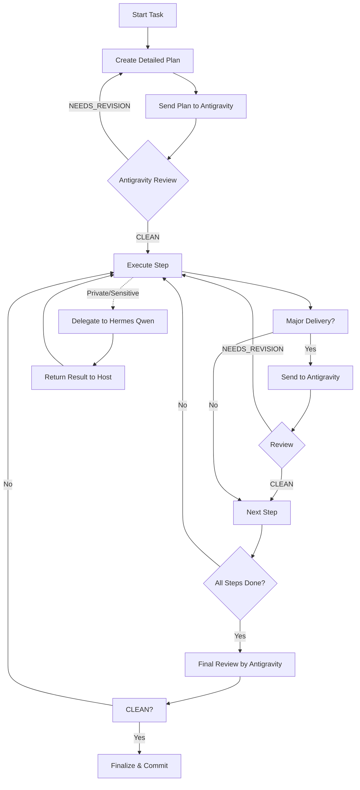

# LLM Council Workflow

The council follows a strict gate-based loop to ensure high-quality execution.

## Workflow Diagram

## Review Gates (Minimal Set)

1. **Initial Plan** (mandatory): Establish direction and capture bad assumptions early.
2. **Architecture/Design**: For high-risk or complex system changes.
3. **Core Implementation**: The bulk of the functional code.
4. **Tests/Verification**: Ensure the delivery is actually verified.
5. **Final Review**: Pre-commit/PR check.

## Iteration Patterns

### Pattern 1: Gemini Plans, Hermes Executes
Gemini (Antigravity) provides high-level architecture; Hermes (Qwen) handles the heavy local file writes and terminal commands.

### Pattern 2: Hermes Drafts, Gemini Reviews
Hermes (Qwen) creates a local draft; Gemini (Antigravity) provides a "sanity check" before the code is merged into the main repo.
