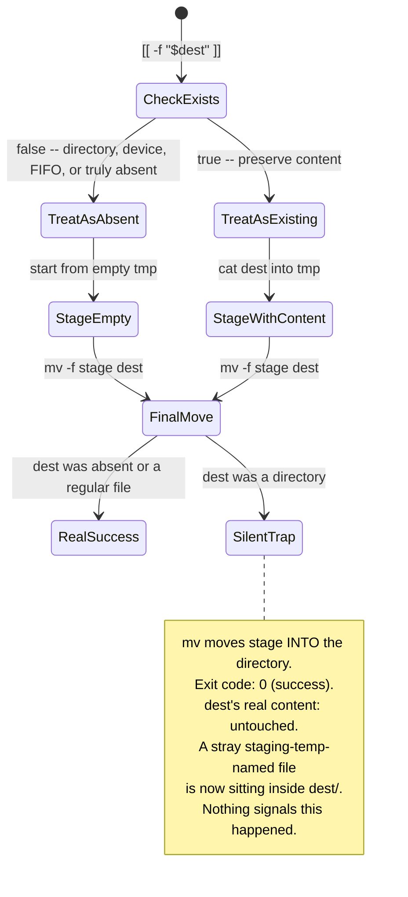

# Atomic File-Write Helper Traps — Reference Card

> **Durable invariant.** Load before writing or reviewing any bash helper that
> stages content to a temp path and then `mv`s it into place (`atomic_write_file`,
> `atomic_install_file`, `atomic_append_snippet`, and anything shaped like them).
> Canonical scripts: `scripts/git/sync-attribution-guard-scripts.sh`.

## Purpose

Prevent the `atomic_append_snippet` class of failure: a staged temp file is
`mv`'d onto a destination path that turned out **not to be a regular file**
(most often a directory). `mv` does not fail or replace the destination in
that case — it silently moves the source **into** it. The calling function
returns success. The destination's real content is untouched. A
stray, mangled-named file is left sitting inside it. Nothing signals any of
this happened.

## Root cause (first principles)

The bug is not in `mv` — this is documented POSIX behavior, not a defect.
The bug is in helper functions that check one thing (`[[ -f "$dest" ]]`,
to decide whether to preserve existing content) and rely on a
**different, unstated assumption** (that `$dest` is safe to write a file
to) holding at the final `mv` step, without ever verifying the second
assumption explicitly.



| Layer | What the check verifies | What it does **not** verify |
| --- | --- | --- |
| `[[ -f "$dest" ]]` | Is dest *currently* a readable regular file | Whether dest is safe to `mv` a file onto later |
| `mv -f "$stage" "$dest"` | Moves `$stage` to (or into) `$dest` | Whether `$dest` was the kind of path the caller intended |

**These are not the same guarantee.** A directory fails the first check
(silently routed down the "treat as absent" path) but does not fail the
second (POSIX `mv` special-cases an existing directory target — moves
the source in, rather than erroring or replacing it).

## Verified failure trace (not assumed — reproduced empirically)

```text
$ mkdir dest_dir && echo "real content" > dest_dir/AGENTS.md
$ echo "new snippet" > snippet.txt
$ atomic_append_snippet dest_dir 0644 snippet.txt   # pre-fix version
$ echo $?
0
$ ls dest_dir/
AGENTS.md   .dest_dir.sync.sCYhhk      <- stray staging-temp file, snippet only
$ cat dest_dir/AGENTS.md                             <- completely unchanged
real content
```

The function believed it succeeded. It did not append anything to
`AGENTS.md`. The snippet content it was asked to append now sits in a
garbage-named sibling file no caller would think to check.

## The fix

Add an explicit type guard **before any work begins**, refusing anything
that is not "doesn't exist yet" or "is a regular file":

```bash
if [[ -L "$dest" || ( -e "$dest" && ! -f "$dest" ) ]]; then
  echo "error: $dest exists but is not a regular file (refusing to touch it)" >&2
  return 1
fi
```

Reject symlinks explicitly (`-L`) before the type guard: `[[ -e && ! -f ]]` follows
symlinks, so a symlink to an external regular file would pass the guard and copy
that external content into the staged file before `mv`.

`atomic_install_file()` in the same file already had this exact guard
(as `[[ -d "$dest" ]]`) — `atomic_append_snippet()` was simply missing
the safety invariant its sibling function already established. **When
one helper in a file has a defensive check another sibling helper
lacks, treat that asymmetry itself as a finding worth checking**, not
just the specific bug that happened to surface it.

## Standardized checklist for any new atomic-write helper

Before shipping a bash function that stages-then-`mv`s into a
destination path, verify all four:

1. **Type-check the destination explicitly** before any read/write
   work: `[[ -e "$dest" && ! -f "$dest" ]]` → fail closed. Do not rely
   on `-f`'s false case meaning "safe to treat as absent."
2. **Check every command's own exit status individually** when
   building content across multiple reads (e.g. `cat a; cat b`) —
   never rely on a `{ ...; }` brace group's own status, which only
   reflects the *last* command run inside it.
3. **Trace the success path with an adversarial destination** before
   trusting a "same conditions, same behavior" claim: what if the
   path is a directory? A broken symlink? A symlink to something else
   entirely? A FIFO or device node? Each is a plausible pre-existing-state
   or race-condition surface, not a purely theoretical one.
4. **Write the regression test against the real function**, not a
   reimplementation of its logic — extract the function body by brace
   matching and source just that (see
   `tests/test_sync_attribution_guard_scripts.py::_extract_function`)
   if the script isn't safely sourceable whole (e.g. it does argument
   validation or real work at file-scope, not gated behind a
   `[[ "$0" == "${BASH_SOURCE[0]}" ]]`-style guard).

## Decision log (closes the loop)

| Date | Decision | Rationale |
| --- | --- | --- |
| 2026-07-31 | Explicit `-e && ! -f` type guard in `atomic_append_snippet` | Empirically traced the un-fixed function's exact failure mode before writing the fix — silent success, zero data written, garbage left behind. Caught during review remediation on orama PR #251 (CodeRabbit 4830042706), pushed further past the review's own scope on request rather than left as a known gap. |
| 2026-07-31 | Matched `atomic_install_file`'s existing `-d` guard, broadened to `-e && ! -f` | Consistency with the sibling function in the same file; broader catches device nodes/FIFOs too, not directories alone. |
| 2026-07-31 | Test extracts the function body rather than sourcing the whole script | The script performs real argument validation at file scope (`target_input="${1:?...}"`), so `source`-ing it directly for unit testing fails immediately — not a testing-framework limitation, a real property of this specific script's structure. |

## Related

- `scripts/git/sync-attribution-guard-scripts.sh` — `atomic_append_snippet`,
  `atomic_install_file` (the guard's original location)
- `tests/test_sync_attribution_guard_scripts.py` — regression coverage
- `pending-operation-push-guard-reference-card.md` — sibling finding from the
  same review pass (AM vs REBASE state confusion), same session, same
  discipline: trace the actual git/shell mechanics rather than assume they
  match the mental model the code was written against.

## Skill / memory graduation

PT lesson (via `learn.py`): a helper function's `mv`-into-place step can
silently succeed onto an unexpected destination type; type-check
explicitly before any stage-then-move helper does its final write. Do
not re-derive this trace in session — load this card.
