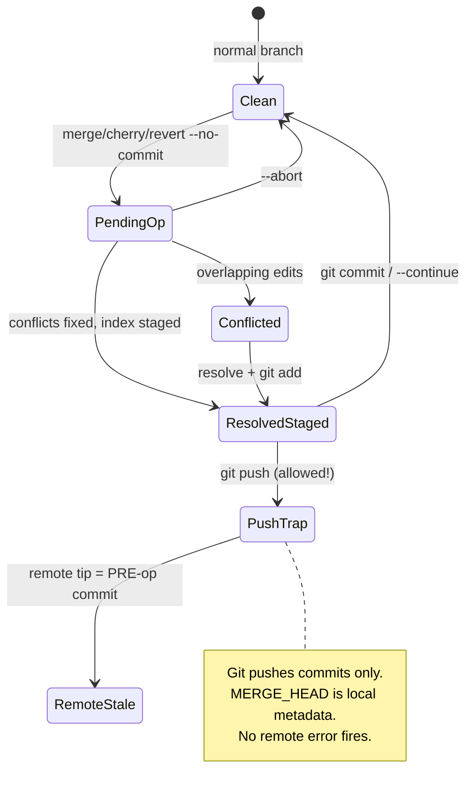

# Pending Operation Push Guard — Reference Card

> **Durable invariant.** Load before any `git push` after merge/cherry-pick/revert work.
> Canonical script: `scripts/git/check_no_pending_merge.sh` (wired in `.githooks/pre-push`).

## Purpose

Prevent the periscope PR #39 class of failure: a **resolved but uncommitted**
`--no-commit` operation leaves `*_HEAD` refs set locally. `git push` succeeds and
ships the **pre-operation** commit — no error fires. The PR body can describe a
merge that is not on the branch.

## Root cause (first principles)



| Layer | Git guarantees | Git does **not** guarantee |
| ------- | ---------------- | ---------------------------- |
| **Refs** | `MERGE_HEAD` / `CHERRY_PICK_HEAD` / `REVERT_HEAD` = unfinished op | Push will fail or warn |
| **Index** | Staged result lives in index | Index state is pushed |
| **Remote** | Receives objects at `HEAD` | Matches “merge is done” mental model |

**Design choice (approved 2026-07-30):** Use a **two-layer state table**, not one
nested diamond flowchart. Layer A = which `*_HEAD` exists; Layer B = unmerged
paths (`git diff --name-only --diff-filter=U`) only when `MERGE_HEAD` is set.

## KB exit codes and symbols

Microsoft-style: stable **symbol** + numeric **exit** + **hex** for scripting.

| Exit | Hex | Symbol | Condition | Remediation |
| ------ | ----- | -------- | ----------- | ------------- |
| 0 | `0x00000000` | `GIT_PUSH_OK` | No pending `*_HEAD` | Push allowed |
| 1 | `0x00000001` | `GIT_PUSH_E_PENDING_MERGE_CLEAN` | `MERGE_HEAD`, no unmerged paths | `git commit` or `git merge --abort` |
| 2 | `0x00000002` | `GIT_PUSH_E_PENDING_MERGE_CONFLICT` | `MERGE_HEAD` + unmerged paths | Resolve → `git add` → `git commit` or `git merge --abort` |
| 3 | `0x00000003` | `GIT_PUSH_E_PENDING_CHERRY_PICK` | `CHERRY_PICK_HEAD` | `git cherry-pick --continue` or `--abort` |
| 4 | `0x00000004` | `GIT_PUSH_E_PENDING_REVERT` | `REVERT_HEAD` | `git revert --continue` or `--abort` |

**Priority when classifying exit (single primary code):** conflict merge (2) →
clean merge (1) → cherry-pick (3) → revert (4). Multiple `*_HEAD` refs are
abnormal; the script lists all markers but emits one primary exit code.

### Stderr contract (machine + human)

```text
pre-push: blocked [GIT_PUSH_E_PENDING_MERGE_CLEAN] (exit 1, 0x00000001) — uncommitted in-progress operation(s): MERGE_HEAD
  MERGE_HEAD: staged merge ready — run 'git commit' to finalize, or 'git merge --abort'.
  The branch tip you're about to push is still the PRE-operation commit.
  Finalize or abort the operation above, then push again.
  KB: bin/orama-system/skills/git-history-surgery/references/pending-operation-push-guard-reference-card.md
```

Pre-push hook propagates the script exit code (`|| exit $?`), not a flat `1`.

## Layer B — merge sub-state matrix

| `MERGE_HEAD` | `git diff --diff-filter=U` | Exit | Guidance line |
| -------------- | ---------------------------- | ------ | --------------- |
| absent | — | 0 | — |
| present | empty | 1 | staged merge ready → `git commit` |
| present | non-empty | 2 | resolve and stage conflicts → `git commit` |

Cherry-pick/revert rows do not probe unmerged paths in v1; use `--continue` /
`--abort` messaging (CodeRabbit 4823103931 aligned for merge only).

### Known limitation (v1)

`git cherry-pick --no-commit` on a **clean** apply does **not** set
`CHERRY_PICK_HEAD` (Git leaves only staged index changes). This guard detects
cherry-pick via `CHERRY_PICK_HEAD` when the operation is in progress (typically
after a conflict). A future v2 may add `git diff --cached` heuristics; the
periscope PR #39 incident class is merge-specific and fully covered.

## Manual pre-push checklist

Run in order **every** push (hook is backstop only):

```text
pwd; git remote get-url origin; git branch --show-current
git diff --name-only --diff-filter=U   # must be empty before commit
for marker in MERGE_HEAD CHERRY_PICK_HEAD REVERT_HEAD; do
  if git rev-parse -q --verify "$marker" >/dev/null; then
    echo "STOP: pending $marker"
    scripts/git/check_no_pending_merge.sh
    exit $?
  fi
done
```

Before opening a PR, re-derive claims from `git diff <base>...<head> --stat` —
not from memory of what you resolved.

## Executable regression spec

`tests/test_check_no_pending_merge.py` (all `pytest.mark.unit`):

| Test | Scenario | Expected exit |
| ------ | ---------- | --------------- |
| `test_check_no_pending_merge_passes_without_in_progress_ops` | clean repo | 0 |
| `test_check_no_pending_merge_blocks_resolved_no_commit_merge` | non-conflicting `--no-commit --no-ff` | 1 |
| `test_check_no_pending_merge_blocks_conflicted_merge_head` | conflicting merge | 2 |
| `test_merge_head_with_unmerged_files` | conflict + “resolve and stage” text | 2 |
| `test_check_no_pending_merge_blocks_pending_cherry_pick` | conflicted cherry-pick (in progress) | 3 |
| `test_check_no_pending_merge_blocks_pending_am_session` | real stuck `git am` session (not a synthetic marker) | 1, reported as `AM` not `REBASE` |
| `test_check_no_pending_merge_blocks_pending_revert` | `--no-commit` revert | 4 |

## Decision log (closes the loop)

| Date | Decision | Rationale |
| ------ | ---------- | ----------- |
| 2026-07-30 | Detect via `*_HEAD` refs, not `<<<<<<<` grep | Text markers miss add/add, rename/delete conflicts |
| 2026-07-30 | Pre-push guard + wiki checklist | Git cannot warn on uncommitted index at push |
| 2026-07-30 | Distinct exits 1–4 + KB symbols | Predictable automation (LESSONS §2026-06-20 exit-code table pattern) |
| 2026-07-30 | Layer B unmerged probe for `MERGE_HEAD` only | CodeRabbit 4823103931 — don’t tell users to `git commit` with unmerged files |
| 2026-07-30 | Reference card + thin skill wrappers | Progressive disclosure; token-frugal discovery triggers |
| 2026-07-30 | Extend `git-history-surgery` item 11 | Avoid skill sprawl; same doctrine family as stash safeguard |
| 2026-07-31 | Distinguish `AM` from `REBASE` via `rebase-apply/applying` | `git am` and a real rebase both use `.git/rebase-apply/` — reporting an am session as `REBASE` sent operators toward `git rebase --continue`/`--abort`, neither of which resolves an am session. Root cause: `rebase-apply/` is shared plumbing between two distinct git *operations*; the marker file (`applying` vs `rebasing`) is the only reliable discriminator. Caught by CodeRabbit review 4830042706 on orama PR #251. |

## Related

- `scripts/git/check_no_pending_merge.sh` — implementation
- `docs/wiki/08-git-hygiene-and-branching.md` § Merge → Push → PR discipline
- `bin/orama-system/skills/git-pending-push-guard/SKILL.md` — discovery triggers
- [`bin/orama-system/skills/oramasys-method/references/integrative-merge.md`](../../oramasys-method/references/integrative-merge.md)
  — simulate → harmonize → **finalize before push**
- Incident: periscope PR #39 (2026-07-30); orama PR #244 stack

## Skill / memory graduation

PT lesson (via `learn.py`): pending `*_HEAD` before push is a fleet-wide invariant;
pytest + pre-push hook are the enforcement anchors. Do not re-derive this table in
session — load this card.
