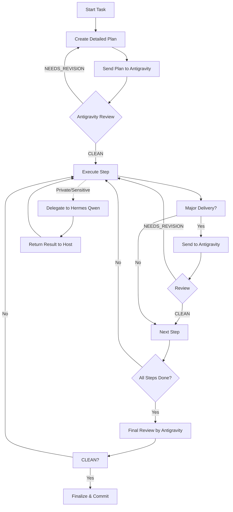

# Hermes Council Review Gates

Use this reference when `/pt-orama-council` needs a multi-agent review loop.

## Roles

| Role | Default surface | Responsibility |
|---|---|---|
| Host/Executor | Codex or current main orama agent | Plan, edit, verify, commit, and make final decisions |
| Reviewer/Critic | AGY/Antigravity (Gemini) | Review plans and deliveries after visible-output readiness passes |
| Local Specialist | Hermes (Qwen) | Handle bounded private or local subtasks after provider canary passes |

The main orama agent always keeps judgment. Workers may critique, propose, or specialize; they do not commit, delete, deploy, force-push, change accounts, or handle secrets directly.

## Workflow Diagram



## Review Gates (Minimal Set)

1. **Initial Plan** (mandatory): Establish direction and capture bad assumptions early.
2. **Architecture/Design**: For high-risk or complex system changes.
3. **Core Implementation**: The bulk of the functional code.
4. **Tests/Verification**: Ensure the delivery is actually verified.
5. **Final Review**: Pre-commit/PR check.

Proceed past a review gate only when:
- Reviewer output is usable.
- Findings are clean or intentionally accepted by the main orama agent.
- The relevant readiness canary passed for that lane.
- Verification evidence is attached to the handoff.

## Review Package Shape

When sending work to a reviewer, include:

```text
GOAL:
CONTEXT:
CHANGES OR PLAN:
VERIFICATION:
KNOWN RISKS:
REQUESTED OUTPUT: FINDINGS, MISSING COVERAGE, APPROVAL
```

Reviewer output should be findings-first. Approval words such as `CLEAN` are advisory; the main orama agent decides whether to proceed.
