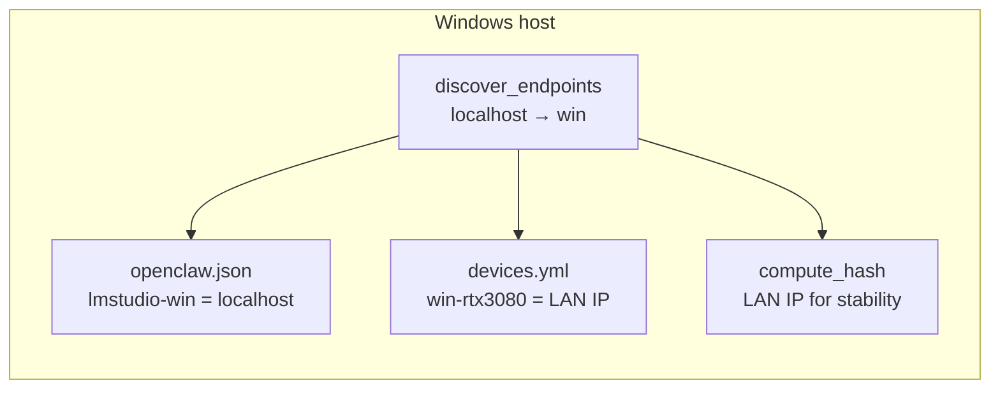

# PR #108 Code Review — Hermes Harness Onboarding + Windows Discover

**Date:** 2026-06-25  
**PR:** [orama-system#108](https://github.com/diazMelgarejo/orama-system/pull/108)  
**Branch:** `feat/hermes-harness-onboarding`  
**Reviewer:** Cursor Cloud Agent  
**Scope:** `discover.py` Windows platform role reversal, Hermes harness onboarding (skills, canaries, gstack shim), companion plan docs  
**Fix commit:** `bb62766` — hash/runtime IP split, test and sync shim corrections

---

## Executive summary

PR #108 wires **Windows platform role reversal** into `scripts/discover.py` (localhost → `win`, `$MAC_IP` → `mac`) and delivers a large **Hermes harness onboarding** package: reference cards, partner canary verifier, thin-wrapper sync shim, gstack brain-sync `.cmd`, and plan doc updates.

**Verdict:** Approve after merge strategy is chosen. Core design is sound; one **critical regression** in `c75d352` (mutating runtime endpoints before `openclaw.json` patch) was fixed in `bb62766`. Targeted tests: **70/70 pass**.

---

## Progress vs `main`

| Item | Status |
|------|--------|
| Substance (discover + Hermes onboarding) | ✅ Strong |
| Overlap with `origin/main` (`a75ad68`) | ⚠️ Much merged via #107 + #109; branch adds MAC_IP cache fallback, LM_READY gate, `cursor-agent` skill, refined hash logic |
| CodeRabbit threads | ✅ All resolved — including r3480506247 (`patch_models_yml` loopback) on `main` @ `b4f0e4b` |
| Rebase onto `main` | ❌ Conflicts on skill docs duplicated in `a75ad68` — use **merge commit** or cherry-pick `bb62766` |

---

## Architecture (correct model)



**Invariant:** One discovery probe, two IP views — runtime loopback for dispatch; LAN IP for topology files and stable hashing.

---

## Strengths

- **`RUNNING_ON_WINDOWS`** correctly flips localhost assignment (fixes `windows_only` models stripped on Windows host).
- **Loopback guard** in `patch_devices_yml` with device-boundary regex prevents `win-rtx3080` pattern drifting into `cloud.lan_ip`.
- **`verify_partner_canaries.py`** gates LM Studio on `LM_READY` in completion text (not just `/v1/models` liveness).
- **`platform/windows/gstack-brain-sync.cmd`** solves cmd.exe shebang issue (gstack #1731).
- **Doc hygiene:** `$LM_STUDIO_WIN_ENDPOINT` replaces hardcoded workstation IPs (LINT-006).
- **Hermes reference cards:** cross-harness protocol, LAN endpoint contract, partner prompt contract, platform affinity routing.

---

## Bugs found and fixed (`bb62766`)

### 1. Critical — Windows IP normalization broke runtime URLs

**Where:** `scripts/discover.py` `run_discovery()` (introduced in `c75d352`)

**Problem:** Mutating `endpoints["win"]["ip"]` from `localhost` → LAN IP **before** `patch_openclaw_json()` would write `http://192.168.x.x:1234/v1` into `lmstudio-win` on the Windows host instead of `localhost`.

**Fix:** Split concerns:

| View | IP used | Consumers |
|------|---------|-----------|
| **Runtime** (`endpoints`) | `localhost` on Windows | `patch_openclaw_json`, `write_env_lmstudio` |
| **Hash/snapshot** (`hash_endpoints`) | Resolved LAN IP | `compute_hash`, `save_discovery_state`, `patch_devices_yml` |

Helpers added: `_win_lan_patch_ip()`, `_endpoints_for_hash()`, consolidated `_lan_ip_on_subnet()`.

### 2. Tests failing (3/70) — policy filter stub

**Where:** `tests/test_discover_windows.py` `_load_discover()`

**Problem:** Stub passed models through unchanged; `filter_endpoints_for_policy` tests expected real filtering.

**Fix:** Rebind `filter_models_for_platform = _filter_models_for_platform_local` after import.

### 3. `sync_hermes_thin_wrappers.py` — invalid CLI passthrough

**Problem:** Passed `--hermes-home` to `install_hermes_thin_skills.py`, which has no such flag.

**Fix:** Set `HERMES_HOME` in subprocess `env`; updated tests.

### 4. Test hygiene

- Fixed unawaited coroutine warning in `test_mac_host_localhost_assigned_to_mac` (mock `scan_subnet_async`).
- Added `test_endpoints_for_hash_resolves_win_lan_without_mutating_runtime`.

---

## What already looked good (no changes)

- MAC_IP unreachable → last-known-good cache fallback (`cfbf155`+)
- `patch_devices_yml` loopback guard + `_win_lan_ip()` UDP probe
- `cursor-agent` skill disambiguation from Grok `agent` binary (`f06b12d`)
- CRLF documentation for Windows `.cmd` files (wiki 08, hermes-harness SKILL)
- Composer 2.5 default for cursor-agent fanout (`70aa155`)

---

## CodeRabbit follow-up — r3480506247 (resolved `main` @ `b4f0e4b`)

**Thread:** [discussion_r3480506247](https://github.com/diazMelgarejo/orama-system/pull/108#discussion_r3480506247)  
**Issue:** `patch_models_yml` lacked `_LOOPBACK` guard — asymmetric with `patch_devices_yml`.  
**Fix:** `_LOOPBACK` guard + `LM_STUDIO_WIN_ENDPOINT(S)` regex alignment + regression tests.  
**Review thread status:** resolved via GraphQL (2026-06-26). PT memory: `lesson_e7d62d7a5ed9`.


1. **Merge strategy:** Merge `main` into branch; resolve skill-doc conflicts by keeping `main` + applying `bb62766` discover changes.
2. **`load_policy()` fallback:** Local `_simple_policy_parse` in `discover.py` is acceptable offline; consider full PT delegation when `PERPETUA_TOOLS_ROOT` is set (same pattern as #107).
3. **Full suite:** Run `python3 -m pytest` before merge (PR claims 844 passed; review ran targeted 70).

---

## Validation commands

```bash
python3 -m pytest tests/test_discover_windows.py tests/test_sync_hermes_thin_wrappers.py tests/test_verify_partner_canaries.py -q
# 70 passed (post bb62766)

python3 -m pytest  # full suite before merge
```

---

## Related

- [Hermes harness canonical onboarding plan](plans/2026-06-24-hermes-harness-canonical-onboarding.md)
- [Cross-harness hardware policy architecture](hermes-hardware-policy-cross-harness.md)
- [Hermes Windows hardware walkthrough plan](plans/2026-06-24-hermes-windows-hardware-policy-walkthrough.md)
- PRs: [#108](https://github.com/diazMelgarejo/orama-system/pull/108) · [#107](https://github.com/diazMelgarejo/orama-system/pull/107) · [#109](https://github.com/diazMelgarejo/orama-system/pull/109)
