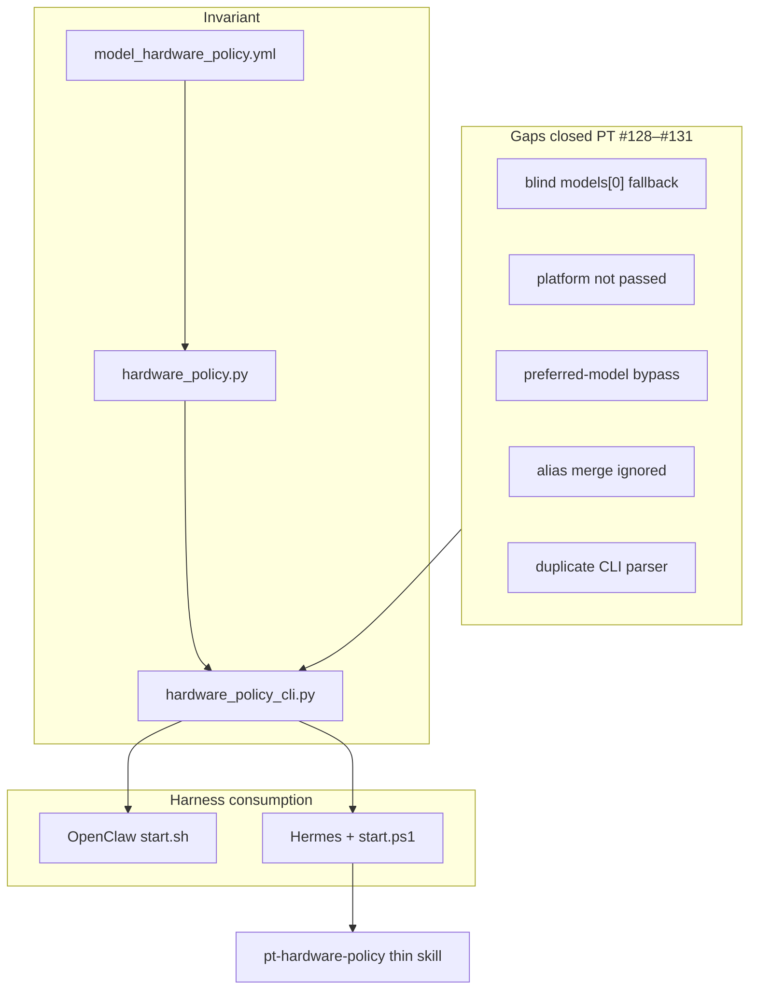

# Cross-Harness Hardware Policy Architecture

> **Date:** 2026-06-24 · **Status:** canonical reference (orama PR #107 + Perpetua-Tools PR #134)
> **Companion:** [Live Windows walkthrough plan](plans/2026-06-24-hermes-windows-hardware-policy-walkthrough.md) · [Cross-platform harness table](cross-platform.md#harness-roles-and-hardware-policy-2026-06-24)

---

## Purpose

This document records the **cross-harness hardware policy architecture** wired in
2026-06-24: one Perpetua-Tools policy consumption path shared by OpenClaw (macOS/Linux)
and Hermes (Windows 11). orama-system provides harness entrypoints and thin skills;
Perpetua-Tools owns the policy file, canonical API, and CLI.

**Real purpose (AFRP):** Parallel orchestrators must not infer NEVER_MAC / NEVER_WIN
from LM Studio `/v1/models` list membership. Mac proxies Win models over LAN; Windows
Hermes runs GGUF at `localhost:1234`. Same YAML, inverted platform verdict — one
enforcement chain.

---

## Architecture overview



**How to read this diagram**

- **Invariant (top):** `model_hardware_policy.yml` in Perpetua-Tools is the single
  source of truth. All runtime checks flow through `hardware_policy.py` and surface
  to operators via `hardware_policy_cli.py`. No harness re-declares NEVER lists.
- **Gaps closed (middle):** PT PRs #128–#131 removed five bypass paths that let
  dispatch ignore platform, aliases, or the canonical loader. Those fixes land in
  the API/CLI layer before any harness consumes policy.
- **Harness consumption (bottom):** Mac/Linux OpenClaw calls `./start.sh --hardware-policy`.
  Windows Hermes calls `.\platform\windows\start.ps1 --hardware-policy` and may load
  the `pt-hardware-policy` thin skill as the agent-facing adapter.

All paths are **fail-closed**: a NEVER verdict blocks dispatch; there is no silent
fallback to `models[0]`.

---

## Platform harness model

Three hosts, two harness families, **one** policy file:

| Host OS | Primary harness | Startup gate | LM Studio role | Orchestrator role |
|---------|-----------------|--------------|----------------|-------------------|
| **macOS** | OpenClaw (`start.sh`) | `./start.sh --hardware-policy` | Mac MLX home; Win GGUF = **NEVER_MAC** | Mac orchestrator |
| **Linux** | OpenClaw (`start.sh`) | same as macOS | Any documented PT profile (physical HW permitting) | Full hardware matrix peer |
| **Windows 11** | Hermes + `start.ps1` | `.\platform\windows\start.ps1 --hardware-policy` | Win GGUF at **localhost:1234** | Hermes = parallel local orchestrator / autoresearcher |

### Windows role reversal

```
Mac OpenClaw orchestrator              Windows Hermes orchestrator
─────────────────────────              ───────────────────────────
LM Studio Win over LAN                 LM Studio Win at localhost:1234
(192.168.x.x:1234)                     (install.ps1 → lmstudio-win)

windows_only models = NEVER_MAC        windows_only models = ALLOWED (physical home)
Mac MLX = home                         Mac MLX = NEVER_WIN
```

On Windows, `install.ps1` writes `openclaw.json` with `lmstudio-win` →
`http://localhost:1234`. Heavy GGUF models (27B, gemma quant) are **allowed**
here — this is their physical home. Hermes is the local orchestrator counterpart
to Mac OpenClaw, not a second policy author.

**Linux note:** macOS and Linux share the same OpenClaw harness software (`start.sh`).
Linux is not a reduced policy consumer — it may run any profile documented in PT
`hardware/SKILL.md`, subject to physical GPUs/backends present.

---

## Why this exists — the invariant

From `Perpetua-Tools/config/model_hardware_policy.yml`:

> Dispatching `windows_only` models to Mac = OOM, missing CUDA kernel, or
> **"double barrel" GPU damage** when Mac LM Studio mirrors a Win model via LAN
> proxy and Win dispatches it concurrently.

### LM Studio proxy gotcha

Mac `/v1/models` lists **Windows models too** (LAN proxy). You cannot infer physical
hardware from which endpoint lists a model. Enforcement uses **provider name**
(`lmstudio-mac` vs `lmstudio-win`), not model-list membership.

Example: `gemma-4-26B-A4B-it-Q4_K_M` can appear on `lmstudio-mac` but is **NEVER_MAC**.

See also: [v2 hardware policy enforcement](v2/17-hardware-policy-enforcement.md) for
the original 4-layer chain and mirror-backend design.

---

## Five gaps closed (Perpetua-Tools PRs #128–#131)

| # | Gap | Where | Failure mode | Fix |
|---|-----|-------|--------------|-----|
| 1 | Blind fallback | `launch_researchers.py` | `models[0]` without affinity filter | `_pick_model_with_affinity` |
| 2 | Platform never passed | `run_researcher()` | Win researchers used Mac rules | `_platform_for_role(role)` |
| 3 | Preferred-model bypass | resolvers | Listed Win model accepted on Mac | Filter before returning preferred |
| 4 | Alias sections ignored | `load_policy()` | Quant-suffixed ids bypass NEVER_MAC | `_normalize_policy` |
| 5 | Duplicate CLI parser | `hardware_policy_cli.py` | `start.sh --check-openclaw` false-negative | Delegate to `utils.hardware_policy` |

PR #122 hardened `supervisor`, `agent_launcher`, and `worker_registry` — but
`launch_researchers.py` and the CLI validation path were missed until #128–#131.

### Nested merge chain

| PR | Flow | Fix |
|----|------|-----|
| #128 | `299a` → `main` | `_pick_model_with_affinity` + platform param |
| #129 | `a924` → `main` | Wire platform; close preferred bypass |
| #130 | `c16f` → `a924` | Merge `windows_only_aliases` into `load_policy()` |
| #131 | `9887` → `a924` | CLI delegates to canonical loader |

**Lesson:** GitHub "merged" does not guarantee branch tip updated. Always verify with
`git diff origin/main...origin/<branch>` before sign-off.

---

## Session arc — what it looked like vs what it was

| Surface symptom | Structural work |
|-----------------|-----------------|
| CLI import cleanup | Integration-branch hygiene after nested merges #128–#131 |
| Docstrings for CodeRabbit | Agent-readable invariants (no duplicate parsers) |
| Review 9887 → merge a924 → rebase | Repair nested merge integrity before human sign-off |
| Hermes wiring (orama #107) | Extend integrity to Windows — same YAML, reversed platform role |
| Path resolution + attribution hardening | Portable skills across cloud/sibling/`OPENCLAW_HOME` layouts |

---

## Enforcement stack (file map)

| Layer | File (Perpetua-Tools unless noted) | Role |
|-------|-------------------------------------|------|
| Policy SSoT | `config/model_hardware_policy.yml` | Machine truth — lists + aliases |
| Canonical API | `src/utils/hardware_policy.py` | `load_policy`, `check_affinity`, `filter_models_for_platform` |
| CLI validation | `scripts/hardware_policy_cli.py` | Delegates to API — **never duplicate parsers** |
| Researcher dispatch | `scripts/launch_researchers.py` | `_platform_for_role`, `_pick_model_with_affinity` |
| Runtime gates | `agent_launcher.py`, `supervisor.py`, `worker_registry.py` | `check_affinity` before spawn |
| Discovery filter | `src/perpetua/discovery/selector.py` | `_MIRROR_BACKENDS` excludes mirror dispatch |
| Mac/Linux entry | `orama-system/start.sh --hardware-policy` | Calls CLI `--list` + `--check-openclaw` |
| Windows entry | `orama-system/platform/windows/start.ps1 --hardware-policy` | Same CLI |
| Hermes adapter | `bin/orama-system/skills/hermes-harness/commands/pt-hardware-policy/SKILL.md` | Agent playbook — pointer only |
| Path contract | `bin/orama-system/skills/hermes-harness/references/workspace-path-resolution.md` | Workspace-agnostic PT/orama discovery |

---

## Path resolution (workspace-agnostic)

Skills and thin wrappers must **not** hardcode sibling paths like `../Perpetua-Tools`.

| Priority | Source |
|----------|--------|
| 1 | `PERPETUA_TOOLS_PATH` / `PT_HOME` |
| 2 | `PERPETUA_TOOLS_ROOT` / `PERPETUATOOLSROOT` (orama canonical) |
| 3 | `.paths` / `.paths.ps1` → `PT_DIR` |
| 4 | `OPENCLAW_HOME/Perpetua-Tools` |
| 5 | Sibling discovery from orama git toplevel |
| 6 | Legacy `../perplexity-api/Perpetua-Tools` |

**Preferred entry points** (from orama-system repo root):

```bash
# macOS / Linux
./start.sh --hardware-policy
```

```powershell
# Windows 11 Hermes host
.\platform\windows\start.ps1 --hardware-policy
```

Full contract: [`workspace-path-resolution.md`](../bin/orama-system/skills/hermes-harness/references/workspace-path-resolution.md).

---

## orama-system changes (PR #107)

| Area | Change |
|------|--------|
| Hermes harness | Platform harness model; mandatory policy gate before LM Studio dispatch |
| `pt-hardware-policy` | New command card + thin-skill installer wrapper |
| `hardware-affinity-gate` | Pointer to PT canonical — do not execute embedded duplicate logic |
| `platform/windows/` | Fixed `$RepoRoot` (two levels up); env-var PT discovery parity with `start.sh` |
| Docs | This file, cross-platform.md, wiki 15, walkthrough plan |
| Attribution guard | Coauthor email fail-closed restored (unrelated scope creep caught in review) |

---

## Verification

```bash
# orama-system
python3 -m pytest tests/test_hermes_thin_skills.py tests/test_git_attribution_guard.py -q
python3 bin/orama-system/skills/hermes-harness/scripts/install_hermes_thin_skills.py --test

# Perpetua-Tools (companion PR #134)
python3 scripts/hardware_policy_cli.py --check-openclaw
python3 scripts/hardware_policy_cli.py --validate "gemma-4-26B-A4B-it-Q4_K_M" mac   # expect exit 1
python3 -m pytest tests/test_launch_researchers_affinity.py tests/test_hardware_routing.py -q
```

Live Windows walkthrough (Phases A–F) is **deferred** — see
[walkthrough plan](plans/2026-06-24-hermes-windows-hardware-policy-walkthrough.md).

---

## Related

- [Cross-platform harness roles](cross-platform.md#harness-roles-and-hardware-policy-2026-06-24)
- [Hermes Windows harness (wiki)](wiki/15-hermes-windows-harness.md)
- [Policy fail-closed checklist (wiki)](wiki/09-policy-fail-closed-and-checklist.md)
- [v2 hardware policy enforcement (historical 4-layer chain)](v2/17-hardware-policy-enforcement.md)
- Perpetua-Tools: [`hardware-policy` skill](https://github.com/diazMelgarejo/Perpetua-Tools/blob/main/.claude/skills/hardware-policy/SKILL.md)
- PRs: [orama #107](https://github.com/diazMelgarejo/orama-system/pull/107) · [PT #134](https://github.com/diazMelgarejo/Perpetua-Tools/pull/134)
