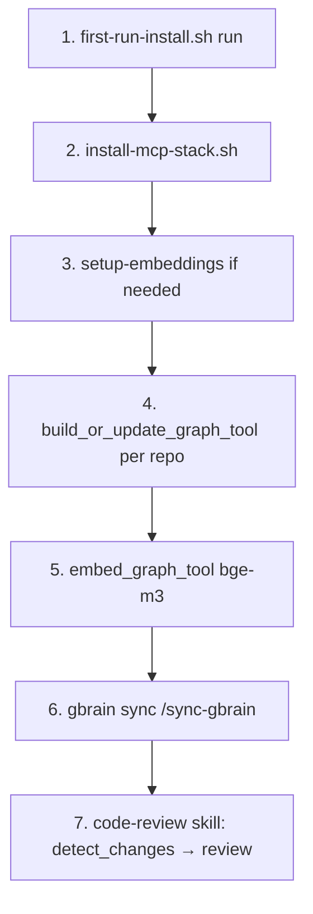

# How to bootstrap a fresh machine through code review

> **Quadrant:** How-to (task-oriented). **Canonical references:** do not duplicate — link out.
> **Last updated:** 2026-05-25

One sentence: you will install the orama toolchain on a new machine, wire MCP and embeddings, seed the code-review-graph (CRG), then run your first graph-first review using the code-review skill.

## Prerequisites

| Requirement | Why |
|-------------|-----|
| orama-system clone with `OPENCLAW_ROOT` discoverable (parent of repo or explicit env) | CRG MCP config lives in `$OPENCLAW_ROOT/.mcp.json` |
| macOS with Homebrew (typical) | Python 3.13, Ollama |
| NVM Node ≥ v20 at `NVM_NODE_BIN` (not system `/usr/bin/node`) | CRG, Claude Code, npm globals |
| Claude Code or Cursor with MCP enabled | CRG tools + optional ai-cli workers |

**Path variables** (full table): [`bin/orama-system/references/first-run-install.md`](../../bin/orama-system/references/first-run-install.md#path-variables)

**Hardware policy (Mac):** Ollama at `localhost:11434` with `qwen3.5:9b-nvfp4` (inference) and `bge-m3` (embeddings). Orchestration fails closed without these on Mac.

---

## End-to-end flow (overview)



| Phase | Installer / skill | Marker |
|-------|---------------------|--------|
| Platform bootstrap | `first-run-install.sh` | `~/.orama-system/first-run.done` |
| MCP workers (optional) | `install-mcp-stack.sh` | `claude mcp list` shows `ai-cli` |
| CRG env only | `setup-embeddings` (also in first-run) | `.mcp.json` → `CRG_OPENAI_MODEL=bge-m3` |
| Graph data | MCP `build_or_update_graph_tool` | `list_graph_stats` → nodes > 0 |
| Semantic index | MCP `embed_graph_tool` | embeddings_count > 0 |
| Review workflow | [`code-review` skill](../../bin/orama-system/skills/code-review/SKILL.md) | graph → gbrain → Read |

---

## Step 1 — First-run platform bootstrap

Agent skill: [`bin/orama-system/skills/first-run-setup/SKILL.md`](../../bin/orama-system/skills/first-run-setup/SKILL.md)

### 1a. Fast status (no pulls)

```bash
cd /path/to/orama-system
bash bin/orama-system/scripts/first-run-install.sh status
```

Expect probes for: node, python3.13, Ollama models, CRG (`uvx`), gbrain, embeddings, Claude CLI, PreCompact hook.

### 1b. Install / heal (idempotent)

```bash
bash bin/orama-system/scripts/first-run-install.sh run
```

Heavy steps with visible progress:

- **0.3** — `ollama pull` for `qwen3.5:9b-nvfp4` and `bge-m3` (resumes via `~/.orama-system/first-run.json`)
- **0.5.1** — `mcp-install/scripts/setup-embeddings` (wires `.mcp.json`; does **not** build the graph)

### Verification

```bash
test -f ~/.orama-system/first-run.done && echo "first-run: done"
curl -sf http://localhost:11434/api/tags | grep -E 'qwen3.5:9b-nvfp4|bge-m3'
```

**Reference:** component matrix and heal table — [`bin/orama-system/references/first-run-install.md`](../../bin/orama-system/references/first-run-install.md)

---

## Step 2 — MCP orchestration stack (separate)

First-run does **not** install ai-cli-mcp or Gemini. Run after Step 1 succeeds.

```bash
bash bin/orama-system/scripts/install-mcp-stack.sh --dry-run   # preview
bash bin/orama-system/scripts/install-mcp-stack.sh             # install
```

Restart the IDE, then confirm `/mcp` lists `ai-cli` (and `gemini-cli` only if you passed `--include-gemini`).

**Skill:** [`bin/orama-system/mcp-install/SKILL.md`](../../bin/orama-system/mcp-install/SKILL.md)

**PR multi-lens fan-out** (later): uses ai-cli / OmniRoute / Task — [`orchestration-dispatch.md`](../../bin/orama-system/skills/code-review/references/orchestration-dispatch.md)

---

## Step 3 — Unified embeddings (if status shows warn)

Usually handled inside `first-run-install.sh run`. Re-run manually if CRG is not on `bge-m3`:

```bash
bash bin/orama-system/mcp-install/scripts/setup-embeddings
bash bin/orama-system/skills/code-review/scripts/crg-embed-mode status
```

Restart Claude Code / Cursor after `.mcp.json` changes.

**Reference:** [`bin/orama-system/mcp-install/references/setup-embeddings.md`](../../bin/orama-system/mcp-install/references/setup-embeddings.md)

---

## Step 4 — Build the code-review graph (MCP, required once)

`setup-embeddings` configures the server; it **cannot** call MCP build tools. Do this in an MCP-enabled session after restart.

### Check health

```
list_graph_stats_tool(repo_root="/path/to/orama-system")
```

| `nodes` | `embeddings_count` | Action |
|---------|-------------------|--------|
| 0 | any | Run build + embed (below) |
| > 0 | 0 | Embed only |
| > 0 | > 0 | Skip to Step 6 |

### Build (per repo you review)

```
build_or_update_graph_tool(
  repo_root = "/path/to/orama-system",
  full_rebuild = True,
  postprocess = "full"
)
```

Repeat for AlphaClaw and Perpetua-Tools when you review those repos (canonical paths, not worktree-only copies).

### Embed (must match gbrain: bge-m3 via Ollama)

```
embed_graph_tool(
  repo_root = "/path/to/orama-system",
  provider = "openai",
  model = "bge-m3"
)
```

**Prerequisite:** Ollama up with `bge-m3` pulled.

**Corrupted graph:** delete `<repo>/.code-review-graph/graph.db` and repeat build + embed.

**Full procedure:** [`code-review` SKILL — Graph Initialization](../../bin/orama-system/skills/code-review/SKILL.md#graph-initialization--repair-fresh-clone--0-node--disk-error)

---

## Step 5 — gbrain sync (semantic code + memory)

```bash
# After /setup-gbrain or first-run gbrain check passes
/sync-gbrain    # in Claude Code — or gbrain CLI from repo root
```

Worktrees use `.gbrain-source` pins; run sync per worktree after meaningful code changes.

**Exploration order after bootstrap:** CRG → gbrain → Read — [`tool-chain.md`](../../bin/orama-system/skills/code-review/references/tool-chain.md)

---

## Step 6 — Run your first code review

Invoke the **code-review** skill (or follow it manually). Mother skill trigger: `code review`, `detect_changes`, `blast-radius`, etc.

### Delta review (local changes, single-pass)

1. **Graph:** `detect_changes` (or `/code-review-graph:review-delta` in Claude Code)
2. **Gbrain:** `gbrain code-def` / `gbrain search` on symbols from blast radius
3. **Context:** `get_review_context` for snippets
4. **Read:** only assigned files from steps 1–3
5. **Judge:** persona in [`agents/code-reviewer.md`](../../bin/orama-system/skills/code-review/agents/code-reviewer.md), confidence ≥ 80, report per [`output-format.md`](../../bin/orama-system/skills/code-review/references/output-format.md)

### PR review (multi-lens)

Same Phases A–C, then fan-out five lenses per [`review-lenses-pr.md`](../../bin/orama-system/skills/code-review/references/review-lenses-pr.md) and [`orchestration-dispatch.md`](../../bin/orama-system/skills/code-review/references/orchestration-dispatch.md).

### Quick verification commands

```bash
git diff --stat
# In MCP session:
#   detect_changes → get_impact_radius → get_review_context
```

---

## Reference — command cheat sheet

| Goal | Command / tool |
|------|----------------|
| Bootstrap status | `bash bin/orama-system/scripts/first-run-install.sh status` |
| Bootstrap install | `bash bin/orama-system/scripts/first-run-install.sh run` |
| MCP workers | `bash bin/orama-system/scripts/install-mcp-stack.sh` |
| Embeddings wire-up | `bash bin/orama-system/mcp-install/scripts/setup-embeddings` |
| CRG embed mode | `bash bin/orama-system/skills/code-review/scripts/crg-embed-mode status` |
| Graph stats | MCP `list_graph_stats_tool` |
| Start diff review | MCP `detect_changes` |
| Symbol lookup | `gbrain code-def <symbol>` |
| Snippets before Read | MCP `get_review_context` |

---

## Tutorial — first session in 15 minutes

Learning-oriented shortest path (assumes clone already on disk):

1. `bash bin/orama-system/scripts/first-run-install.sh status` — see what is red.
2. `bash bin/orama-system/scripts/first-run-install.sh run` — wait for Ollama pulls to finish.
3. Restart IDE; MCP `list_graph_stats_tool` on orama-system — if 0 nodes, build + embed (Step 4).
4. Make a one-line change in any tracked file; run MCP `detect_changes`.
5. Call `get_review_context` for one changed file; confirm you did **not** read the whole repo first.

You have now used the same chain the code-review skill enforces: graph → gbrain → Read.

---

## Troubleshooting

| Symptom | Likely cause | Fix |
|---------|--------------|-----|
| `first-run` fails on Ollama | Daemon down or models missing | Start Ollama; re-run `run` (resume pulls) |
| CRG MCP missing in IDE | `.mcp.json` not registered | `code-review-graph install --platform claude-code --repo "$OPENCLAW_ROOT"` |
| `nodes = 0` after install | Never ran `build_or_update_graph_tool` | Step 4 |
| Semantic search empty | No embeddings | Step 4 embed; Ollama + bge-m3 |
| Review reads whole repo | Skipped graph phase | Re-run with code-review skill; see red flags in SKILL.md |
| ai-cli workers missing | Skipped Step 2 | `install-mcp-stack.sh` |

**Local env / secrets:** [`docs/local-env-catch-up.md`](../local-env-catch-up.md)

---

## Related documentation

| Doc | Quadrant | Content |
|-----|----------|---------|
| [`bin/orama-system/references/first-run-install.md`](../../bin/orama-system/references/first-run-install.md) | Reference | Per-component §0 matrix |
| [`bin/orama-system/skills/first-run-setup/SKILL.md`](../../bin/orama-system/skills/first-run-setup/SKILL.md) | How-to | Agent workflow for bootstrap |
| [`bin/orama-system/mcp-install/SKILL.md`](../../bin/orama-system/mcp-install/SKILL.md) | How-to | MCP stack installer |
| [`bin/orama-system/skills/code-review/SKILL.md`](../../bin/orama-system/skills/code-review/SKILL.md) | How-to | Review phases + graph repair |
| [`bin/orama-system/skills/code-review/references/tool-chain.md`](../../bin/orama-system/skills/code-review/references/tool-chain.md) | Reference | CRG → gbrain → Read |
| [`bin/orama-system/SKILL.md`](../../bin/orama-system/SKILL.md) | Reference | Mother skill, search policy, first-run pointer |
| [`docs/plans/2026-05-19-gbrain-crg-embedding-integration.md`](../plans/2026-05-19-gbrain-crg-embedding-integration.md) | Explanation | Why bge-m3 unifies CRG + gbrain |
