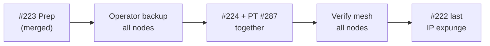
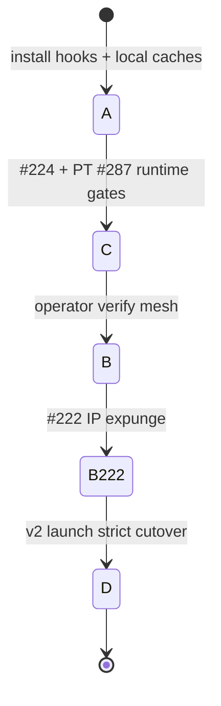
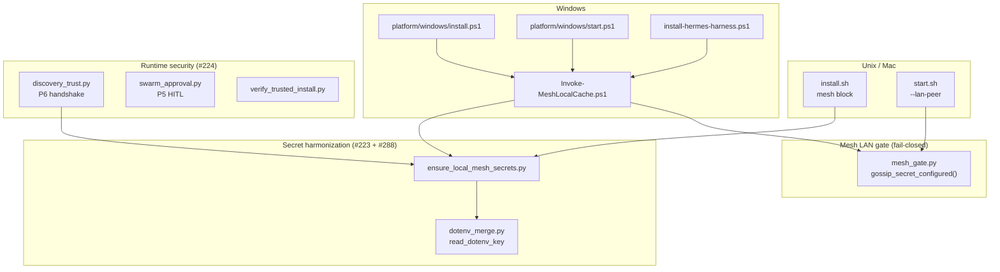
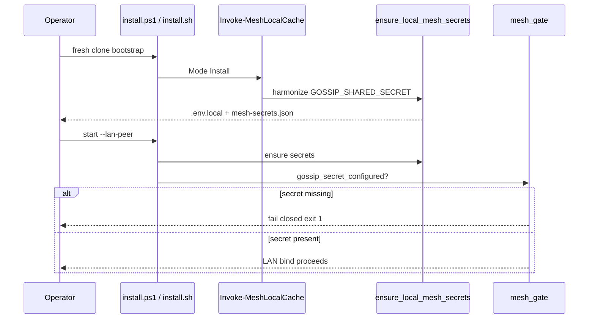
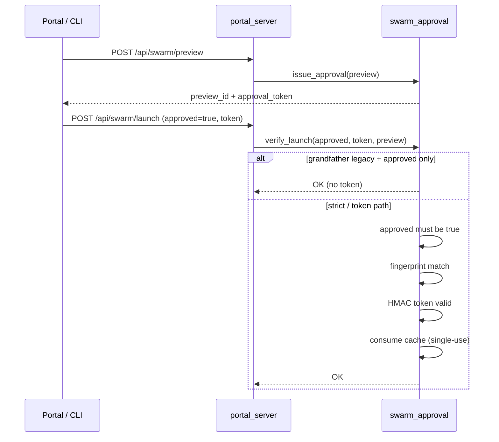
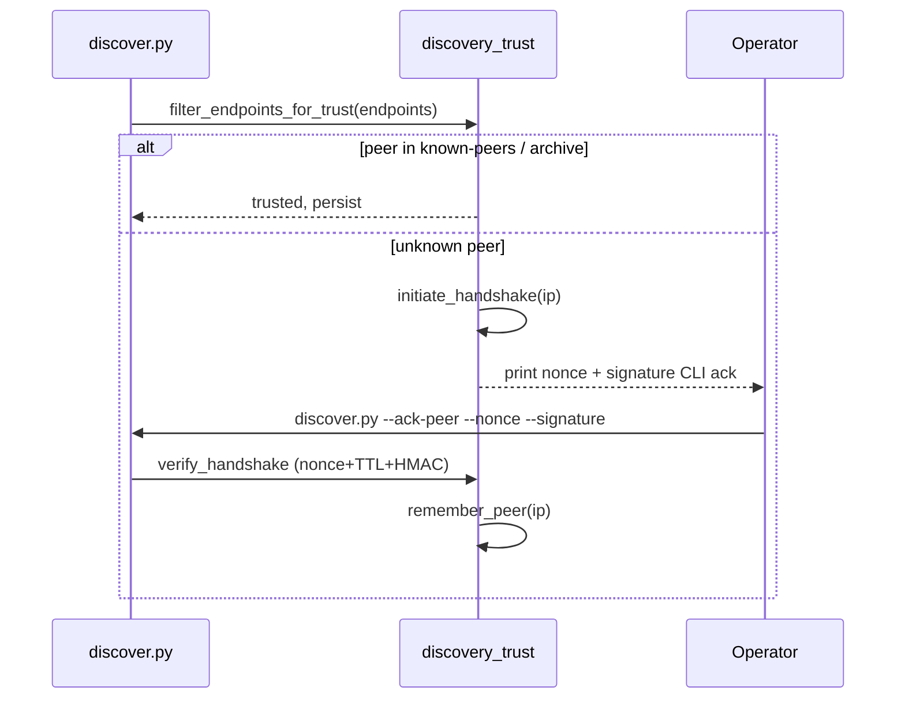

# PR #224 mesh security finality report (2026-07-26)

> **Integrated copy:** Perpetua-Tools [`PHASE-0-MASTER-PLAN-2026-07-27.md` §12](https://github.com/diazMelgarejo/Perpetua-Tools/blob/main/docs/phase-0-specifications/PHASE-0-MASTER-PLAN-2026-07-27.md) (post-merge status updated there). This file remains the full-source report with diagrams.
> **Branch:** `cursor/p5-p6-mesh-hardening-f559`  
> **PR:** [orama-system #224](https://github.com/diazMelgarejo/orama-system/pull/224)  
> **Head (finality):** `97bb307e` — holistic CodeRabbit review remediation  
> **Sibling:** [Perpetua-Tools #287](https://github.com/diazMelgarejo/Perpetua-Tools/pull/287) + [#288](https://github.com/diazMelgarejo/Perpetua-Tools/pull/288)  
> **Prep (merged):** [orama #223](https://github.com/diazMelgarejo/orama-system/pull/223) → `main` @ `a0ced30c`  
> **Deferred last:** [orama #222](https://github.com/diazMelgarejo/orama-system/pull/222) — IP expunge + v2 ladder

## Executive summary

PR #224 delivers **Phase C runtime gates** (P5 swarm HITL + P6 discovery trust) on top of merged #223 prep (Phase A). The stack is **fail-closed on LAN bind**: mesh secrets, control-plane tokens, discovery handshakes, and swarm approvals must be explicit — no silent bypass when binding to the network.

This document is the canonical operator + implementer report for #224 finality: merge order, architecture diagrams, cross-repo contracts, branch consolidation history, CodeRabbit remediation, and deferred v2 work.

---

## PR stack status

| PR | Branch | Status | Phase | Scope |
|----|--------|--------|-------|-------|
| **#223** | `cursor/mesh-prep-main-f559` | **Merged** → `main` | **A** Prep | `dotenv_merge`, `ensure_local_mesh_secrets`, `lan_topology_archive`, install hooks |
| **#224** | `cursor/p5-p6-mesh-hardening-f559` | **Ready** (this report) | **C** Runtime | P5/P6, Windows parity, `mesh_gate`, trusted install verifier |
| **#287** | `cursor/gossip-lan-mandate-f559` | Ready (PT) | **C** Runtime | PT gossip auth, `mesh_auth.py`, `install.ps1` |
| **#288** | (merged into #287) | Done | Fix | Adopt `.env.local` secret without silent rotation |
| **#222** | `cursor/hermes-staging-security-hardening-f559` | **Merge last** | **B** + docs | IP expunge, `docs/v2/50-mesh-security-migration-ladder.md` |

---

## Merge order (operator safety)

**Never merge #222 before #223/#224/#287** — operators need local caches and secrets before tracked IP removal.

| Step | Action | Why |
|------|--------|-----|
| 1 | ~~Merge orama **#223**~~ | Done — prep on `main` |
| 2 | **Operator backup** on every fleet node | `.env.local`, `.local/mesh-secrets.json`, `.local/lan-topology.json` (orama) |
| 3 | Merge orama **#224** + PT **#287** **together** | Runtime gates + PT gossip auth share `GOSSIP_SHARED_SECRET` contract |
| 4 | Verify mesh on all nodes | `install.sh` / `install.ps1`, gossip emit/tail, LM Studio probes |
| 5 | Merge orama **#222** last | IP expunge + v2 security migration ladder |



---

## Phase ladder (execution order: A → C → B → D)

Phase letters are **not** alphabetical execution order.

| Phase | Name | PR / artifact | Scope |
|-------|------|---------------|-------|
| **A** | Prep | #223 (merged) | Local caches, secrets, install hooks |
| **C** | Runtime gates | **#224** + PT #287 | GOSSIP gate, discovery trust, swarm approval, PT LAN auth |
| **B** | IP expunge | #222 (last) | Remove real LAN IPs from tracked YAML/JSON |
| **D** | Strict cutover | v2 launch | Fail closed without secrets/topology; `perpetua-core` authority |

Phase **D** is deferred to v2 launch. Phases **A** and **C** ship in v1.x.



---

## Mesh security constellation (holistic architecture)

PR #224 finality (`97bb307e`) unifies LAN/mesh security around **one truth** for gossip secret presence and **fail-closed** gates at every bind point.

```
┌─────────────────────────────────────────────────────────────────┐
│  scripts/mesh/mesh_gate.py  (single source of truth)              │
│  GOSSIP in $env OR non-empty .env.local (dotenv last-wins)      │
└────────────┬───────────────────────────────┬────────────────────┘
             │                               │
    start.sh (bash)              Invoke-MeshLocalCache.ps1 (LanBind)
             │                               │
    start.ps1 ── fails if PS1 missing ──────┘
             │
    ensure_local_mesh_secrets.py ── harmonize + sibling JSON stores
             │
    dotenv_merge.read_dotenv_key ── adopt env-only secrets (#288)

┌──────────────────┐  ┌──────────────────┐  ┌──────────────────────┐
│ discovery_trust  │  │ swarm_approval   │  │ verify_trusted_      │
│ P6: nonce+TTL    │  │ P5: approved +   │  │ install: logging +   │
│ win_peers gated  │  │ token, single-use│  │ reanchor_scan sync   │
└──────────────────┘  └──────────────────┘  └──────────────────────┘
```



---

## Install parity (bash ↔ PowerShell)

| Concern | Unix / Mac | Windows |
|---------|------------|---------|
| Full install | `install.sh` | `platform/windows/install.ps1` |
| Mesh prep (Install mode) | `python3 scripts/mesh/ensure_local_mesh_secrets.py` + `lan_topology_archive.py` | `Invoke-MeshLocalCache.ps1 -Mode Install` |
| LAN start gate (LanBind) | `start.sh --lan-peer` → `mesh_gate.py` | `start.ps1 -LanPeer` → `Invoke-MeshLocalCache.ps1 -Mode LanBind` |
| RTX standalone harness | N/A | `install-hermes-harness.ps1` |
| PS 5.1 glyphs | N/A | UTF-8 **BOM** on all mesh PS1 scripts |
| Missing mesh PS1 | N/A | **exit 1** (no silent continue) |



---

## Cross-repo contracts

| Env var | Repo | Purpose |
|---------|------|---------|
| `GOSSIP_SHARED_SECRET` | Both | Shared HMAC for gossip + discovery handshake |
| `PT_BIND_LAN=1` | PT | Fail-closed HTTP 503 on gossip without secret |
| `ORAMA_SYSTEM_PATH` | PT | Sibling harmonization → orama `.env.local` |
| `PERPETUA_TOOLS_PATH` | orama | Sibling harmonization → PT `.env.local` |
| `ORAMA_SWARM_STRICT=1` | orama | P5 strict mode — token + explicit approval |
| `ORAMA_APPROVE_DISCOVERY=1` | orama | One-shot P6 peer approve |

**HTTP header (PT):** `X-Gossip-Secret` must match `GOSSIP_SHARED_SECRET` when secret is configured.

**Gitignored local files:**

| File | Repo | Purpose |
|------|------|---------|
| `.env.local` | Both | Harmonized secrets |
| `.local/mesh-secrets.json` | Both | JSON mirror for tooling |
| `.local/mesh.log` | Both | Mesh script audit trail |
| `.local/lan-topology-archive.json` | orama | Pre-IP-expunge topology cache |
| `.local/known-peers.json` | orama | P6 trusted peer IPs |
| `.local/discovery-handshake-pending.json` | orama | P6 pending handshakes |

---

## Branch consolidation (#223 → #224)

After #223 merged to `main`, the only post-merge commit on the old 223 branch was **#288** (`read_dotenv_key` adoption). That work was **moved to #224**, not left on a stale branch:

| Commit | Branch | Action |
|--------|--------|--------|
| `a0ced30c` | `main` | #223 merged |
| `13cb33da` | old 223 branch | Cherry-picked → #224 as `a3bab11b` |
| `61ebc27a` | #224 | `merge main` — absorb #223 into P5/P6 stack |
| `d2ec9798` | #224 | PT #287/#288 sibling-store parity |
| `97bb307e` | #224 | CodeRabbit holistic remediation (**finality**) |

**Rule:** Do not merge further commits from `cursor/mesh-prep-main-f559`. All post-#223 mesh work lives on `cursor/p5-p6-mesh-hardening-f559`.

---

## PR #224 commit stack (ahead of `main`)

```
97bb307e  fix(security): holistic CodeRabbit #224 review remediation  ← FINALITY
d2ec9798  fix(mesh): port PT #287/#288 sibling-store parity onto #224 stack
a3bab11b  fix(mesh): adopt .env.local gossip secret without silent rotation
61ebc27a  merge(main): absorb merged #223 mesh-prep into #224 stack
cf0e349c  fix(windows): mesh cache hook in install-hermes-harness.ps1
3cc861b8  fix(windows): add Invoke-MeshLocalCache.ps1 parity
db1a6286  feat(security): P5/P6 mesh hardening with grandfathering
```

---

## #288 silent rotation bug (why it mattered)

**Regression introduced in #287:** When `GOSSIP_SHARED_SECRET` existed only in `.env.local` (no `mesh-secrets.json`), `ensure_local_mesh_secrets.py` generated a **new** secret and `harmonize_dotenv_keys` **appended** a second declaration. Dotenv loaders use **last wins** → fleet auth silently rotated → **403 storm**.

**Three-piece fix (elegant, composable):**

| Piece | Role |
|-------|------|
| `read_dotenv_key()` | Read effective (last) non-empty value from dotenv |
| `_read_existing_secret()` adoption | Check JSON **then** `.env.local` before generating |
| `pending.pop(key)` in harmonize | When existing value kept, do not append duplicate |
| JSON bootstrap branch | Backfill `mesh-secrets.json` from env-only secret |

Ported to orama on #224 (`a3bab11b`, `d2ec9798`).

---

## CodeRabbit #224 review remediation (`97bb307e`)

Reference: [PR #224 review](https://github.com/diazMelgarejo/orama-system/pull/224#pullrequestreview-4782678152)

### Actionable fixes (all addressed)

| Area | Before | After |
|------|--------|-------|
| **Mesh LAN gate** | File-existence bypass for `.env.local` | `mesh_gate.py` — non-empty secret in env or dotenv |
| **start.ps1** | Missing `Invoke-MeshLocalCache.ps1` → silent skip | **exit 1** fail-closed |
| **P6 discovery** | Handshake HMAC only | Pending nonce + TTL validation; session consumed on success |
| **P6 win_peers** | Only `mac`/`win` gated | `win_peers[]` same trust gate |
| **P5 swarm** | Token without `approved=True` | Explicit HITL required; single-use cache |
| **Trusted install** | `print()` stdout | `logging` module; `--quiet` preserved |
| **Branch sync** | `merge-base` / `rev-list` | `reanchor_scan.sh` for feature branches |
| **Git status** | Ignored `git status` failures | Fail-closed on status errors |

### Nitpick fixes

| File | Fix |
|------|-----|
| `verify_trusted_install.py` | `logging` instead of `print()` |
| `test_swarm_approval.py` | `-> None` + `pytest.mark.unit` |
| `install-hermes-harness.ps1` | UTF-8 BOM for ✓ / ✗ / ! glyphs |

### Test evidence

```bash
pytest tests/test_mesh_secrets.py \
       tests/test_mesh_gate.py \
       tests/test_discovery_trust.py \
       tests/test_swarm_approval.py \
       tests/test_control_plane_auth.py -q
# 35 passed (2026-07-26)
```

---

## P5 swarm approval flow



---

## P6 discovery trust flow



---

## v1 transition vs v2 authority (documented, not enforced yet)

| Era | Model |
|-----|-------|
| **v1.x (now)** | Both repos install **standalone**. When co-installed, share secrets via `ORAMA_SYSTEM_PATH` / `PERPETUA_TOOLS_PATH` sibling harmonization. Lax by design during transition. |
| **v2 target** | `perpetua-core` = **single runtime and state authority**. `oramasys` = **stateless**, imports types from `perpetua-core` only. Mesh module centralizes secrets/topology. |

### Deferred hardening (v1 acceptable → v2 cleanup)

| Item | v1 | v2 |
|------|----|----|
| Atomic JSON write (`tmp` + replace) | Tolerate rare partial writes | Central mesh module |
| Defensive `_load_json` everywhere | Partial (discovery_trust) | Full validation |
| `GOSSIP_SHARED_SECRET__PREVIOUS_*` retention | Accumulates in v1 rotation | Drop pattern |
| Windows ACL in `harden_local_file` | chmod on Unix only | ACL path |

---

## Operator commands

### Unix / Mac (orama)

```bash
cd "$ORAMA_SYSTEM_PATH"
bash install.sh
python3 scripts/mesh/ensure_local_mesh_secrets.py
./start.sh --lan-peer
python3 scripts/mesh/mesh_gate.py .   # exit 0 = secret configured
```

### Windows (orama)

```powershell
cd $env:ORAMA_SYSTEM_PATH
powershell -ExecutionPolicy Bypass -File .\platform\windows\install.ps1
.\.venv\Scripts\python.exe scripts\mesh\ensure_local_mesh_secrets.py
powershell -File .\platform\windows\start.ps1 -LanPeer
```

### Perpetua-Tools (sibling PR #287)

```powershell
cd $env:PERPETUA_TOOLS_PATH
powershell -ExecutionPolicy Bypass -File .\install.ps1
.\.venv\Scripts\python.exe scripts\mesh\ensure_local_mesh_secrets.py
```

---

## Integrative dotenv doctrine (never delete)

- `harmonize_dotenv_keys` fills **missing or empty** keys only.
- Duplicate keys: update the **last** declaration; comment earlier duplicates.
- Rotation (`--force`): supersede old values as commented lines — **additive, never delete**.
- **#288:** adopt existing `.env.local` values before generating new secrets.

---

## Open operator checklist

- [ ] Backup `.env.local` + `.local/mesh-secrets.json` on **all** fleet nodes
- [ ] Merge #224 + PT #287 together; distribute `GOSSIP_SHARED_SECRET` out-of-band
- [ ] RTX 5080: `install.ps1` → `start.ps1 -LanPeer` smoke test
- [ ] Gossip emit/tail with `X-Gossip-Secret` header
- [ ] Merge #222 **last** after mesh verified

---

## Related documents

| Document | Relationship |
|----------|--------------|
| [`README.md`](README.md) | Fleet mesh active index |
| [`43-gossipbus-mesh-transport.md`](../../v2/43-gossipbus-mesh-transport.md) | Phase 10+ mesh transport (future) |
| [`49-peer-mesh-auth-tls-v2-plan.md`](../../v2/49-peer-mesh-auth-tls-v2-plan.md) | Peer TLS deferred plan |
| PT `.agent/memory/working/MESH_SECURITY_MIGRATION_2026-07-26.md` | Cross-repo memory mirror (PT) |
| #222 `docs/v2/50-mesh-security-migration-ladder.md` | Canonical ladder doc (merge with #222) |
