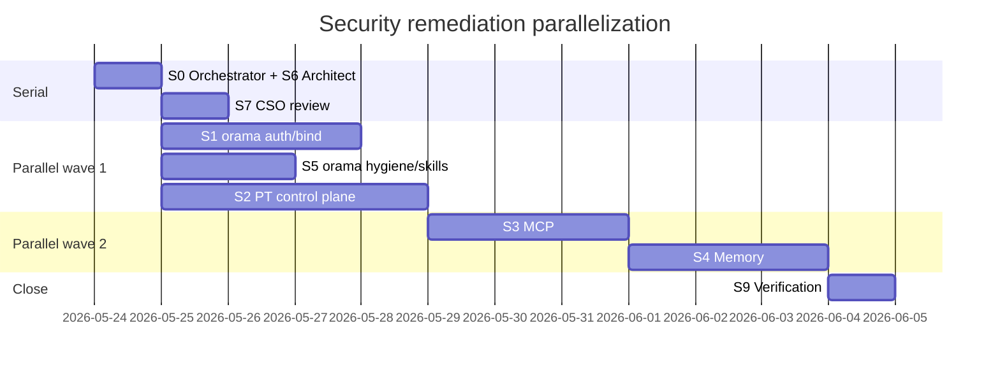

# Security Remediation Plan — Post PR Review (2026-05-23)

> **Date:** 2026-05-24 (plan authored)  
> **Source:** [`OpenClaw/v1/2026-05-23-security-markdown.md`](../../../OpenClaw/v1/2026-05-23-security-markdown.md)  
> **Methodology:** gstack `/autoplan` (CEO → Eng → DX auto-decisions; security findings treated as **non-negotiable** user challenges, not taste calls)  
> **Status:** Fixes **1–3 implemented** (2026-05-25). Fixes **4–6 queued** — see [`../SECURITY-POLICY.md`](../SECURITY-POLICY.md).

---

## Executive summary

The 2026-05-23 security review of the last ten merged PRs is **multi-repo**. Nothing on a shared LAN is production-safe until **Perpetua-Tools (PT)** and **orama-system** close the same trust boundary: authenticate every control-plane mutation, default-bind to loopback, and treat durable memory and MCP file tools as data-egress paths.

**Scope split:**

| Repository | Owns | orama-system role |
|------------|------|-------------------|
| **Perpetua-Tools** | `orchestrator/fastapi_app.py` job API, worker registry, MCP (`alphaclaw-mcp`, `local-agents`), RAG (`gossip_bus`, LanceDB), LM Studio / Win coder URL parsing | Consumer via `start.sh`; shared auth contract; hygiene gates for docs only |
| **orama-system** | `portal_server.py`, `api_server.py`, `start.sh` bind policy, `utils/control_plane_auth.py`, repo hygiene, OpenClaw skills/submodule bootstrap | Implement portal/API auth middleware, startup warnings, secret/path CI, skill hardening |
| **AlphaClaw** (packages in PT) | MCP server implementation | Remediation lands in PT tree; no separate orama code path |

**orama-only vs cross-repo:** Seven of nine finding classes touch PT or AlphaClaw packages. orama-system work is still required for the **portal**, **ultrathink API**, **start.sh** orchestration, **tracked-secret hygiene**, **openclaw-add-secret** skill, and **submodule supply-chain** policy.

**Already in orama (partial — do not re-implement blindly):**

- `utils/control_plane_auth.py` — bearer token, `ORAMA_INSECURE_DEV`, loopback-first `default_bind_host`, CORS allowlist helper, operator payload redaction
- `portal_server.py` / `api_server.py` — auth middleware hooks (verify route coverage is complete)
- `tests/test_control_plane_auth.py` — portal/API regression tests
- `config/mac-orchestrator.json` — `${env:...}` placeholders (post-redaction); `tests/test_repo_hygiene.py::test_scan_tracked_secrets_*`
- `scripts/review/repo_hygiene.py` — `scan_personal_paths`, `scan_tracked_secrets`
- `docs/2026-05-24-security-review-debug-and-fix-notes.md` — validated risks and bind guidance

**Strategic north star (one sentence):** One shared control-plane auth + redaction layer, loopback-by-default networking, and no durable or MCP egress without classification and redaction.

---

## Autoplan review digest (auto-decided)

### CEO — mode: HOLD SCOPE + SELECTIVE EXPANSION (security only)

| Finding | Decision | Principle |
|---------|----------|-----------|
| Defer all security for feature velocity | **Reject** | Security/feasibility blockers are never auto-deferred |
| Full rewrite of orchestration | **Reject** | P5 explicit over clever; extend existing `control_plane_auth` |
| Shared auth module across PT + orama | **Accept** | P4 DRY; single contract |
| RAG “ship later” on shared LAN | **Reject** | Data governance is in blast radius of #31 |
| Expand CI hygiene to PT in same PR | **Defer** to PT workstream | Cross-repo; separate PR with copied scanner |

**Premise gate (human):** Operating on a LAN with `start.sh` without `ORAMA_CONTROL_PLANE_TOKEN` and loopback bind is an explicit **dev-only** choice, not the default posture for “secured stack.”

### Eng — architecture

```
┌─────────────────────────────────────────────────────────────┐
│  Browser / MCP client / LAN peer                             │
└───────────────┬─────────────────────────────────────────────┘
                │  Bearer ORAMA_CONTROL_PLANE_TOKEN (mutations)
                ▼
┌───────────────────────┐     loopback      ┌────────────────────┐
│  portal_server :8002   │ ─────────────────►│  PT fastapi :8000   │
│  (orama)              │   + auth headers  │  (jobs, bootstrap)  │
└───────────┬───────────┘                   └─────────┬──────────┘
            │                                         │
            │ loopback                                │ workers
            ▼                                         ▼
┌───────────────────────┐                   ┌────────────────────┐
│  api_server :8001     │                   │ codex/gemini/agy/LM  │
│  (ultrathink)         │                   │ (gated capabilities) │
└───────────────────────┘                   └────────────────────┘
```

| Eng item | Decision |
|----------|----------|
| Default bind | `localhost` unless `*_BIND_LAN=1` + startup warning (extend current `start.sh`) |
| Auth default for operators | `ORAMA_INSECURE_DEV=0` + token in `.env.local` for any LAN bind |
| PT routes without auth | **Block** — extend PT `control_plane_auth` mirror of orama utils |
| Capability scopes (read vs mutate vs CLI) | **Accept** phase 2 — minimal v1: binary auth then scopes |
| Dangerous worker flags | Server-side env gate on PT (`ALLOW_DANGEROUS_CLI_WORKERS=0` default) |
| MCP path allowlist | Canonical roots only; reject absolute paths |
| Memory redaction before SQLite/Lance/embed | Shared redactor module in PT |
| Endpoint URL validator | Central parser in PT; block public IPs unless override |

### DX — operator runbook

| Touchpoint | Target |
|------------|--------|
| First secure start | Document in `.env.example` + `docs/local-env-catch-up.md`: set token, keep bind loopback |
| `start.sh` LAN warning | Already warns when `*_BIND_LAN=1`; add “set ORAMA_CONTROL_PLANE_TOKEN” |
| Secret onboarding skill | No argv secrets; Keychain read from stdin |
| Submodule updates | PR template + CI note when gitlink changes |

---

## Finding → phase map

| ID | Severity | Finding | Primary repo | Phase |
|----|----------|---------|--------------|-------|
| F1 | Critical | Unauthenticated job/portal control plane | PT + orama | 1–2 |
| F2 | High | MCP file/log exfiltration | PT (AlphaClaw) | 3 |
| F3 | High | RAG/GossipBus no governance | PT | 3 |
| F4 | High | Committed API-key-shaped secret | orama (remediated in tree; verify rotation) | 0 |
| F5 | Medium | Personal paths in docs | orama (fixed #37); CI hardening | 1 |
| F6 | Medium | `openclaw-add-secret` argv leak | orama | 4 |
| F7 | Medium | LM Studio / Win coder URL policy | PT | 3 |
| F8 | Medium | Submodule supply-chain policy | orama | 4 |
| F9 | Low | Portal 404 path disclosure | orama | 4 |

---

## Phased implementation

### Phase 0 — Immediate operator actions (same day)

**Goal:** Stop active credential abuse; no code required for rotation.

1. **Revoke/rotate** any Google API key that ever lived in `config/mac-orchestrator.json` (even if now `${env:...}`).
2. Set in **orama** `.env.local` (never commit):
   - `ORAMA_CONTROL_PLANE_TOKEN=<strong random>`
   - `ORAMA_INSECURE_DEV=0` when using LAN or shared machine
3. Do **not** set `PT_BIND_LAN`, `ORAMA_BIND_LAN`, or `PORTAL_BIND_LAN` until phases 1–2 are verified.
4. Confirm PT checkout is not exposed on `0.0.0.0:8000` without PT auth (PT phase 2).

**Verification:** Manual curl without `Authorization` → `401` on portal `/api/status` and orama `/ultrathink` with token enforced.

---

### Phase 1 — orama hygiene & defaults (orama-system only)

**Goal:** Fail closed in CI; secure-by-default docs; no machine-specific paths in committed docs.

| Work item | Files |
|-----------|-------|
| Mandate `repo_hygiene.py` in CI (pre-commit or workflow) | `.github/workflows/*` or existing hook chain, `scripts/review/repo_hygiene.py` |
| Confirm `scan_tracked_secrets` + `scan_personal_paths` block regressions | `tests/test_repo_hygiene.py` |
| Document secure start in operator runbook | `docs/local-env-catch-up.md`, `.env.example` |
| `start.sh`: require token when any `*_BIND_LAN=1` | `start.sh` |
| Audit portal routes for auth middleware gaps | `portal_server.py`, `tests/test_control_plane_auth.py` |

**Out of scope:** PT `fastapi_app` changes (phase 2 workstream).

---

### Phase 2 — Shared control-plane auth (PT + orama)

**Goal:** One bearer token; loopback default; portal proxies PT with `auth_headers()`.

| Work item | Repo | Files (indicative) |
|-----------|------|---------------------|
| Extract or align shared module | PT | `orchestrator/control_plane_auth.py` (orama tests already expect this path) |
| Apply dependency on all non-health PT `/v1/*` and mutating routes | PT | `orchestrator/fastapi_app.py` |
| Portal proxy passes `Authorization` to PT | orama | `portal_server.py` |
| CSRF for browser mutations (if cookie session added later) | orama | `portal_server.py` — **defer** if bearer-only v1 |
| Rate limit + audit log (minimal) | PT | new `orchestrator/audit.py` or middleware — **thin v1**: structured log line per mutation |
| Dangerous CLI workers behind env flag | PT | `orchestrator/worker_registry.py` |
| Integration test: unauthenticated job POST → 401 | PT | `tests/test_control_plane_auth.py` (PT) |

**orama touch list:** `utils/control_plane_auth.py`, `portal_server.py`, `api_server.py`, `start.sh`, `tests/test_control_plane_auth.py`, `.env.example`, `docs/local-env-catch-up.md`

**PT touch list:** `orchestrator/control_plane_auth.py`, `orchestrator/fastapi_app.py`, `orchestrator/worker_registry.py`, `tests/…`

---

### Phase 3 — Data egress boundaries (PT-primary)

**Goal:** MCP and memory cannot read arbitrary files or send raw secrets to embeddings.

| Work item | Repo | Files (indicative) |
|-----------|------|---------------------|
| MCP trust declaration + least-privilege tool sets | PT | `packages/alphaclaw-mcp/src/index.ts` |
| Path canonicalization + repo allowlist | PT | `packages/local-agents/src/orchestrator.js` |
| Shared redactor for config/logs/file reads | PT | new `orchestrator/redaction.py` |
| `MemoryRecord` schema + redact-before-persist | PT | `orchestrator/gossip_bus.py`, `orchestrator/memory_store.py`, `orchestrator/memory_embed.py` |
| Local-only embedding default; opt-in remote | PT | `orchestrator/memory_embed.py` |
| URL parser for LM Studio / Win coder | PT | `orchestrator/supervisor.py`, `orchestrator/worker_registry.py` |
| Extend `.gitignore` / hygiene for SQLite memory DBs | PT + orama | PT `.gitignore`, orama `repo_hygiene.py` artifact rules |

**orama role:** Hygiene rules for memory artifacts; documentation in `docs/v2/` only (no `Documents/Terminal xCode/...` paths).

---

### Phase 4 — orama polish & supply chain (orama-system only)

| Work item | Files |
|-----------|-------|
| Harden `openclaw-add-secret` (stdin, no `-w` on CLI) | `bin/orama-system/skills/openclaw-skills/skills/openclaw-add-secret/SKILL.md` |
| Submodule SHA change gate + review note template | `scripts/review/repo_hygiene.py` (new check), `docs/wiki/08-git-hygiene-and-branching.md`, `.github/pull_request_template.md` |
| Generic portal 404 (no local path in body) | `portal_server.py`, test |
| Backport personal-path lint **spec** for PT (separate PR) | N/A in orama — deliver `docs/plans/…` excerpt for PT maintainers |

---

### Phase 5 — Verification gate (all repos)

**Block merge without:**

| Gate | Command / tool |
|------|----------------|
| orama unit tests | `uv run pytest tests/test_control_plane_auth.py tests/test_repo_hygiene.py -q` |
| orama hygiene | `python scripts/review/repo_hygiene.py .` |
| PT unit tests (when PT PR ready) | `pytest orchestrator/tests/test_control_plane_auth.py` (path TBD in PT) |
| MCP path traversal tests | PT package tests |
| Memory redaction tests | PT tests with fixture payloads containing fake API keys |
| **verification-agent** | Orchestrator gate: PASS before crystallization |
| **cso** (optional comprehensive) | Monthly deep scan after v1 shipped |

---

## File touch list (orama-system consolidated)

| Path | Phase | Change type |
|------|-------|-------------|
| `utils/control_plane_auth.py` | 1–2 | Extend scopes, LAN+token guard helper |
| `portal_server.py` | 1–2, 4 | Auth coverage audit, 404 sanitization |
| `api_server.py` | 1–2 | Auth middleware parity |
| `start.sh` | 1 | Fail if LAN bind without token |
| `tests/test_control_plane_auth.py` | 1–2 | New routes / proxy cases |
| `scripts/review/repo_hygiene.py` | 1, 4 | CI mandatory; submodule gitlink check |
| `tests/test_repo_hygiene.py` | 1, 4 | New fixtures |
| `.env.example` | 0–1 | Secure defaults documented |
| `docs/local-env-catch-up.md` | 0–1 | Token + bind policy |
| `bin/orama-system/skills/.../openclaw-add-secret/SKILL.md` | 4 | stdin Keychain flow |
| `scripts/install-openclaw-skills.sh` | 4 | Doc-only supply-chain comment |
| `.github/workflows/*` | 1 | `repo_hygiene` job |

**Do not commit:** `.env.local`, literal tokens, machine-specific absolute paths.

---

## Agent distribution matrix

Use **parallel worktrees** (`scripts/worktree-bootstrap.sh`) when two or more executors write code simultaneously. CRG queries use **canonical** orama path; PT work uses PT repo root.

| Stream | Owner agent | Repo | Delivers | Depends on | Parallel? |
|--------|-------------|------|----------|------------|-----------|
| **S0 — Orchestration** | `ultrathink-orchestrator` | — | Phase ordering, blocker routing, verifier gate | — | N/A (serial coordinator) |
| **S1 — orama auth & bind** | `masterful-executor-agent` | orama | Phase 1 + orama half of phase 2 (portal, api, start.sh, tests) | — | Yes |
| **S2 — PT control plane** | `masterful-executor-agent` | Perpetua-Tools | Phase 2 PT (`fastapi_app`, workers, shared auth module) | S1 contract frozen (auth header name, env vars) | Yes (after 1-day contract sync) |
| **S3 — MCP & local agents** | `masterful-executor-agent` | PT / AlphaClaw pkgs | Phase 3 MCP path policy + tests | S2 auth (optional) | Yes |
| **S4 — Memory governance** | `masterful-executor-agent` | PT | Phase 3 RAG redaction/retention | S3 redactor (prefer shared module from S3) | Yes (after redactor interface) |
| **S5 — orama hygiene & skills** | `masterful-executor-agent` | orama | Phase 1 CI, phase 4 skill/submodule/404 | — | Yes |
| **S6 — Architecture** | `visionary-architect-agent` | PT + orama | Auth module boundary, capability scope enum, data-flow diagram | Before S2 implementation | Serial brief, then parallel |
| **S7 — Threat model** | `cso` | all | STRIDE on control plane + MCP + memory egress | Draft plan approved | After S6 |
| **S8 — Code review** | `code-reviewer` | per PR | High-confidence issues only | Each stream PR | Per PR |
| **S9 — Verification** | `verification-agent` | all | Phase 5 gate, pytest + hygiene | S1–S5 merged or staged | Serial last |
| **S10 — CI failures** | `ci-investigator` | per repo | Fix hygiene/workflow regressions | If CI red | As needed |

### Recommended parallelization



**Estimated calendar (single operator, agents parallelized):**

- **Day 0:** Phase 0 manual rotation + env (human).
- **Days 1–4 (parallel):** S1 + S5 + S2 (three executors).
- **Days 5–7 (parallel):** S3 + S4 after redactor contract.
- **Day 8:** S9 verification + S8 review on combined PRs.

Without parallel agents: roughly **2–3×** wall clock (order: S1 → S2 → S3 → S4 → S5).

---

## Test / verification checklist (copy for PRs)

### orama-system PR

- [ ] `ORAMA_INSECURE_DEV=0` + token → unauthenticated `/api/status` returns 401
- [ ] `/health` stays public
- [ ] `repo_hygiene.py` passes on tracked files
- [ ] No `AIzaSy…` / `xoxb-` patterns in tracked config
- [ ] No `/Users/` or machine-specific OpenClaw layout paths in docs (use `$OPENCLAW_ROOT`)
- [ ] LAN bind without token → `start.sh` exits non-zero (after phase 1)
- [ ] Portal 404 does not echo dashboard filesystem path

### Perpetua-Tools PR

- [ ] Unauthenticated `POST /v1/jobs` → 401
- [ ] Authenticated job create still works on loopback
- [ ] Dangerous workers disabled unless `ALLOW_DANGEROUS_CLI_WORKERS=1`
- [ ] MCP `local_agent_*` rejects path outside allowlist
- [ ] Memory insert strips `sk-…` / `AIzaSy…` test fixtures
- [ ] `WIN_CODER_ENDPOINTS` public IP rejected without override

---

## Decision audit trail (autoplan)

| # | Phase | Decision | Class | Principle |
|---|-------|----------|-------|-----------|
| 1 | 0 | Rotate exposed provider keys | Mechanical | Fail closed |
| 2 | 1 | CI mandatory for hygiene | Mechanical | Completeness |
| 3 | 2 | Shared bearer auth PT+orama | Mechanical | DRY |
| 4 | 2 | Scopes v2 after binary auth | Taste | Ship lake first |
| 5 | 3 | Single redactor module | Mechanical | DRY |
| 6 | 3 | Block public model URLs by default | Mechanical | Explicit egress |
| 7 | 4 | Submodule SHA requires review note | Mechanical | Supply chain |
| 8 | 4 | stdin for Keychain secret input | Mechanical | No argv secrets |

---

## Cross-repo coordination notes

1. **Terminology:** `orchestrator` only in public APIs/docs (never `coordinator`).
2. **Secrets:** `.env.local` only; `config/mac-orchestrator.json` stays `${env:VAR}` placeholders.
3. **PT is runtime authority;** orama stays stateless — auth helpers are shared contract, not duplicated business logic in orama.
4. **Do not** document machine-specific paths; use `$REPO_ROOT`, `<workspace>`, `~/.orama-system/`.
5. **Reference:** [`docs/2026-05-24-security-review-debug-and-fix-notes.md`](../2026-05-24-security-review-debug-and-fix-notes.md) for validated bind/auth behavior on branch `cursor/application-security-review-8a3d`.

---

## Final approval gate (human)

| Item | Recommendation |
|------|----------------|
| Proceed multi-repo | **Yes** — PT phases 2–3 are blocking for LAN safety |
| orama-only first PR | **Yes** — phase 1 + S5 can ship before PT auth merges |
| Default `ORAMA_INSECURE_DEV` flip | **Taste** — prefer `0` in `.env.example` comment; keep `1` in `tests/conftest.py` for local pytest |
| History rewrite for old key | **Only if** key was valid on public remote — else rotation suffices |

---

## Related documents

- Source findings: `OpenClaw/v1/2026-05-23-security-markdown.md`
- Debug notes: `docs/2026-05-24-security-review-debug-and-fix-notes.md`
- Unified absorption (gates): `docs/2026-05-14--UNIFIED-ABSORPTION-PLAN.md`
- HITL classes: `docs/HUMAN-IN-LOOP-ACCOUNTABILITY.md`
