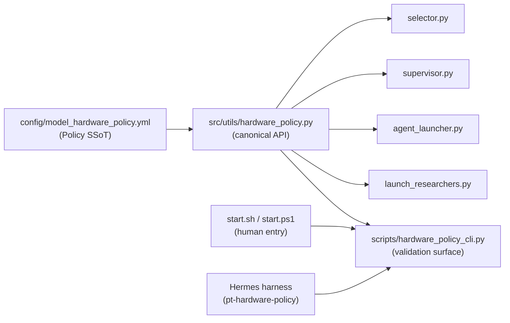
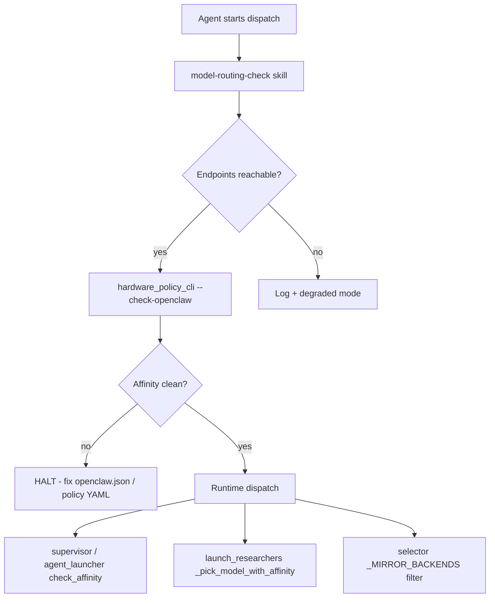

# Hermes Windows Hardware Policy — Live Walkthrough Plan

> **Date:** 2026-06-24 (review pass 2026-06-25) · **Owner:** orama-system (L3) + Perpetua-Tools (L2)
> **Status:** 📋 PLANNED (live Windows walkthrough only) — execute Phases A–F on a live Windows 11 host (deferred session). **orama #107 is already MERGED** (`6e850f8`); only PT #134 may remain open.
> **Branch:** orama #107 merged → `feat/hermes-harness-onboarding` carries it; PT `cursor/critical-bug-investigation-a924` (#134) in `$PERPETUA_TOOLS_PATH`
> **Author:** Cursor Cloud Agent + cyre
> **Review trigger:** Next Windows Hermes bring-up (orama #107 no longer gates this — it is merged)
> **Canonical architecture:** [Cross-Harness Hardware Policy Architecture](../hermes-hardware-policy-cross-harness.md) — **single source of truth for the harness model below; do not re-edit it in three places.**

> **Cross-repo path contract:** every `$PERPETUA_TOOLS_PATH/…` below is the L2 repo (canonical name **Perpetua-Tools**; on this host the on-disk clone is `…/ultrathink/Perplexity-Tools`). Reference it through the env var, never a literal sibling name.

---

## Executive summary

This plan captures the full hardware-affinity workstream completed in-session and
schedules a **live Windows walkthrough** for a future date: `install.ps1` →
`start.ps1 --hardware-policy` on a real Win11 Hermes host.

**Real purpose (AFRP):** PR #134 was never only an import hoist. The stack exists
to establish **one canonical policy consumption path** across all harnesses — OpenClaw
(Mac/Linux) and Hermes (Windows) — so parallel orchestrators never infer affinity
independently at runtime.

| What it looked like | What it actually was |
|---------------------|----------------------|
| CLI import cleanup | Integration-branch hygiene after nested merges #128–#131 |
| Docstrings for CodeRabbit | Agent-readable invariants (no duplicate parsers) |
| Review 9887 → merge a924 → rebase | Repair nested merge integrity before human sign-off |
| Hermes wiring (orama #107) | Extend integrity to Windows — same YAML, reversed platform role |

---

## AFRP gate (session classification)

```text
AFRP Gate: Type C | Level Practitioner | Mode 2
Scope: Wire Hermes Windows to PT hardware policy SSoT; document platform harness model;
       plan live Windows validation for a future session.
```

---

## Platform harness model

Three hosts, two harness families, **one** policy file:

| Host OS | Primary harness | Startup gate | LM Studio role | Orchestrator role |
|---------|-----------------|--------------|----------------|-------------------|
| **macOS** | OpenClaw (`start.sh`) | `./start.sh --hardware-policy` | Mac MLX home; Win GGUF = **NEVER_MAC** | Mac orchestrator |
| **Linux** | OpenClaw (`start.sh`) | same as macOS | Any documented PT profile (physical HW permitting) | Full hardware matrix peer |
| **Windows 11** | Hermes + `start.ps1` | `.\platform\windows\start.ps1 --hardware-policy` | Win GGUF at **localhost:1234** | Hermes = parallel local orchestrator / autoresearcher |

### Role reversal on Windows

```
Mac OpenClaw orchestrator              Windows Hermes orchestrator
─────────────────────────              ───────────────────────────
LM Studio Win over LAN                 LM Studio Win at localhost:1234
($WIN_IP:1234)                         (install.ps1 → lmstudio-win)

windows_only models = NEVER_MAC        windows_only models = ALLOWED (physical home)
Mac MLX = home                         Mac MLX = NEVER_WIN
```

**Linux note:** macOS and Linux share the **same OpenClaw harness software** (`start.sh`).
Linux is not a reduced policy consumer — it may run any profile documented in PT
`hardware/SKILL.md`, subject to physical GPUs/backends present.

---

## The invariant (why this exists)

From `$PERPETUA_TOOLS_PATH/config/model_hardware_policy.yml`:

> Dispatching `windows_only` models to Mac = OOM, missing CUDA kernel, or
> **"double barrel" GPU damage** when Mac LM Studio mirrors a Win model via LAN
> proxy and Win dispatches it concurrently.

### LM Studio proxy gotcha

Mac `/v1/models` lists **Windows models too** (LAN proxy). You cannot infer physical
hardware from which endpoint lists a model. Enforcement uses **provider name**
(`lmstudio-mac` vs `lmstudio-win`), not model-list membership.

Example: `gemma-4-26B-A4B-it-Q4_K_M` can appear on `lmstudio-mac` but is **NEVER_MAC**.

---

## Five gaps closed (PRs #128–#131)

| # | Gap | Where | Failure mode | Fix |
|---|-----|-------|--------------|-----|
| 1 | Blind fallback | `launch_researchers.py` | `models[0]` without filter | `_pick_model_with_affinity` |
| 2 | Platform never passed | `run_researcher()` | Win researchers used Mac rules | `_platform_for_role(role)` |
| 3 | Preferred-model bypass | resolvers | Listed Win model accepted on Mac | Filter before returning preferred |
| 4 | Alias sections ignored | `load_policy()` | Quant-suffixed ids bypass NEVER_MAC | `_normalize_policy` |
| 5 | Duplicate CLI parser | `hardware_policy_cli.py` | `start.sh --check-openclaw` false-negative | Delegate to `utils.hardware_policy` |

PR #122 hardened `supervisor`, `agent_launcher`, `worker_registry` — but
`launch_researchers.py` and the CLI validation path were missed.

### Nested merge chain

| PR | Flow | Fix |
|----|------|-----|
| #128 | `299a` → `main` | `_pick_model_with_affinity` + platform param |
| #129 | `a924` → `main` | Wire platform; close preferred bypass |
| #130 | `c16f` → `a924` | Merge `windows_only_aliases` into `load_policy()` |
| #131 | `9887` → `a924` | CLI delegates to canonical loader |

**Lesson:** GitHub "merged" ≠ branch tip updated. Always verify with
`git diff origin/main...origin/<branch>` (DECISIONS.md §2026-06-24).

---

## Architecture — canonical enforcement stack



| Layer | File | Role |
|-------|------|------|
| Policy SSoT | `config/model_hardware_policy.yml` | Machine truth — lists + aliases |
| Canonical API | `src/utils/hardware_policy.py` | `load_policy`, `check_affinity`, `filter_models_for_platform` |
| CLI validation | `scripts/hardware_policy_cli.py` | Delegates to API — **never duplicate parsers** |
| Researcher dispatch | `scripts/launch_researchers.py` | `_platform_for_role`, `_pick_model_with_affinity` |
| Runtime gates | `agent_launcher.py`, `supervisor.py`, `worker_registry.py` | `check_affinity` before spawn |
| Discovery filter | `src/perpetua/discovery/selector.py` | `_MIRROR_BACKENDS` excludes mirror dispatch |
| Mac/Linux entry | `orama-system/start.sh --hardware-policy` | Calls CLI |
| Windows entry | `orama-system/platform/windows/start.ps1 --hardware-policy` | Same CLI |

---

## Deep review walkthrough (methodical sequence)

### Step 1 — Policy YAML

**File:** `$PERPETUA_TOOLS_PATH/config/model_hardware_policy.yml`

- `windows_only` + `windows_only_aliases` → NEVER on Mac
- `mac_only` + `mac_only_aliases` → NEVER on Win
- `shared` + `shared_aliases` → both platforms
- Comments document proxy gotcha + anti-mirror dispatch rule

**Harness rule:** cite YAML; never restate full lists in Hermes/OpenClaw skills.

### Step 2 — Resolver logic

**File:** `$PERPETUA_TOOLS_PATH/scripts/launch_researchers.py`

```
run_researcher(role)
  → platform = _platform_for_role(role)
  → _resolve_lmstudio_model(..., platform=platform)
      → fetch /v1/models (untrusted list)
      → _pick_model_with_affinity(models, preferred, platform)
          → filter_models_for_platform(models, platform)
          → preferred only if in allowed (not merely in models)
          → else allowed[0]
```

**Windows Hermes parallel:** Hermes does not use `launch_researchers` directly, but the
**same policy** governs which models it may bind to `localhost:1234`. Hermes must call
PT CLI before dispatch — not read `/v1/models` and guess.

### Step 3 — Alias merge

**File:** `$PERPETUA_TOOLS_PATH/src/utils/hardware_policy.py` → `_normalize_policy()`

LM Studio reports quant-suffixed ids (e.g. `gemma-4-26B-A4B-it-Q4_K_M`) that differ
from base `windows_only` entries. Policy YAML keeps aliases in `*_aliases` keys;
`_normalize_policy` folds them into enforceable lists before any check.

**Tests:**
- `test_load_policy_merges_windows_only_aliases`
- `test_hardware_policy_blocks_gemma_quant_alias_on_mac`
- `test_resolve_lmstudio_model_filters_gemma_quant_alias_on_mac`

### Step 4 — OpenClaw validation

**File:** `$PERPETUA_TOOLS_PATH/scripts/hardware_policy_cli.py`

- `--check-openclaw` iterates `lmstudio-*` providers in `~/.openclaw/openclaw.json`
- OpenClaw dispatches **directly** from this file — bypasses supervisor
- Platform inferred from provider id (`mac` in id → Mac, else Win)

| Host | Entry point |
|------|-------------|
| Mac/Linux | `./start.sh --hardware-policy` |
| Windows | `.\platform\windows\start.ps1 --hardware-policy` |

**Residual note:** `start.sh` status display uses `run_hardware_policy_check || true`
(informational). The `--hardware-policy` flag path is fail-closed.

### Step 5 — Skills consumption (robust execution)

**Load order for any agent touching models:**

1. `.claude/skills/hardware-policy/SKILL.md` (PT operational playbook)
2. Platform-specific: `hermes-harness` (Win) or `openclaw-skills` (Mac/Linux)
3. Pre-dispatch: `model-routing-check` skill (reachability + `--check-openclaw`)

**Invariant in PT `AGENTS.md`:** after changing `hardware_policy.py`, grep for duplicate parsers:
```bash
rg '_simple_policy_parse|def _forbidden' --glob '*.py'
```

### Agent dispatch flow (all harnesses)



---

## What was shipped in-session (reference)

### orama-system (`cursor/hermes-hardware-policy-wire-c4ae` → PR #107)

| File | Change |
|------|--------|
| `bin/orama-system/skills/hermes-harness/SKILL.md` | Platform Harness Model; mandatory policy gate |
| `commands/pt-hardware-policy/SKILL.md` | New Hermes command card |
| `install_hermes_thin_skills.py` | `/pt-hardware-policy` wrapper; argparse fix |
| `hardware-affinity-gate/SKILL.md` | Pointer to PT canonical — no embedded logic |
| `docs/wiki/15-hermes-windows-harness.md` | Policy gate in verification |
| `docs/cross-platform.md` | Harness roles section |
| `platform/windows/README.md` | Policy delegation note |
| `tests/test_hermes_thin_skills.py` | Four-wrapper test update |

### Perpetua-Tools (`cursor/critical-bug-investigation-a924` → PR #134)

| File | Change |
|------|--------|
| `scripts/hardware_policy_cli.py` | Import hoist + agent docstrings |
| `src/utils/hardware_policy.py` | `_normalize_policy` / `load_policy` docstrings |
| `.claude/skills/hardware-policy/SKILL.md` | Platform matrix; Windows entry points |
| `AGENTS.md` | Hardware affinity cross-agent invariants |
| `SKILL.md` | Fixed stale module paths |
| `model-routing-check` skill | Affinity gate step |
| `docs/wiki/09-hardware-affinity.md` | Hermes Windows section |

---

## PLANNED: Live Windows walkthrough (next session)

> **Defer execution.** Run this checklist on a physical Win11 host with LM Studio,
> Hermes, and sibling repos checked out.

### Prerequisites

- [ ] Windows 11 with Git for Windows (or GitHub Desktop Git Bash)
- [ ] LM Studio running with `windows_only` model loaded (27B GGUF or gemma quant)
- [ ] Repos cloned as siblings (or `PERPETUA_TOOLS_PATH` / `ORAMA_SYSTEM_PATH` set):
  - `Perpetua-Tools`
  - `orama-system`
- [ ] Python 3.11+ with PT venv or system Python on PATH
- [ ] Hermes installed per `hermes-harness` skill (`%LOCALAPPDATA%\hermes`)

### Phase A — `install.ps1` (one-time setup)

From **orama-system** repo root in PowerShell (UTF-8):

```powershell
[Console]::OutputEncoding = [System.Text.Encoding]::UTF8
$env:PYTHONIOENCODING = 'utf-8'
$env:PYTHONUTF8 = '1'

Set-ExecutionPolicy -Scope CurrentUser RemoteSigned   # once
.\platform\windows\install.ps1
```

**Verify install.ps1 outcomes:**

| Check | Expected |
|-------|----------|
| LM Studio probe | Listening on `localhost:1234` (warn OK if not started yet) |
| `~/.openclaw/openclaw.json` | `lmstudio-win` → `http://localhost:1234` |
| `ollama-win` | `http://localhost:11434` (if Ollama present) |
| `platform` field | `windows` |

```powershell
Get-Content "$env:USERPROFILE\.openclaw\openclaw.json" | ConvertFrom-Json |
  Select-Object -ExpandProperty models |
  Select-Object -ExpandProperty providers
```

### Phase B — Hermes thin skills (policy command)

```powershell
cd <orama-system-root>
python bin\orama-system\skills\hermes-harness\scripts\install_hermes_thin_skills.py --install
python bin\orama-system\skills\hermes-harness\scripts\install_hermes_thin_skills.py --verify
```

**Expected wrappers:** `/pt-hardware-policy`, `/pt-orama-council`, `/pt-orama-review`, `/pt-orama-delegate`

### Phase C — `start.ps1 --hardware-policy` (affinity gate)

```powershell
cd <orama-system-root>
.\platform\windows\start.ps1 --hardware-policy
echo "exit=$LASTEXITCODE"
```

**Pass criteria:**

| Test | Command | Expected |
|------|---------|----------|
| Policy lists | (output of `--list` via start.ps1) | `windows_only` includes gemma quant alias |
| OpenClaw clean | `--check-openclaw` section | `✅ openclaw.json clean` OR actionable violations |
| NEVER_WIN probe | Direct CLI validate MLX on win | exit 0 or N/A if no MLX assigned |
| windows_only allowed | `python $env:PERPETUA_TOOLS_PATH\scripts\hardware_policy_cli.py --validate "<27B reasoning id from policy YAML>" win` | exit 0 |

Direct PT CLI (same enforcement path):

```powershell
$PtDir = $env:PERPETUA_TOOLS_PATH   # on this host: ...\ultrathink\Perplexity-Tools
python "$PtDir\scripts\hardware_policy_cli.py" --list
python "$PtDir\scripts\hardware_policy_cli.py" --check-openclaw
python "$PtDir\scripts\hardware_policy_cli.py" --validate "gemma-4-26B-A4B-it-Q4_K_M" win
```

### Phase D — Hermes dispatch canary (after policy passes)

Only after Phase C passes:

```powershell
$hermesScripts = Join-Path $env:LOCALAPPDATA "hermes\hermes-agent\venv\Scripts"
$env:PATH = "$hermesScripts;$env:PATH"

hermes chat --query "Reply with exactly: HERMES_READY" --quiet --safe-mode `
  --provider nous --model nvidia/nemotron-3-ultra:free --max-turns 1
```

For LM Studio local routing (after verifying model responds quickly):

```text
Base URL: http://127.0.0.1:1234/v1
API key: lm-studio
Model: <windows_only model from policy YAML>
```

**Rule:** Never bind a model from `/v1/models` list alone — confirm against policy first.

> **Model-ID provenance (verified 2026-06-25):** the IDs used as examples in this plan — `Qwen3.5-27B-Claude-4.6-Opus-Reasoning-Distilled-v2`, `gemma-4-26B-A4B-it-Q4_K_M`, `gemma-4-e4b-it` — are real entries in `$PERPETUA_TOOLS_PATH/config/model_hardware_policy.yml` (lines 44/50/60/61), not invented. Do not confuse the valid `gemma-4-e4b-it` with `gemma4:e4b`, which the canonical onboarding plan lists as a **known-invalid** malformed form. Always resolve the exact id from a live `/v1/models` probe and cross-check against the YAML.

### Phase E — Negative test (optional but recommended)

Temporarily assign a `mac_only` / MLX model to `lmstudio-win` in `openclaw.json`, then:

```powershell
.\platform\windows\start.ps1 --hardware-policy
```

Expected: **exit non-zero**, NEVER_WIN violation reported. Revert `openclaw.json` after test.

### Phase F — Record results

- [ ] Append dated entry to `orama-system/docs/LESSONS.md`
- [ ] Append to `$PERPETUA_TOOLS_PATH/docs/LESSONS.md` if PT-specific finding
- [ ] Update this plan status: PLANNED → DONE with date + host spec
- [ ] Mark PT #134 ready for merge if all gates green (orama #107 already merged)

---

## Validation commands (offline, any host)

```bash
# orama-system
pytest tests/test_hermes_thin_skills.py -q
python bin/orama-system/skills/hermes-harness/scripts/install_hermes_thin_skills.py --test

# Perpetua-Tools
python3 scripts/hardware_policy_cli.py --validate gemma-4-26B-A4B-it-Q4_K_M mac   # exit 1
pytest tests/test_launch_researchers_affinity.py tests/test_hardware_routing.py -q
```

---

## Related skills and docs

| Resource | Path |
|----------|------|
| Hermes harness (canonical) | `bin/orama-system/skills/hermes-harness/SKILL.md` |
| PT hardware policy | `$PERPETUA_TOOLS_PATH/.claude/skills/hardware-policy/SKILL.md` |
| Hermes Windows wiki | `docs/wiki/15-hermes-windows-harness.md` |
| PT affinity wiki | `$PERPETUA_TOOLS_PATH/docs/wiki/09-hardware-affinity.md` |
| Cross-platform harness roles | `docs/cross-platform.md` § Harness roles |
| Windows platform README | `platform/windows/README.md` |
| PT policy YAML | `$PERPETUA_TOOLS_PATH/config/model_hardware_policy.yml` |

---

## Open PRs (merge order suggestion)

1. **Perpetua-Tools #134** — docstrings + skills wiring (affinity closure on PT side). Status: verify against `$PERPETUA_TOOLS_PATH` `main` — may already be merged.
2. ~~**orama-system #107**~~ — **MERGED** (`6e850f8` on `feat/hermes-harness-onboarding`). Hermes harness policy consumption is already in this branch's history; no longer an open PR.

---

## Changelog

| Date | Event |
|------|-------|
| 2026-06-24 | Plan authored from Cursor Cloud session: nested branch repair, PR #134 review, Hermes wiring |
| TBD | Live Windows walkthrough executed (Phase A–F) |
