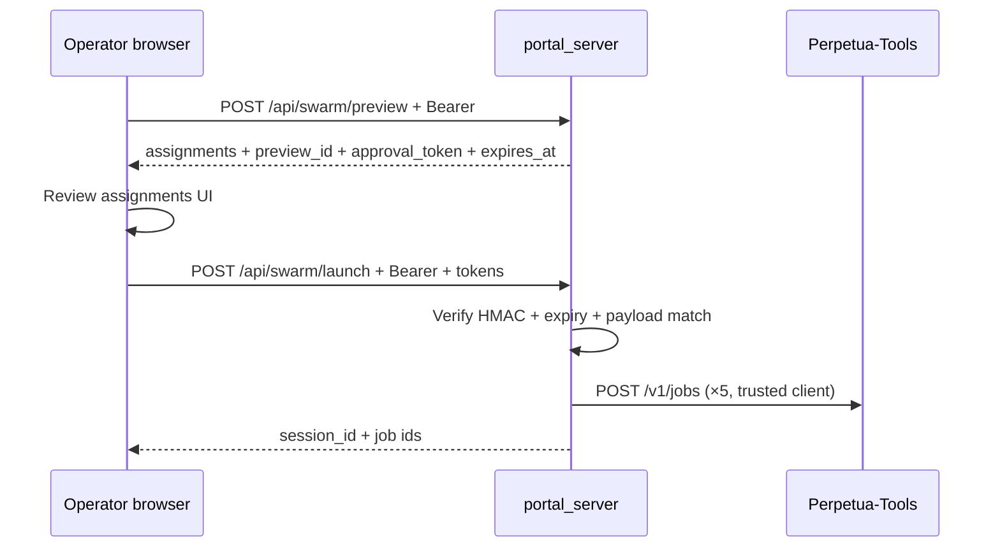

<!-- /autoplan restore point: $HOME/.gstack/projects/orama-system/cursor-security-pr3-swarm-approval-f559-autoplan-restore-20260629-095831.md -->

# PR3 Execution Plan — P5 Server-Side Swarm Approval

> **Status:** ✅ `/autoplan` APPROVED — ready for T1–T7 implementation  
> **Review branch:** `cursor/security-pr3-swarm-approval-f559` (2026-06-29)  
> **Date:** 2026-06-28  
> **Method:** oramasys-method (AFRP Type C, Mode 2)  
> **Parent stack:** [`2026-06-28-security-pr3-pr6-zero-queue-plan.md`](2026-06-28-security-pr3-pr6-zero-queue-plan.md)  
> **Planner subagent:** `.cursor/agents/pt-orama-security-planner.md`  
> **Branch:** `cursor/security-pr3-swarm-approval-f559` (from current `main`)  
> **SECURITY.md finding:** P5 (High) — client `approved: true` is not true HITL

---

## AFRP

```text
AFRP: Type C | Level Practitioner | Mode 2
Scope: Replace client-controlled swarm launch approval with HMAC-bound preview tokens in orama-system only.
```

---

## Why PR3 first? (plain language)

Three phrases from the stack plan, unpacked:

| Phrase | Meaning |
|--------|---------|
| **Highest remaining High** | After PR1–PR2 merged to `main`, the severity queue’s open **High** items are P5 (swarm), P6 (discovery), and P3 partial (Windows bind). P5 is the highest-risk *mutating* path still trusting a client boolean — it dispatches five PT jobs with attacker-controlled prompts once bearer auth passes. |
| **orama-only** | Swarm preview/launch lives entirely in `orama-system` (`portal_server.py`, React command center). Perpetua-Tools already gates `POST /v1/jobs` with bearer auth (Fix 3). No PT code changes required for P5. |
| **No discover coupling** | P6 touches `scripts/discover.py`, LAN probes, `pending_discovery.json`, and portal `/api/rediscover`. P5 does not — isolated surface, smaller blast radius, no shared state with discovery persistence. |

**Recommendation:** Ship PR3 before PR4 so job dispatch HITL is fixed without mixing discovery approval semantics.

---

## Problem (current `main`)

PR1 closed unauthenticated swarm launch (401 without bearer). **P5 remains:** any authenticated client (or XSS on loopback dashboard) can POST:

```json
{ "objective": "…", "approved": true }
```

Server accepts the bool and dispatches five jobs to PT — no proof the operator reviewed the preview assignments.

```2073:2077:src/orama_system/portal_server.py
@app.post("/api/swarm/launch")
async def api_swarm_launch(req: SwarmLaunchRequest):
    """Launch approved preview assignments as PT-owned jobs; orama stores no job state."""
    if not req.approved:
        raise HTTPException(status_code=422, detail="approved=true is required")
```

React composer hardcodes `approved: true` on launch (`web/src/features/command-center/SwarmComposer.tsx`).

**Root cause:** RC-4 partial — UX shortcut (`approved` in request body) used as authorization.

---

## Design (minimal, stateless)

### Flow



### Token contract

| Field | Rule |
|-------|------|
| `preview_id` | UUID v4, returned by preview |
| `approval_token` | `base64url(hmac_sha256(secret, canonical_payload))` |
| `expires_at` | ISO-8601 UTC; default TTL **15 minutes** |
| `secret` | `ensure_control_plane_token()` value (same as bearer verification) |
| `canonical_payload` | Stable JSON: `{preview_id, objective, task_type, optimize_for, preferred_device, assignments_hash}` where `assignments_hash = sha256(json.dumps(assignments, sort_keys=True))` |

**Stateless:** no server-side preview store; verification re-computes hash from launch request fields and compares to signed payload.

### API changes

**`POST /api/swarm/preview`** — add to response:

```json
{
  "preview_id": "…",
  "approval_token": "…",
  "expires_at": "2026-06-28T12:15:00+00:00",
  "assignments": [ … ],
  "hardware_policy": { … }
}
```

**`POST /api/swarm/launch`** — require `preview_id` + `approval_token`; **reject** if:

- tokens missing or malformed
- `expires_at` in payload past now
- HMAC mismatch (tampered objective/assignments)
- `assignments_hash` does not match recomputed preview

**Deprecate** `approved: bool` — ignore if present; return **422** with clear message if tokens absent (no silent fallback to `approved: true`).

### Helper placement

Add to `src/utils/control_plane_auth.py` (reuse auth secret, keep portal thin):

- `sign_operator_payload(payload: dict, *, ttl_seconds: int = 900) -> dict` → `{token, expires_at}`
- `verify_operator_payload(payload: dict, token: str, expires_at: str) -> bool`

Portal wrappers: `_sign_swarm_preview(preview: dict) -> dict`, `_verify_swarm_launch(req, preview_body) -> None` (raises HTTPException).

---

## Execution tasks (TDD order)

| Step | Task | Verify |
|------|------|--------|
| **T1** | Add `sign_operator_payload` / `verify_operator_payload` + unit tests in `tests/test_control_plane_auth.py` | pytest green |
| **T2** | Extend `_build_swarm_preview` return path / `api_swarm_preview` to attach `preview_id`, token, expiry | `tests/test_swarm_preview.py` |
| **T3** | Harden `api_swarm_launch`: require tokens, verify HMAC, reuse preview body (do not rebuild assignments from stale client-only fields without check) | `tests/test_swarm_launch.py` |
| **T4** | Security regressions: bearer + invalid/missing/expired/tampered token | `tests/test_portal_mutating_route_auth.py` |
| **T5** | React: store preview tokens from preview response; launch sends `preview_id` + `approval_token`; disable launch until preview succeeded | `web/` vitest if present; manual API contract |
| **T6** | Update `SECURITY.md` P5 row + A1 workstream remainder (additive annotation) | doc lint |
| **T7** | Run targeted suite (below) + `repo_hygiene.py` | all pass |

---

## Files to touch

| Path | Change |
|------|--------|
| `src/utils/control_plane_auth.py` | HMAC sign/verify helpers |
| `src/orama_system/portal_server.py` | Preview signing, launch verification, pydantic models |
| `web/src/api/swarm.ts` | Types + launch request shape |
| `web/src/features/command-center/SwarmComposer.tsx` | Hold tokens from preview; gate launch |
| `tests/test_control_plane_auth.py` | Sign/verify unit tests |
| `tests/test_swarm_preview.py` | Assert token fields present |
| `tests/test_swarm_launch.py` | Token-required paths |
| `tests/test_portal_mutating_route_auth.py` | Authed but no token → 422/403 |
| `SECURITY.md` | P5 remediated note |

**Out of scope (PR3):** `scripts/discover.py`, `start.ps1`, CSRF middleware, PT repo, session cookie UX (PR5).

---

## Acceptance criteria

- [ ] `POST /api/swarm/launch` with valid bearer but **no** `approval_token` → **422** (not 200)
- [ ] Valid preview → launch with matching tokens → dispatches PT jobs (existing behavior)
- [ ] Tampered `objective` between preview and launch → **403**
- [ ] Expired token → **403**
- [ ] Wrong `preview_id` → **403**
- [ ] Unauthenticated launch → **401** (unchanged, PR1)
- [ ] React composer cannot launch without prior preview in session
- [ ] `SECURITY.md` P5 annotated remediated with test anchor

---

## Test commands

```bash
cd "$(git rev-parse --show-toplevel)"
python3 -m pytest \
  tests/test_control_plane_auth.py \
  tests/test_swarm_preview.py \
  tests/test_swarm_launch.py \
  tests/test_portal_mutating_route_auth.py -q
python3 scripts/review/repo_hygiene.py .
# If web touched:
cd web && pnpm test --run 2>/dev/null || true
```

---

## SECURITY.md sync

**orama-system only** for PR3. Additive update to §B P5 and §A1 remainder:

- P5: “**2026-06-XX:** server-side HMAC preview token required on launch; client `approved` deprecated.”
- Remove P5 from “Remaining toward zero open queue” line; leave P6, CSRF, P3 partial.

**Perpetua-Tools `SECURITY.md`:** no code change; optional one-line cross-ref under control-plane if swarm is documented there.

---

## Risks and mitigations

| Risk | Mitigation |
|------|------------|
| Token secret rotation invalidates in-flight previews | Acceptable; operator re-previews (15m TTL) |
| Launch rebuilds preview server-side (double PT route calls) | Verify hash of **returned** preview matches signed payload; optionally cache preview in launch req body under hash check |
| Breaking API clients sending only `approved: true` | Intentional break; 422 message documents new fields |
| `ORAMA_INSECURE_DEV=1` dev mode | Still require tokens in dev (HITL is not optional) |

---

## Branch and PR

```bash
git checkout main && git pull --ff-only
git checkout -b cursor/security-pr3-swarm-approval-f559
# … implement T1–T7 …
git push -u origin cursor/security-pr3-swarm-approval-f559
```

Open draft PR → `main`, title: `fix(security): P5 server-side swarm approval tokens (PR3)`.

**Stack:** PR4 (P6 discovery) rebases on this branch after merge.

---

## Crystallize (expected outcome)

P5 closes the last **High-severity mutating shortcut** in the portal job-dispatch path without touching LAN discovery or Windows bind policy. **Server-bound launch intent** becomes: *preview assignments → server issues HMAC token → launch must present token* — aligned with RC-4. This is **preview–launch integrity binding**, not cryptographic proof of human review (PR5 CSRF/session + audit follow-on).

---

## GSTACK REVIEW REPORT

> **Generated:** 2026-06-29 · `/autoplan` on `cursor/security-pr3-swarm-approval-f559`  
> **Verdict:** **APPROVED** with P0 amendments below (incorporated into T1–T5)  
> **UI scope:** yes (SwarmComposer) · **DX scope:** yes (API contract break)

### Plan amendments (must apply during implementation)

| # | Amendment | Rationale |
|---|-----------|-----------|
| **A1** | Include `expires_at` inside HMAC canonical payload (not a separate trusted field) | Prevents expiry extension / replay oracle |
| **A2** | T3 flow: verify MAC → rebuild preview → recompute hash → constant-time compare → dispatch **rebuilt** assignments only | Closes TOCTOU; never dispatch client assignments |
| **A3** | T5: store tokens in composer state; clear on any preview-field change; remove `mockSwarmPreview` launch bypass | UI false-HITL today |
| **A4** | SECURITY.md wording: "HMAC-bound preview required" — not "true HITL" | Honest compliance narrative |
| **A5** | Add acceptance: launch with valid token but changed `task_type` → **403** | Tamper coverage |
| **A6** | Golden vector test for `assignments_hash` canonical JSON | Hash stability contract |

### Premises (confirmed at gate)

| # | Premise | Verdict |
|---|---------|---------|
| P1 | PR1 closed unauthenticated swarm launch | ✅ Confirmed |
| P2 | P5 is highest-risk **mutating** portal path remaining | ✅ Accept (P6/L1 follow) |
| P3 | Threat = authenticated client skipping preview via `approved: true` | ✅ Confirmed in code |
| P4 | HMAC token proves **server preview participation**, not human eyes | ✅ Accept with honest docs |
| P5 | Stateless HMAC + 15m TTL is acceptable for v1 | ✅ Accept; document double-launch within TTL |
| P6 | `orama-only`; no PT code changes | ✅ Confirmed |
| P7 | Launch rebuild for routing is OK if hash-locked | ✅ Accept with A2 ordering |

### What already exists

| Asset | State |
|-------|-------|
| `_build_swarm_preview()` | ✅ Five-role assignments + hardware policy |
| `api_swarm_launch` | ⚠️ `approved: true` + rebuild preview |
| `ensure_control_plane_token()` | ✅ Secret source for HMAC (T1) |
| `tests/test_swarm_*.py` | ⚠️ All `approved`-based — rewrite in T3/T4 |
| `SwarmComposer.tsx` | ⚠️ Hardcoded `approved: true`; weak `canLaunch` gate |
| `CommandCenter.tsx` | ⚠️ Seeds `mockSwarmPreview` — enables launch without API preview |
| `sign_operator_payload` | ❌ Absent — blocks L1 `l1_dispatch.py` |

### NOT in scope (deferred)

- P6 discovery approval (PR4) — reuse same helper with `scope=discovery`
- CSRF / session cookie (PR5)
- Audit log / operator identity (post-merge stub)
- PT `/v1/jobs` attestation
- Single-use token consume / nonce store (accepted risk F10 for v1)
- `contextProfile` UI control (cosmetic; not in API)

### Dream state delta

```text
TODAY          → AFTER PR3 (amended)     → 6-MONTH IDEAL
approved:true  → HMAC preview token      → CSRF + session + audit + unified scopes
rebuild launch → hash-locked rebuild     → signed exact payload dispatch
no sign helper → sign_operator_payload   → swarm + discovery + L1 + lifecycle
```

### CEO review summary

- **GO** for T1–T7; correct queue-closure and unblocks PR4/L1.
- Reframe externally: **preview–launch integrity binding**, not "true HITL."
- Generalize helper for PR4/L1 scopes (`swarm`, `discovery`, `l1`).
- **P0:** Fix launch-rebuild semantics (A2); fix UI token coupling (A3).

### Design review summary (7 dimensions)

| Dimension | Score | Key finding |
|-----------|-------|-------------|
| Information hierarchy | 7/10 | Preview assignments visible; token state invisible to operator |
| Missing states | 5/10 | No expired-token UI, no "re-preview required" on field edit |
| User journey | 6/10 | Preview→review→launch flow exists; mock bypass breaks trust |
| Specificity | 8/10 | Plan names files; T5 needs explicit invalidation rules |
| Error states | 4/10 | 403 vs 422 not specified in UI copy |
| Accessibility | N/A | No change scope |
| Responsive | N/A | No change scope |

**Design litmus:** Ship T5 with token state, disable launch until preview success **and** form matches signed fields, clear tokens on edit.

### Eng review summary

**Architecture (verify → rebuild → hash → dispatch):**

```text
  SwarmComposer                portal_server                    PT
  ─────────────                ─────────────                    ──
  POST /preview  ───────────►  _build_swarm_preview()
                               + sign_operator_payload()
                               ◄── preview_id, token, expires_at

  POST /launch   ───────────►  verify_operator_payload()
                               _build_swarm_preview()  (rebuild)
                               hash(rebuilt) == signed hash?
                               dispatch rebuilt assignments ──► POST /v1/jobs ×5
```

**Test gaps to close in T3–T5:**

- Routing drift preview≠launch → 403
- Double-launch same token within TTL (document accept)
- `test_portal_mutating_route_auth` must not mock-only bypass verification
- SwarmComposer vitest or extracted `canLaunch` unit test
- Golden vector for `assignments_hash`

**Failure modes (critical):** F4 objective tamper, F5 routing drift, F10 double-launch, F12 mock preview bypass — all addressed by amendments A1–A3.

### DX review summary

| Dimension | Score | Note |
|-----------|-------|------|
| TTHW | 6/10 | Operators must preview before launch (intentional break) |
| API naming | 7/10 | `preview_id` + `approval_token` clear; document 422 migration |
| Error messages | 5/10 | 422 body must list required fields (not just "approved") |
| Docs | 6/10 | SECURITY.md update in T6; add API migration note |
| Upgrade path | 4/10 | Hard break on `approved: true` — acceptable with clear 422 |

### Decision Audit Trail

| # | Phase | Decision | Classification | Principle | Rationale |
|---|-------|----------|----------------|-----------|-----------|
| 1 | CEO | Ship PR3 before PR4/P5 CSRF | Mechanical | P3 | Stack plan ordering correct |
| 2 | CEO | Reframe as integrity binding not HITL | Taste | P1 | Honest threat model |
| 3 | Eng | Include expires_at in signed payload | Mechanical | P1 | Closes replay oracle |
| 4 | Eng | Verify→rebuild→hash→dispatch ordering | Mechanical | P5 | Explicit over clever |
| 5 | Eng | Accept double-launch within TTL for v1 | Taste | P3 | Stateless tradeoff |
| 6 | Design | Clear tokens on field edit | Mechanical | P1 | Prevents 403 confusion |
| 7 | Design | Remove mockSwarmPreview launch bypass | Mechanical | P1 | False HITL |
| 8 | DX | Hard 422 on missing tokens (no approved fallback) | Mechanical | P1 | Closes P5 |
| 9 | CEO | Generalize helper name for L1/PR4 | Mechanical | P4 | DRY across routes |
| 10 | Eng | Add routing-drift test | Mechanical | P1 | PT nondeterminism |

### Cross-phase themes

**Theme: "Binding ≠ human review"** — flagged in CEO + Eng + DX. High-confidence: document honestly in SECURITY.md.

**Theme: "Launch rebuild is the sharp edge"** — CEO + Eng. Hash-lock ordering is P0.

### Implementation task list (post-review)

| Priority | Task | Files |
|----------|------|-------|
| P0 | T1 sign/verify + golden vector + expiry-in-payload | `control_plane_auth.py`, `test_control_plane_auth.py` |
| P0 | T2 preview signing | `portal_server.py`, `test_swarm_preview.py` |
| P0 | T3 launch verify + amended flow | `portal_server.py`, `test_swarm_launch.py` |
| P0 | T5 React token state + mock fix | `SwarmComposer.tsx`, `swarm.ts`, `CommandCenter.tsx` |
| P1 | T4 auth regressions | `test_portal_mutating_route_auth.py` |
| P1 | T6 SECURITY.md | `SECURITY.md` |
| P1 | T7 pytest + hygiene | CI commands in plan |

### /autoplan approval

**Status:** APPROVED as-is with amendments A1–A6 incorporated into execution.  
**Next:** Implement T1→T7 on this branch → `gh pr create` → merge unblocks L1 + PR4.
