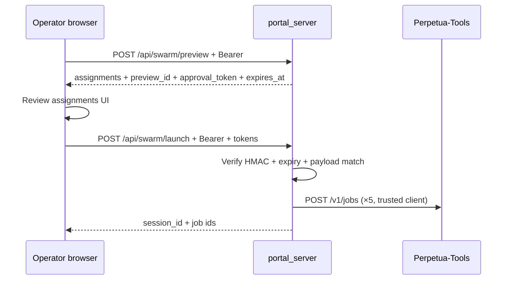

# PR3 Execution Plan — P5 Server-Side Swarm Approval

> **Status:** 📋 PLANNED — ready for `/autoplan` execution  
> **Date:** 2026-06-28  
> **Method:** oramasys-method (AFRP Type C, Mode 2)  
> **Parent stack:** [`2026-06-28-security-pr3-pr6-zero-queue-plan.md`](2026-06-28-security-pr3-pr6-zero-queue-plan.md)  
> **Planner subagent:** `.cursor/agents/pt-orama-security-planner.md`  
> **Branch:** `cursor/security-pr3-swarm-approval-f559` (from current `main`)  
> **SECURITY.md finding:** P5 (High) — client `approved: true` is not true HITL

---

## AFRP

```text
AFRP: Type C | Level Practitioner | Mode 2
Scope: Replace client-controlled swarm launch approval with HMAC-bound preview tokens in orama-system only.
```

---

## Why PR3 first? (plain language)

Three phrases from the stack plan, unpacked:

| Phrase | Meaning |
|--------|---------|
| **Highest remaining High** | After PR1–PR2 merged to `main`, the severity queue’s open **High** items are P5 (swarm), P6 (discovery), and P3 partial (Windows bind). P5 is the highest-risk *mutating* path still trusting a client boolean — it dispatches five PT jobs with attacker-controlled prompts once bearer auth passes. |
| **orama-only** | Swarm preview/launch lives entirely in `orama-system` (`portal_server.py`, React command center). Perpetua-Tools already gates `POST /v1/jobs` with bearer auth (Fix 3). No PT code changes required for P5. |
| **No discover coupling** | P6 touches `scripts/discover.py`, LAN probes, `pending_discovery.json`, and portal `/api/rediscover`. P5 does not — isolated surface, smaller blast radius, no shared state with discovery persistence. |

**Recommendation:** Ship PR3 before PR4 so job dispatch HITL is fixed without mixing discovery approval semantics.

---

## Problem (current `main`)

PR1 closed unauthenticated swarm launch (401 without bearer). **P5 remains:** any authenticated client (or XSS on loopback dashboard) can POST:

```json
{ "objective": "…", "approved": true }
```

Server accepts the bool and dispatches five jobs to PT — no proof the operator reviewed the preview assignments.

```2073:2077:src/orama_system/portal_server.py
@app.post("/api/swarm/launch")
async def api_swarm_launch(req: SwarmLaunchRequest):
    """Launch approved preview assignments as PT-owned jobs; orama stores no job state."""
    if not req.approved:
        raise HTTPException(status_code=422, detail="approved=true is required")
```

React composer hardcodes `approved: true` on launch (`web/src/features/command-center/SwarmComposer.tsx`).

**Root cause:** RC-4 partial — UX shortcut (`approved` in request body) used as authorization.

---

## Design (minimal, stateless)

### Flow



### Token contract

| Field | Rule |
|-------|------|
| `preview_id` | UUID v4, returned by preview |
| `approval_token` | `base64url(hmac_sha256(secret, canonical_payload))` |
| `expires_at` | ISO-8601 UTC; default TTL **15 minutes** |
| `secret` | `ensure_control_plane_token()` value (same as bearer verification) |
| `canonical_payload` | Stable JSON: `{preview_id, objective, task_type, optimize_for, preferred_device, assignments_hash}` where `assignments_hash = sha256(json.dumps(assignments, sort_keys=True))` |

**Stateless:** no server-side preview store; verification re-computes hash from launch request fields and compares to signed payload.

### API changes

**`POST /api/swarm/preview`** — add to response:

```json
{
  "preview_id": "…",
  "approval_token": "…",
  "expires_at": "2026-06-28T12:15:00+00:00",
  "assignments": [ … ],
  "hardware_policy": { … }
}
```

**`POST /api/swarm/launch`** — require `preview_id` + `approval_token`; **reject** if:

- tokens missing or malformed
- `expires_at` in payload past now
- HMAC mismatch (tampered objective/assignments)
- `assignments_hash` does not match recomputed preview

**Deprecate** `approved: bool` — ignore if present; return **422** with clear message if tokens absent (no silent fallback to `approved: true`).

### Helper placement

Add to `src/utils/control_plane_auth.py` (reuse auth secret, keep portal thin):

- `sign_operator_payload(payload: dict, *, ttl_seconds: int = 900) -> dict` → `{token, expires_at}`
- `verify_operator_payload(payload: dict, token: str, expires_at: str) -> bool`

Portal wrappers: `_sign_swarm_preview(preview: dict) -> dict`, `_verify_swarm_launch(req, preview_body) -> None` (raises HTTPException).

---

## Execution tasks (TDD order)

| Step | Task | Verify |
|------|------|--------|
| **T1** | Add `sign_operator_payload` / `verify_operator_payload` + unit tests in `tests/test_control_plane_auth.py` | pytest green |
| **T2** | Extend `_build_swarm_preview` return path / `api_swarm_preview` to attach `preview_id`, token, expiry | `tests/test_swarm_preview.py` |
| **T3** | Harden `api_swarm_launch`: require tokens, verify HMAC, reuse preview body (do not rebuild assignments from stale client-only fields without check) | `tests/test_swarm_launch.py` |
| **T4** | Security regressions: bearer + invalid/missing/expired/tampered token | `tests/test_portal_mutating_route_auth.py` |
| **T5** | React: store preview tokens from preview response; launch sends `preview_id` + `approval_token`; disable launch until preview succeeded | `web/` vitest if present; manual API contract |
| **T6** | Update `SECURITY.md` P5 row + A1 workstream remainder (additive annotation) | doc lint |
| **T7** | Run targeted suite (below) + `repo_hygiene.py` | all pass |

---

## Files to touch

| Path | Change |
|------|--------|
| `src/utils/control_plane_auth.py` | HMAC sign/verify helpers |
| `src/orama_system/portal_server.py` | Preview signing, launch verification, pydantic models |
| `web/src/api/swarm.ts` | Types + launch request shape |
| `web/src/features/command-center/SwarmComposer.tsx` | Hold tokens from preview; gate launch |
| `tests/test_control_plane_auth.py` | Sign/verify unit tests |
| `tests/test_swarm_preview.py` | Assert token fields present |
| `tests/test_swarm_launch.py` | Token-required paths |
| `tests/test_portal_mutating_route_auth.py` | Authed but no token → 422/403 |
| `SECURITY.md` | P5 remediated note |

**Out of scope (PR3):** `scripts/discover.py`, `start.ps1`, CSRF middleware, PT repo, session cookie UX (PR5).

---

## Acceptance criteria

- [ ] `POST /api/swarm/launch` with valid bearer but **no** `approval_token` → **422** (not 200)
- [ ] Valid preview → launch with matching tokens → dispatches PT jobs (existing behavior)
- [ ] Tampered `objective` between preview and launch → **403**
- [ ] Expired token → **403**
- [ ] Wrong `preview_id` → **403**
- [ ] Unauthenticated launch → **401** (unchanged, PR1)
- [ ] React composer cannot launch without prior preview in session
- [ ] `SECURITY.md` P5 annotated remediated with test anchor

---

## Test commands

```bash
cd "$(git rev-parse --show-toplevel)"
python3 -m pytest \
  tests/test_control_plane_auth.py \
  tests/test_swarm_preview.py \
  tests/test_swarm_launch.py \
  tests/test_portal_mutating_route_auth.py -q
python3 scripts/review/repo_hygiene.py .
# If web touched:
cd web && pnpm test --run 2>/dev/null || true
```

---

## SECURITY.md sync

**orama-system only** for PR3. Additive update to §B P5 and §A1 remainder:

- P5: “**2026-06-XX:** server-side HMAC preview token required on launch; client `approved` deprecated.”
- Remove P5 from “Remaining toward zero open queue” line; leave P6, CSRF, P3 partial.

**Perpetua-Tools `SECURITY.md`:** no code change; optional one-line cross-ref under control-plane if swarm is documented there.

---

## Risks and mitigations

| Risk | Mitigation |
|------|------------|
| Token secret rotation invalidates in-flight previews | Acceptable; operator re-previews (15m TTL) |
| Launch rebuilds preview server-side (double PT route calls) | Verify hash of **returned** preview matches signed payload; optionally cache preview in launch req body under hash check |
| Breaking API clients sending only `approved: true` | Intentional break; 422 message documents new fields |
| `ORAMA_INSECURE_DEV=1` dev mode | Still require tokens in dev (HITL is not optional) |

---

## Branch and PR

```bash
git checkout main && git pull --ff-only
git checkout -b cursor/security-pr3-swarm-approval-f559
# … implement T1–T7 …
git push -u origin cursor/security-pr3-swarm-approval-f559
```

Open draft PR → `main`, title: `fix(security): P5 server-side swarm approval tokens (PR3)`.

**Stack:** PR4 (P6 discovery) rebases on this branch after merge.

---

## Crystallize (expected outcome)

P5 closes the last **High-severity mutating shortcut** in the portal job-dispatch path without touching LAN discovery or Windows bind policy. True operator HITL becomes: *preview assignments → server issues bound token → launch must present token* — aligned with RC-4 and the defense-in-depth table’s “runtime guard” row for control plane.
