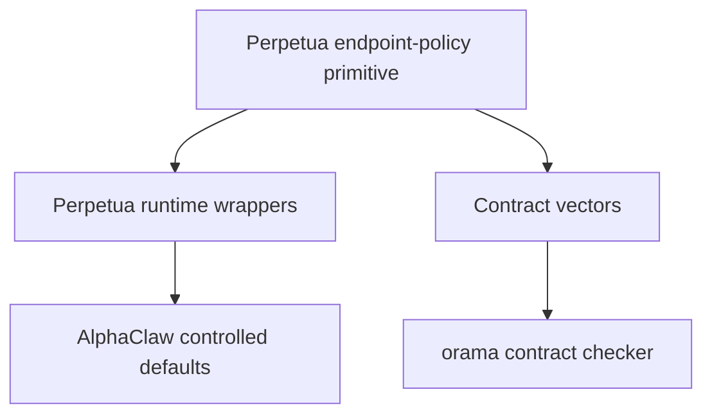

# Gstack AutoPlan Review - Endpoint Policy Standardization

Date: 2026-07-04
Status: phone-review draft
Source artifact reviewed: `Cross-Repository Endpoint Policy Standardization_ CI Remediation and Security Hardening for Perpetua-Tools, orama-system, and AlphaClaw.md`
AutoPlan source: `garrytan/gstack/autoplan/SKILL.md` on `main`
Margin source: `https://margin.fieldspan.ai/skill.md`
Scope: orama-system planning document only
Hard boundary: do not touch the AlphaClaw fork; AlphaClaw is controlled from Perpetua

## Correction From Previous Run

The previous version of this file was a misfire. It focused on adopting Gstack/Margin review mechanics and only secondarily mentioned the endpoint-policy deliverable.

This version replaces that with the requested output: a ruthless, refined, steelmanned Gstack AutoPlan review of the attached cross-repository endpoint-policy standardization plan.

Margin remains the review surface. This repository document remains the source of truth.

## AutoPlan Method Applied

The local Gstack skill is not installed in this session, so the review was applied from the canonical `autoplan/SKILL.md` text. The relevant method is:

1. CEO review: challenge premise, ownership, sequencing, and business risk.
2. Design review: skipped as UI scope; this is policy and CI architecture.
3. Engineering review: evaluate architecture, code path boundaries, tests, failure modes, and deployment risk.
4. DX review: evaluate developer workflow, error quality, onboarding, migration path, and review ergonomics.
5. Final gate: auto-decide routine choices, surface user challenges, and leave a reviewable approval artifact.

The AutoPlan ideal asks for dual model voices and local task logs. Those are not fully available in this connector-first environment. This document records the limitation and still produces the required review artifact.

## Final Gate Verdict

Decision: revise, stage, and proceed only through a verification gate.

The attached deliverable is directionally strong, but not safe to apply in toto. It mixes verified facts with deduced facts, proposes direct package implementation before live source verification, and includes AlphaClaw as if it were a peer implementation target. The refined plan keeps the core architecture and tightens the execution boundary.

Recommended next action: run Phase 0 evidence verification, then implement only the Perpetua-owned endpoint-policy primitive as the first coding PR. orama should consume and enforce after the Perpetua primitive exists. AlphaClaw gets no direct edits.

## What The Attached Plan Gets Right

1. It identifies the right architectural failure: endpoint policy should not be hand-copied across repos.
2. It assigns ownership correctly after user correction: Perpetua owns and authors the shared primitive; orama consumes and enforces it.
3. It treats endpoint policy as a security boundary, not just URL cleanup.
4. It recognizes that `urlparse(...).port` is a throwing boundary and must be wrapped into a single typed domain error.
5. It includes the right SSRF vectors: metadata IPs, loopback, link-local, private networks, and IPv4-mapped IPv6.
6. It includes useful test vectors and a future fuzzing direction.
7. It distinguishes code single source of truth from cross-language contract artifacts.
8. It points at the right migration direction: delete mirrored validators rather than keep them drifting.

## Ruthless Criticism

### 1. Verification Is Too Soft For The Claims

The source document repeatedly marks important items as `UNVERIFIED - deduced`, then still writes implementation-ready code as if the target paths and failure modes are confirmed. That is useful as architecture, but dangerous as an execution plan.

Required refinement: every deduced claim must become either a Phase 0 verification task or a non-blocking assumption. Deduced PR states, validator paths, CI logs, and exact workflow failure causes must not be treated as facts.

### 2. The Plan Is Too Large For One PR

The attached plan combines package creation, license separation, orama workflow changes, drift contract design, tests, fuzzing, docs, AlphaClaw contract language, and metadata reconciliation.

Required refinement: split into atomic PRs. The first coding PR should be Perpetua-only and should not change orama behavior until the primitive is real.

### 3. AlphaClaw Is Over-Included

The file says AlphaClaw consumes JSON contract artifacts and includes AlphaClaw in default tables and first-run checks. That is fine as documentation context, but it is too easy for an agent to interpret it as permission to edit AlphaClaw.

Required refinement: AlphaClaw must be represented only as a downstream controlled surface of Perpetua. No AlphaClaw fork edits. No direct AlphaClaw PRs. No npm mirror now.

### 4. License Handling Is Under-Specified

The plan says the endpoint-policy subpackage should be Apache-2.0 inside an AGPL repo. That may be valid if carefully isolated, but the plan does not specify required files, notices, packaging metadata, or whether the repository-level license creates ambiguity.

Required refinement: Phase 0 must verify license expectations before package publication. The first implementation may create a private/internal package skeleton with explicit per-directory `LICENSE` and `NOTICE`, but publication waits for license review.

### 5. Python Floor Is Treated As A Detail, But It Is A Contract

Perpetua targets Python >=3.11 while orama targets >=3.10. A shared package consumed by both must either support >=3.10 or force a deliberate orama Python floor change.

Required refinement: decide the Python support matrix before implementation. Recommended: endpoint-policy supports >=3.10 until orama officially raises its floor.

### 6. The CI Diagnosis Needs A Real Evidence Gate

The CI analysis is plausible, but the plan admits logs were not directly readable. It should not prescribe workflow fixes before reading current workflow content and current scripts on `main`.

Required refinement: read the current orama workflow, current Perpetua workflow/checker, current script names, and current exit semantics before patching.

### 7. The API Contract Is Good But Too Narrow

`validate_model_endpoint_url()` returning normalized string or `ModelEndpointPolicyError` is good. But endpoint policy needs a serializable contract too: error codes, test vectors, host categories, allowed private modes, and default ports.

Required refinement: add a contract vector file after the Python primitive exists. Do not invent a second implementation.

### 8. It Lacks A Backward-Compatible Migration Plan

Deleting mirrored validators is correct eventually, but the plan does not explain how callers migrate or how compatibility wrappers deprecate old import paths.

Required refinement: keep thin wrappers in Perpetua and orama for one release cycle if current code imports local validators. Wrappers should delegate to `endpoint_policy` and emit no behavior changes.

### 9. It Does Not Define Dry-Run Behavior

For policy changes, dry-run is not optional. Long-running or cross-repo changes must first produce a plan and drift report without installing plugins, calling external LLMs, touching GPUs, or changing AlphaClaw.

Required refinement: all orchestration flows that apply this plan must support `--dry-run` and make dry-run side-effect-free.

### 10. It Risks Source-Of-Truth Drift With Margin

Margin is useful for phone review, but the plan must say that Margin is a projection only. A reviewed Margin page that differs from the committed repo doc is process drift.

Required refinement: commit or update the repo artifact first, then publish the rendered copy to Margin. Fold comments back into this file before final approval.

## Steelman

The best version of the attached plan is not a giant cross-repo patch. It is a staged security architecture upgrade with a single ownership rule:

Perpetua owns endpoint policy. orama enforces endpoint policy. AlphaClaw is controlled through Perpetua.

That model is strong because it prevents three failure classes:

1. Silent security drift between validators.
2. Ambiguous endpoint behavior across local model gateways.
3. Unsafe agent behavior where a downstream fork is edited directly instead of through the controlling repo.

The plan is also strong because it treats endpoint policy as a typed boundary. A model endpoint should either normalize cleanly or fail with one domain error. Raw parser exceptions, implicit scheme rewrites, and duplicated host-classification logic are all security and DX defects.

## Refined Architecture

Rules:

- Perpetua authors the primitive and the contract vectors.
- orama consumes the primitive or verifies against the contract vectors.
- AlphaClaw is not edited directly; Perpetua controls AlphaClaw-facing defaults.
- Margin is only a review projection.

## Refined Execution Plan

### Phase 0 - Evidence Gate, No Code

Goal: convert deductions into facts before any implementation.

Tasks:

- Verify current Perpetua validator paths and imports on `main`.
- Verify current orama validator/checker paths and imports on `main`.
- Verify current CI workflow names, script names, and exit-code semantics.
- Verify PR states referenced in the source document, especially Perpetua PR #177 and orama PR #127 if still relevant.
- Verify license metadata and Python floor expectations.
- Confirm whether any endpoint-policy primitive already exists under another name.

Acceptance criteria:

- Every former `UNVERIFIED - deduced` claim is either confirmed, corrected, or moved to assumptions.
- No repo files outside this plan are changed.
- AlphaClaw remains untouched.

### Phase 1 - Perpetua Primitive, Minimal Code PR

Goal: create the smallest Perpetua-owned endpoint-policy primitive.

Scope:

- `packages/endpoint-policy/pyproject.toml`
- `packages/endpoint-policy/LICENSE`
- `packages/endpoint-policy/src/endpoint_policy/`
- focused tests for the policy primitive

Required behavior:

- Public import package: `endpoint_policy`.
- Distribution name: `perpetua-endpoint-policy` unless Phase 0 finds a better existing name.
- Python support: >=3.10 unless deliberately changed.
- One typed error boundary: `ModelEndpointPolicyError`.
- No raw `urllib.parse` exception escapes.
- `allow_private=False` by default.
- Explicit private opt-in for local Ollama/OpenClaw gateways.
- IPv4-mapped IPv6 handling is mandatory.

Out of scope:

- No AlphaClaw edits.
- No npm mirror.
- No orama dependency switch yet.
- No license publication claims beyond local package metadata.

### Phase 2 - orama Consumption And Contract Enforcement

Goal: make orama consume or verify the Perpetua-owned contract without duplicating logic.

Scope:

- orama endpoint-policy contract workflow.
- orama checker script.
- optional compatibility wrapper if existing code imports local policy helpers.

Required behavior:

- The checker fails on drift with a clear JSON report.
- The checker uses contract vectors owned by Perpetua or imports the Perpetua primitive.
- orama does not maintain a second independent validator.
- Existing scan roots remain explicit and fail if expected roots disappear.

### Phase 3 - Migration And De-Duplication

Goal: remove mirrored behavior safely.

Tasks:

- Replace local validators with wrapper imports where needed.
- Keep one-release compatibility wrappers if current callers depend on old import paths.
- Add deprecation notes to docs.
- Remove stale validator code only after tests prove parity.

### Phase 4 - Documentation And Defaults

Goal: document operational behavior without creating a second implementation.

Tasks:

- Add or update DEFAULTS-style docs with endpoint-policy ownership.
- Document discovery order: env, config, sane default.
- Document local-private opt-in for Ollama/OpenClaw.
- Cross-link orama contract enforcement to Perpetua primitive docs.
- Keep AlphaClaw as context only, controlled via Perpetua.

### Phase 5 - Review Loop And Approval

Goal: keep human approval ergonomic and source-controlled.

Tasks:

- Publish this plan to Margin for phone review.
- Treat Margin comments as revision requests, not approval.
- Fold comments back into this source document.
- Re-publish to the same Margin document.
- Final approval happens in conversation or repo review.

## Dry-Run Rule

Long-running or cross-repo goals that touch endpoint policy must run dry-run first.

Dry-run must not:

- call Claude plugins,
- call external LLMs,
- touch GPUs,
- install plugins,
- edit AlphaClaw,
- mutate repo state beyond a plan/report file.

Dry-run should:

- enumerate affected files,
- report what would be changed,
- classify each change as Perpetua-owned, orama-enforced, or AlphaClaw-controlled-through-Perpetua,
- show tests that would run,
- stop for review before code execution.

## Test Plan

| Codepath or artifact | Required coverage | Phase |
|---|---|---|
| Empty or malformed endpoint | raises `ModelEndpointPolicyError` only | Phase 1 |
| Malformed port and out-of-range port | no raw `ValueError` escapes | Phase 1 |
| Metadata IP `169.254.169.254` | blocked by default | Phase 1 |
| Loopback/private gateway | blocked by default, allowed with explicit `allow_private=True` | Phase 1 |
| IPv4-mapped IPv6 | unwrapped and blocked | Phase 1 |
| Happy path public HTTPS endpoint | normalized deterministically | Phase 1 |
| orama contract checker drift | exits non-zero with JSON drift report | Phase 2 |
| compatibility wrappers | preserve old imports while delegating | Phase 3 |
| dry-run mode | no external LLM/plugin/GPU/install side effects | Phase 0/2 |

## Failure Modes Registry

| Failure mode | Severity | Mitigation |
|---|---:|---|
| Deduced facts implemented as if verified | High | Phase 0 evidence gate before code |
| AlphaClaw edited directly | High | Explicit non-scope; Perpetua controls AlphaClaw-facing behavior |
| Apache subpackage ambiguity inside AGPL repo | High | Per-directory license/notice, publication deferred until reviewed |
| orama keeps a mirrored validator | High | Contract checker plus wrapper migration to shared primitive |
| Dry-run performs side effects | High | Dry-run prohibition list and test coverage |
| Margin diverges from repo doc | Medium | Repo doc updated first; same Margin doc republished after changes |
| Python floor mismatch breaks orama | Medium | endpoint-policy supports >=3.10 unless formally raised |
| Private local gateways blocked without escape hatch | Medium | explicit `allow_private=True` for trusted local flows |

## Decision Audit Trail

| # | Phase | Decision | Classification | Principle | Rationale | Rejected |
|---|---|---|---|---|---|---|
| 1 | CEO | Do not apply source plan in toto | Auto-decided | Reduce blast radius | The plan is directionally right but bundles too much verified and unverified work | One giant cross-repo implementation |
| 2 | CEO | Keep AlphaClaw untouched | User boundary | Respect ownership | User stated AlphaClaw fork is completely controlled from Perpetua | Direct AlphaClaw edits |
| 3 | Eng | Add Phase 0 evidence gate | Auto-decided | Verify first | The source file contains critical deduced claims | Coding from deductions |
| 4 | Eng | Perpetua primitive first, orama enforcement second | Auto-decided | Single source of truth | This matches ownership and avoids mirrored logic | Simultaneous duplicated validators |
| 5 | Eng | Support dry-run before long-running cross-repo work | Auto-decided | Safe execution | Prevents plugin, LLM, GPU, install, and repo side effects | Direct execution first |
| 6 | DX | Keep Margin as review projection only | Auto-decided | Source-of-truth clarity | The committed repo doc must remain authoritative | Treating Margin comments as approval |

## User Challenges

None. The user direction is consistent with the refined plan: apply AutoPlan, avoid AlphaClaw, use Margin, and correct the previous misfire.

## Taste Decisions

None requiring user input now. The plan defaults are conservative: verify first, implement minimal Perpetua primitive, then wire orama enforcement.

## Implementation Tasks Aggregated Across Phases

- [ ] Phase 0: Verify current endpoint-policy code paths, PR states, workflow scripts, license metadata, and Python floor.
- [ ] Phase 1: Create the Perpetua-owned endpoint-policy primitive as a minimal isolated PR.
- [ ] Phase 2: Update orama contract enforcement to consume or verify the Perpetua-owned primitive.
- [ ] Phase 3: Replace mirrored validators with compatibility wrappers, then remove duplicates after parity tests.
- [ ] Phase 4: Update docs/defaults and cross-links; keep AlphaClaw as controlled-through-Perpetua context only.
- [ ] Phase 5: Fold Margin comments back into this repo doc before final approval.

## Final Recommendation

Approve the refined plan for review, not execution.

The next executable step is a dry-run Phase 0 evidence report. Only after that should we open a minimal Perpetua PR for `packages/endpoint-policy/`. orama follows as an enforcement consumer. AlphaClaw remains untouched.
