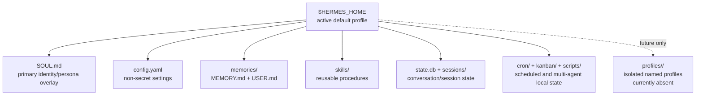
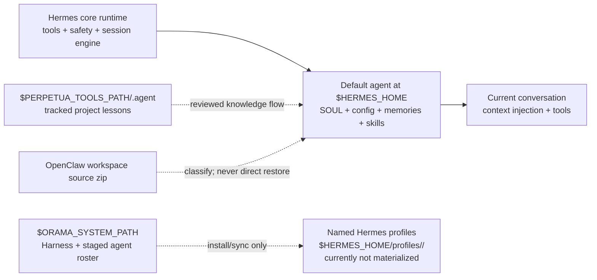
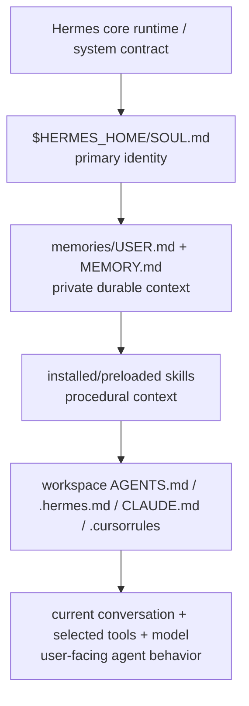
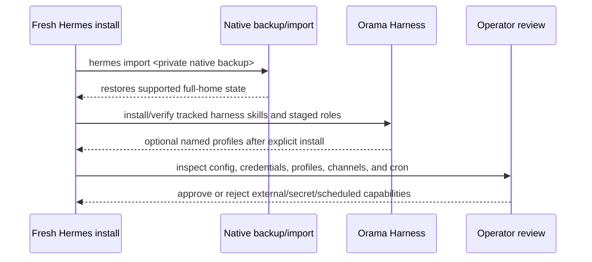

# Merge OpenClaw Hermes Workspace into Primary Hermes + Subagent Profiles Implementation Plan

> **Reality checkpoint — verified 2026-07-27:** The zip remains an **OpenClaw workspace source bundle**, not a Hermes backup or an installed Hermes profile. The actual local target is Hermes **v0.19.0 (2026.7.20)** at `$HERMES_HOME`. It currently contains the root `SOUL.md`, `config.yaml`, `memories/`, `skills/`, `state.db`, `sessions/`, `cron/`, `kanban/`, `kanban.db`, `scripts/`, `state/`, and `state-snapshots/`; it has only `default` and no `$HERMES_HOME/profiles/` directory. `auth.json`, `auth/`, and `.env` are private and excluded from tracked documentation/archives by default. Native `hermes backup` and `hermes import` are the supported whole-home recovery baseline; `$ORAMA_SYSTEM_PATH/bin/orama-system/skills/hermes-harness/scripts/hermes_portable_brain.py` is an additive, manifest-oriented Orama tool. Validate plans against [Hermes configuration](https://hermes-agent.nousresearch.com/docs/user-guide/configuration) and [CLI commands](https://hermes-agent.nousresearch.com/docs/reference/cli-commands) before applying.

## Verified current Hermes identity, brain, and default-profile layout

### The default profile is the root Hermes home

`default` is **not** stored in a `profiles/default/` folder. It is the root Hermes home itself:

```text
$HERMES_HOME
```

`hermes profile list` verified on 2026-07-27:

```text
◆ default    model: gpt-5.6-terra    gateway: running
```

`$HERMES_HOME/profiles/` is currently **absent**. Thus the primary agent's identity, configuration, skills, private memory, session state, scheduler state, and local coordination state are all resolved directly from `$HERMES_HOME`. Named profiles are a future, explicit installation outcome under `$HERMES_HOME/profiles/<slug>/`; they are not aliases for the root default profile.



### Verified default-root inventory

```text
$HERMES_HOME/
├── SOUL.md                 # primary/default-agent identity and operating character
├── config.yaml             # non-secret runtime settings
├── .env                    # private keys/tokens; never track or document contents
├── auth.json               # private OAuth/credential-pool state
├── auth/                   # private provider-auth material
├── memories/
│   ├── MEMORY.md           # durable operational/factual memory
│   └── USER.md             # user preferences and stable profile facts
├── skills/                 # reusable SKILL.md procedures
├── state.db                # canonical SQLite session store
├── sessions/               # session routing/transcript artifacts
├── cron/                   # Hermes scheduler definitions/output
├── kanban/                 # Kanban data/assets
├── kanban.db               # durable multi-agent board database
├── scripts/                # local callable helpers
├── state/                  # runtime state
└── state-snapshots/        # update/recovery snapshots
```

`logs/`, caches, build artifacts, dependency/runtime directories, and the installed source tree (`$HERMES_HOME/hermes-agent/`) are host-runtime concerns, not canonical tracked persona content. `backups/` and `migration/` are conditional directories: they appear after a native backup/import or migration operation and are not currently present.

### What constitutes “Hermes” versus portable overlays

| Layer | What it controls | Current storage | Portability rule |
|---|---|---|---|
| Hermes core | System/tool/runtime contract | `$HERMES_HOME/hermes-agent/` | Install/update normally; it is not a persona file. |
| Default-agent identity | Stable character and operating boundaries | `$HERMES_HOME/SOUL.md` | Transfer only through a private backup/export or deliberate reviewed merge. |
| User + long-term memory | User preferences and durable facts | `$HERMES_HOME/memories/USER.md`, `MEMORY.md` | Private; never blindly overwrite or commit. |
| Procedures | Reusable task workflows | `$HERMES_HOME/skills/` | Review before export/import; prefer canonical tracked sources where available. |
| Local continuity | Sessions, cron, board, helper state | `state.db`, `sessions/`, `cron/`, `kanban*`, `scripts/` | Private backup/export; inspect before restore. |
| Orama Harness | Staged roles, install/export procedures, LAN coordination | `$ORAMA_SYSTEM_PATH/bin/agents/` and `bin/orama-system/skills/hermes-harness/` | Tracked and portable, but not proof of materialized profiles. |
| Perplexity/Perpetua memory | Auditable cross-repo project lessons/reflection | `$PERPETUA_TOOLS_PATH/.agent/` | Tracked project memory; distinct from Hermes private memory. |



### Identity and instruction layering

Hermes core is not a single editable “soul” file. The user-facing agent is composed from a core runtime contract plus local and project context layers:



Accordingly, the OpenClaw bundle must be **classified by destination** rather than copied wholesale:

- Universal identity/safety/onboarding candidates may become a reviewed addition to `$HERMES_HOME/SOUL.md`.
- Monitor-specific pipeline behavior belongs in staged `hermes-monitor` material and only reaches a named profile after explicit installation and verification.
- `USER.md`, `MEMORY.md`, secrets, auth data, sessions, and scheduler state are blocked from automatic merge.
- OpenClaw-only registration, heartbeat, plugin, and historical-session material must be deliberately converted, archived as provenance, or omitted.

### Restore and installation model



For a “restore like the current primary agent” result, prefer the native baseline first:

```bash
hermes backup -o "$HOME/hermes-default-private-backup.zip"
# On a fresh trusted target after Hermes is installed:
hermes gateway stop
hermes import "$HOME/hermes-default-private-backup.zip"
hermes doctor
hermes gateway start
```

Then install/sync tracked Orama assets separately and verify them. The Orama manifest utility enables a more selective, inspectable transfer, but it does not replace native backup/import until export → inspect → restore has been validated against the target Hermes version. Secrets and external-channel credentials remain an explicit operator-review step.

---

> **For Hermes:** Use subagent-driven-development skill to implement this plan task-by-task.

**Goal:** Absorb `hermes-agent-openclaw-workspace-2026-07-27.zip` into Hermes in a way that strengthens the **primary/default greeting agent** while preserving `hermes-monitor` as a bounded subagent profile and keeping Orama/Perplexity canonical state auditable.

**Architecture:** Treat the zip as a **source bundle**, not a direct restore. Extract it to a temporary review directory, classify each OpenClaw file by destination, merge universal identity and operating rules into the primary Hermes brain (`$HERMES_HOME`), merge monitor-specific role content into `$ORAMA_SYSTEM_PATH/bin/agents/hermes-monitor/`, and record project lessons in `$PERPETUA_TOOLS_PATH/.agent/`. Keep `BOOTSTRAP.md` as first-install onboarding guidance, not as a persistent runtime file.

**Tech Stack:** Hermes `$HERMES_HOME`, Orama Harness (`$ORAMA_SYSTEM_PATH/bin/orama-system/skills/hermes-harness/`), `bin/agents/REGISTRY.yml`, `install_hermes_profiles.py`, `hermes_portable_brain.py`, Python stdlib `zipfile/json/pathlib`, PT `.agent/tools/learn.py`, markdown references.

---

## Source artifacts inspected

| Artifact | Role in merge |
|---|---|
| `$OPENCLAW_HERMES_EXPORT_ZIP` | OpenClaw `hermes-agent` workspace slice; source-only (operator-local path) |
| `$HERMES_PROFILE_CATALOGUE_MD` | Human-readable profile catalogue / crosswalk (operator-local artifact) |
| `$ORAMA_SYSTEM_PATH/bin/agents/REGISTRY.yml` | SSoT for Orama-staged Hermes profiles |
| `$ORAMA_SYSTEM_PATH/bin/agents/hermes-monitor/SOUL.md` | Current Hermes-monitor role distillate |
| `$ORAMA_SYSTEM_PATH/bin/agents/hermes-monitor/agent.md` | Current Hermes-monitor command card |
| `$ORAMA_SYSTEM_PATH/bin/agents/personas/hermes.yaml` | Structured Hermes-monitor persona |
| `$ORAMA_SYSTEM_PATH/bin/orama-system/skills/hermes-harness/scripts/install_hermes_profiles.py` | Profile materialization logic |

The zip contains:

```text
.openclaw/agents/hermes-agent/
  AGENTS.md
  BOOTSTRAP.md
  GOALS.md
  HEARTBEAT.md
  IDENTITY.md
  MEMORY.md
  SECURITY.md
  SOUL.md
  TOOLS.md
  USER.md
  agent/.gitkeep
  openclaw-workspace-state.json
.openclaw/openclaw-hermes-agent.json
README.md
```

---

## Merge doctrine

### Do merge into the primary/default Hermes agent

The first agent that greets the user after installation should absorb only **universal identity and onboarding rules**:

- be genuinely helpful, concise, opinionated, resourceful;
- protect privacy;
- ask before external/public actions;
- maintain persistent memory deliberately;
- use `SOUL.md`, `memories/USER.md`, `memories/MEMORY.md`, skills, and project context as layered brain state;
- after first install, greet the user naturally and ask for missing identity/preferences only when not already migrated.

### Do not merge monitor-specific behavior into the primary agent

These belong to `hermes-monitor`, not the default greeting agent:

- Lead Acquisition & Pipeline Monitor;
- Relentless Hunter archetype;
- 07:00 daily lead draft schedule;
- source-link-per-prospect rule;
- silence unless actionable pipeline change;
- forbidden final lead email sending.

### Preserve as subagent profile

`OpenClaw id: hermes-agent` maps to:

```text
Hermes profile: hermes-monitor
Canonical staged SOUL: bin/agents/hermes-monitor/SOUL.md
Persona YAML: bin/agents/personas/hermes.yaml
```

### Keep source bundle non-authoritative

The zip is not a portable Hermes brain archive and should not be restored directly into `$HERMES_HOME`. It is OpenClaw workspace material for controlled merge.

---

## Destination map

| Source in zip | Merge decision | Destination |
|---|---|---|
| `SOUL.md` base “who you are” content | Distill universal parts into primary greeting profile; retain monitor overlay in subagent | `$HERMES_HOME/SOUL.md`; `$ORAMA_SYSTEM_PATH/bin/agents/hermes-monitor/SOUL.md` |
| `AGENTS.md` | Split: universal workspace rules → Orama reference; OpenClaw-specific runtime paths → archive notes | `$ORAMA_SYSTEM_PATH/bin/orama-system/skills/hermes-harness/references/hermes-primary-agent-merge.md` |
| `BOOTSTRAP.md` | Convert to first-install/onboarding reference; do not persist as live file | `$ORAMA_SYSTEM_PATH/bin/orama-system/skills/hermes-harness/references/hermes-first-greeting-onboarding.md` |
| `GOALS.md` | Monitor-only | `$ORAMA_SYSTEM_PATH/bin/agents/hermes-monitor/agent.md` and/or `personas/hermes.yaml` |
| `HEARTBEAT.md` | Convert to scheduler guidance; do not enable monitor automatically | Orama Harness reference; optional cron/local harness task later |
| `IDENTITY.md` | Monitor-only crosswalk | `$ORAMA_SYSTEM_PATH/bin/agents/REGISTRY.yml` validation notes |
| `MEMORY.md` | Treat as seed lesson, not full memory restore | PT `.agent/tools/learn.py`; optional `$HERMES_HOME/memories/MEMORY.md` only after operator approval |
| `SECURITY.md` | Universal safety boundaries + monitor-specific restrictions | primary SOUL/security reference + monitor role files |
| `TOOLS.md` | General note template; keep as reference, not live config | Orama reference; no secrets |
| `USER.md` | Starter template only; do not overwrite real user profile | leave archived; maybe mention in onboarding |
| `openclaw-workspace-state.json` | Provenance only | archive metadata / manifest |
| `openclaw-hermes-agent.json` | OpenClaw-only registration slice | Orama migration reference; not Hermes config |
| `README.md` | Source bundle notes | Orama migration reference |

---

## Proposed new/changed files

### Create in Orama Harness

- `$ORAMA_SYSTEM_PATH/bin/orama-system/skills/hermes-harness/references/hermes-primary-agent-merge.md`
- `$ORAMA_SYSTEM_PATH/bin/orama-system/skills/hermes-harness/references/hermes-first-greeting-onboarding.md`
- `$ORAMA_SYSTEM_PATH/bin/orama-system/skills/hermes-harness/references/openclaw-hermes-agent-workspace-import.md`
- `$ORAMA_SYSTEM_PATH/bin/orama-system/skills/hermes-harness/scripts/merge_openclaw_hermes_agent_workspace.py`
- `$ORAMA_SYSTEM_PATH/tests/hermes_harness/test_merge_openclaw_hermes_agent_workspace.py` *(or nearest existing harness test directory if different)*

### Modify in Orama staging

- `$ORAMA_SYSTEM_PATH/bin/agents/hermes-monitor/SOUL.md`
- `$ORAMA_SYSTEM_PATH/bin/agents/hermes-monitor/agent.md`
- `$ORAMA_SYSTEM_PATH/bin/agents/personas/hermes.yaml`
- `$ORAMA_SYSTEM_PATH/bin/orama-system/skills/hermes-harness/references/hermes-portable-brain-map.md`
- `$ORAMA_SYSTEM_PATH/bin/orama-system/skills/hermes-harness/references/hermes-profile-install.md`
- `$ORAMA_SYSTEM_PATH/bin/orama-system/skills/hermes-harness/references/openclaw-to-hermes-migration.md`
- `$ORAMA_SYSTEM_PATH/bin/orama-system/skills/hermes-harness/commands/windows-hermes-setup/SKILL.md`

### Modify local Hermes only after dry-run approval

- `$HERMES_HOME/SOUL.md`
- `$HERMES_HOME/memories/MEMORY.md`
- `$HERMES_HOME/memories/USER.md` *(only if user approves; normally no overwrite)*
- `$HERMES_HOME/profiles/hermes-monitor/SOUL.md` via `install_hermes_profiles.py --sync`

### Modify Perpetua-Tools memory

- `$PERPETUA_TOOLS_PATH/.agent/memory/semantic/LESSONS.md`
- `$PERPETUA_TOOLS_PATH/.agent/memory/episodic/AGENT_LEARNINGS.jsonl`
- generated graduated candidate JSONs

---

## Phase 0 — Preflight and backup

**Objective:** Make the merge reversible and prove paths/state before touching anything.

**Files:** none changed.

**Commands:**

```bash
export ORAMA_SYSTEM_PATH="$ORAMA_SYSTEM_PATH"
export OPENCLAW_HERMES_EXPORT_ZIP="${OPENCLAW_HERMES_EXPORT_ZIP:-/path/to/hermes-agent-openclaw-workspace.zip}"
export HERMES_PROFILE_CATALOGUE_MD="${HERMES_PROFILE_CATALOGUE_MD:-/path/to/hermes-profile-catalogue.md}"

test -f "$OPENCLAW_HERMES_EXPORT_ZIP"
git -C "$ORAMA_SYSTEM_PATH" branch --show-current
git -C "$ORAMA_SYSTEM_PATH" status --short
git -C "$PERPETUA_TOOLS_PATH" status --short
hermes backup -o "$HOME/hermes-pre-openclaw-hermes-agent-merge.zip"
```

**Expected:** `orama-system` branch is `main`; backup file is created; no secrets printed.

---

## Phase 1 — Extract and classify the zip in dry-run mode

**Objective:** Build an auditable manifest of every file and destination decision.

**Create:** `$ORAMA_SYSTEM_PATH/bin/orama-system/skills/hermes-harness/scripts/merge_openclaw_hermes_agent_workspace.py`

**Script behavior:**

```bash
python3 bin/orama-system/skills/hermes-harness/scripts/merge_openclaw_hermes_agent_workspace.py \
  --zip "$OPENCLAW_HERMES_EXPORT_ZIP" \
  --dry-run \
  --json
```

**Expected JSON fields:**

```json
{
  "source_zip": "...hermes-agent-openclaw-workspace-2026-07-27.zip",
  "openclaw_id": "hermes-agent",
  "target_profile": "hermes-monitor",
  "primary_merge": ["SOUL.md", "SECURITY.md", "AGENTS.md", "BOOTSTRAP.md"],
  "profile_merge": ["GOALS.md", "IDENTITY.md", "SOUL.md", "HEARTBEAT.md"],
  "archive_only": ["openclaw-workspace-state.json", "openclaw-hermes-agent.json", "README.md"],
  "blocked_from_auto_merge": ["USER.md", "MEMORY.md"]
}
```

**Validation:**

```bash
python3 -m py_compile bin/orama-system/skills/hermes-harness/scripts/merge_openclaw_hermes_agent_workspace.py
```

---

## Phase 2 — Write tests for classification and safety

**Objective:** Prevent direct overwrite of primary brain and prevent monitor role leakage.

**Create:** `$ORAMA_SYSTEM_PATH/tests/hermes_harness/test_merge_openclaw_hermes_agent_workspace.py`

**Test cases:**

1. Zip is recognized as OpenClaw workspace export, not Hermes portable brain archive.
2. `openclaw_id=hermes-agent` maps to `hermes_profile=hermes-monitor` using `bin/agents/REGISTRY.yml`.
3. Monitor-specific phrases (`Lead Acquisition`, `Relentless Hunter`, `prospect`) are classified profile-only.
4. Universal safety phrases (`Private things stay private`, `ask before acting externally`) are classified primary-eligible.
5. `USER.md` and `MEMORY.md` are never overwritten without explicit `--include-memory-seeds` / approval flag.
6. Script rejects archive path traversal members.

**Run:**

```bash
cd "$ORAMA_SYSTEM_PATH"
pytest tests/hermes_harness/test_merge_openclaw_hermes_agent_workspace.py -q
```

**Expected:** fail before implementation, pass after implementation.

---

## Phase 3 — Distill primary/default greeting agent content

**Objective:** Produce a merge patch for the first Hermes agent the user meets after installation.

**Create:** `$ORAMA_SYSTEM_PATH/bin/orama-system/skills/hermes-harness/references/hermes-first-greeting-onboarding.md`

**Content to include:**

- first-run greeting behavior from `BOOTSTRAP.md`, but adapted to Hermes:
  - do not ask if migrated `USER.md` / `SOUL.md` already provide answers;
  - ask naturally for missing name, vibe, boundaries, and contact preferences;
  - write to Hermes memory through supported mechanisms, not raw OpenClaw files;
- relationship between `SOUL.md`, `USER.md`, `MEMORY.md`, skills, profiles, and project context;
- “delete BOOTSTRAP” becomes “do not keep bootstrap as live runtime state after first-run completion.”

**Create:** `$ORAMA_SYSTEM_PATH/bin/orama-system/skills/hermes-harness/references/hermes-primary-agent-merge.md`

**Content to include:**

- exact universal snippets approved for primary `$HERMES_HOME/SOUL.md`;
- exact snippets rejected from primary and routed to `hermes-monitor`;
- dry-run command examples;
- operator approval gate before modifying `$HERMES_HOME/SOUL.md`.

**Validation:**

```bash
grep -n "Lead Acquisition\|Relentless Hunter\|prospect" \
  bin/orama-system/skills/hermes-harness/references/hermes-primary-agent-merge.md
```

Expected: these terms appear only under “profile-only / rejected from primary,” not under primary SOUL snippets.

---

## Phase 4 — Strengthen the `hermes-monitor` subagent profile

**Objective:** Preserve the OpenClaw Hermes adapter as a bounded Hermes profile, not the main agent.

**Modify:**

- `$ORAMA_SYSTEM_PATH/bin/agents/hermes-monitor/SOUL.md`
- `$ORAMA_SYSTEM_PATH/bin/agents/hermes-monitor/agent.md`
- `$ORAMA_SYSTEM_PATH/bin/agents/personas/hermes.yaml`

**Merge additions from zip:**

- `GOALS.md`: “Pipeline monitor. Source link per prospect.”
- `SECURITY.md`: no secrets in workspace memory; approval for external sends/deployments.
- `HEARTBEAT.md`: keep comments-only by default; schedule candidate remains opt-in.
- `AGENTS.md`: “stay silent unless useful/actionable,” but scoped to monitor alerts.

**Do not add:**

- generic “you’re not a chatbot” starter content to `hermes-monitor` unless distilled into one concise role-specific sentence;
- OpenClaw path names as hard requirements;
- direct lead-email permission.

**Verification:**

```bash
cd "$ORAMA_SYSTEM_PATH"
python3 bin/orama-system/skills/hermes-harness/scripts/install_hermes_profiles.py --sync --dry-run
python3 bin/orama-system/skills/hermes-harness/scripts/install_hermes_profiles.py --verify
```

Expected: managed profile SOUL drift is detected before sync; after sync implementation, verify passes.

---

## Phase 5 — Add a controlled local-Hermes primary merge command

**Objective:** Allow the operator to preview/apply primary-brain merge without hand-editing `config.yaml` or blindly overwriting `$HERMES_HOME/SOUL.md`.

**Extend:** `merge_openclaw_hermes_agent_workspace.py`

**CLI contract:**

```bash
# Analyze only
python3 bin/orama-system/skills/hermes-harness/scripts/merge_openclaw_hermes_agent_workspace.py \
  --zip "$OPENCLAW_HERMES_EXPORT_ZIP" \
  --dry-run --json

# Write proposed patches under Orama references, not $HERMES_HOME
python3 bin/orama-system/skills/hermes-harness/scripts/merge_openclaw_hermes_agent_workspace.py \
  --zip "$OPENCLAW_HERMES_EXPORT_ZIP" \
  --write-proposals

# Apply primary SOUL merge only after explicit operator approval
python3 bin/orama-system/skills/hermes-harness/scripts/merge_openclaw_hermes_agent_workspace.py \
  --zip "$OPENCLAW_HERMES_EXPORT_ZIP" \
  --apply-primary-soul \
  --backup
```

**Safety behavior:**

- Always create `$HERMES_HOME/backups/pre-openclaw-hermes-agent-merge-<timestamp>.zip` before applying.
- Refuse to apply if `$HERMES_HOME/SOUL.md` has uncommitted-style local edits since dry-run manifest hash.
- Never apply `USER.md` or `MEMORY.md` automatically.
- Never copy `.openclaw/openclaw-hermes-agent.json` into Hermes config.

---

## Phase 6 — Update profile catalogue and migration docs

**Objective:** Make the catalogue and Orama references reflect the real merge model.

**Modify or create:**

- `$HERMES_PROFILE_CATALOGUE_MD`
- `$ORAMA_SYSTEM_PATH/bin/orama-system/skills/hermes-harness/references/openclaw-hermes-agent-workspace-import.md`
- `$ORAMA_SYSTEM_PATH/bin/orama-system/skills/hermes-harness/references/hermes-portable-brain-map.md`
- `$ORAMA_SYSTEM_PATH/bin/orama-system/skills/hermes-harness/references/openclaw-to-hermes-migration.md`
- `$ORAMA_SYSTEM_PATH/bin/orama-system/skills/hermes-harness/references/hermes-profile-install.md`

**Required doc correction:**

The export `hermes-agent-openclaw-workspace-2026-07-27.zip` is **not** the primary Hermes portable brain. It is an OpenClaw `hermes-agent` workspace slice whose role-specific content maps to `hermes-monitor`, while universal first-run guidance may be distilled into primary Hermes onboarding.

---

## Phase 7 — Record project memory in Perpetua-Tools

**Objective:** Preserve lessons without polluting Hermes local memory with temporary implementation details.

**Commands after implementation:**

```bash
cd "$PERPETUA_TOOLS_PATH"
python .agent/tools/learn.py "OpenClaw hermes-agent workspace exports are source bundles, not direct Hermes portable-brain archives; merge universal onboarding/safety into primary Hermes, and route monitor-specific lead pipeline behavior to hermes-monitor."
python .agent/tools/learn.py "When merging OpenClaw agent workspaces into Hermes, classify every file by destination: primary SOUL, profile SOUL, Orama reference, PT memory lesson, archive-only, or blocked-from-auto-merge. USER.md and MEMORY.md require explicit operator approval."
```

**Validation:**

```bash
grep -n "OpenClaw hermes-agent workspace exports\|blocked-from-auto-merge" .agent/memory/semantic/LESSONS.md
```

---

## Phase 8 — Final verification and sync

**Objective:** Prove the merge path is safe, documented, and reproducible.

**Commands:**

```bash
cd "$ORAMA_SYSTEM_PATH"
python3 -m py_compile bin/orama-system/skills/hermes-harness/scripts/merge_openclaw_hermes_agent_workspace.py
pytest tests/hermes_harness/test_merge_openclaw_hermes_agent_workspace.py -q
python3 bin/orama-system/skills/hermes-harness/scripts/merge_openclaw_hermes_agent_workspace.py --zip "$OPENCLAW_HERMES_EXPORT_ZIP" --dry-run --json
python3 bin/orama-system/skills/hermes-harness/scripts/install_hermes_profiles.py --verify
python3 bin/orama-system/skills/hermes-harness/scripts/install_hermes_thin_skills.py --verify
```

**Secret/path scan (all tracked files):**

```bash
git ls-files -z | xargs -0 grep -nE \
  'OPENROUTER_API_KEY|ANTHROPIC_API_KEY|sk-[A-Za-z0-9]|ORAMA_CONTROL_PLANE_TOKEN=.*[A-Za-z0-9_-]{20,}|/Users/[^/]+/Downloads/' \
  || true
```

Expected: no real secrets; no hybrid absolute/env-var paths.

---

## Risks and mitigations

| Risk | Mitigation |
|---|---|
| Main Hermes becomes a noisy lead monitor | Keep pipeline-monitor rules profile-only under `hermes-monitor` |
| OpenClaw starter templates overwrite real user memory | Block `USER.md` and `MEMORY.md` from auto-merge |
| Zip is mistaken for Hermes portable brain archive | Detect lack of `manifest.json` and classify as OpenClaw workspace export |
| Secrets or auth config leak into docs | grep scans; no `.env`/tokens in tracked output |
| Schedule is enabled without approval | Convert `HEARTBEAT.md` to candidate guidance only; no cron creation in merge script |
| Profile SOUL edits clobber operator-customized profiles | Reuse managed marker doctrine from `install_hermes_profiles.py` |
| OpenClaw paths become hard requirements | Keep them as provenance; use `$HERMES_HOME` and `$ORAMA_SYSTEM_PATH` in runnable docs |

---

## Definition of done

- [ ] Zip classifier dry-run explains every file and destination.
- [ ] Primary/default Hermes merge proposal contains only universal identity/onboarding/safety guidance.
- [ ] `hermes-monitor` profile contains all monitor-specific lead pipeline behavior.
- [ ] `USER.md` / `MEMORY.md` are blocked from auto-merge unless explicitly approved.
- [ ] Orama references document the difference between OpenClaw workspace export and Hermes portable-brain archive.
- [ ] Tests pass.
- [ ] PT `.agent` lessons are recorded.
- [ ] Both repos are clean and synced after implementation, subject to branch policy.

---

## Suggested execution order

1. Implement the classifier script and tests first.
2. Generate proposals from the zip; do not apply to `$HERMES_HOME` yet.
3. Update Orama references and `hermes-monitor` staging files.
4. Run profile installer verify/sync dry-run.
5. Ask operator before applying primary `$HERMES_HOME/SOUL.md` changes.
6. Record PT lessons.
7. Fan out completion via `update-all-agents-comms.md`.
