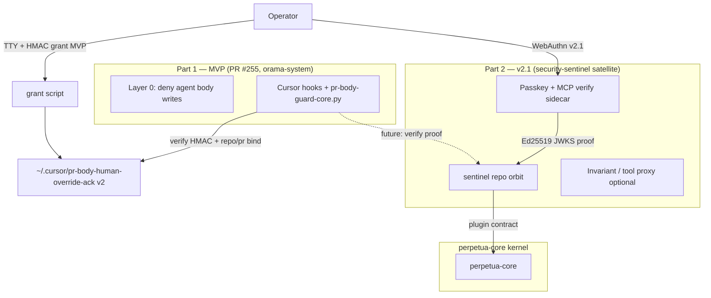

<!-- autoplan restore: 2026-07-31-010 phase6 sync (20260802-093947) -->
# PR-body grant security remediation — two-part plan (MVP + v2.1 sentinel)

> **Date:** 2026-08-02
> **Branch / PR:** `2026-08-02-pr-body-grant-hmac-mvp` (post-#255 `main`) —
> pairs with [Perpetua-Tools PR #320](https://github.com/diazMelgarejo/Perpetua-Tools/pull/320)
> **Trigger:** [CodeRabbit review 4835288649](https://github.com/diazMelgarejo/orama-system/pull/255#pullrequestreview-4835288649)
> (`/autoplan` DONE_WITH_CONCERNS 2026-08-02)
> **Research:**
> [`bin/orama-system/references/pr-body-human-grant-security-gap-research.md`](../../bin/orama-system/references/pr-body-human-grant-security-gap-research.md)
> **Method:** oramasys-method (AFRP Type C, Practitioner) —
> Ruthless MVP, defer crypto-heavy orbit to v2.1
> **Status:** **Implemented** on branch `2026-08-02-pr-body-grant-hmac-mvp` (2026-08-02)

---

## Requirements restatement

1. **Close the security gap** on the PR-body human grant path: TTY gating and plaintext
   ack files are **not** human authorization; agents with shell can run the grant script or
   forge the ack file ([research verdict](../../bin/orama-system/references/pr-body-human-grant-security-gap-research.md)).
2. **Ship a fast MVP patch** on PR #255 (orama-system harness layer) — honest doctrine,
   tightened gates, **Vallum-style HMAC binding** at minimum viable strength.
3. **Defer** passkey + MCP approval plane to **v2.1** as an orbiting **security-sentinel**
   satellite around **perpetua-core** (same orbit pattern as [agate](../v2/42-agate-hardware-policy-orbit.md)).
4. Align with **community consensus**: enforcement at tool boundary, non-forgeable proofs,
   out-of-band human verification for high-impact actions ([OWASP AI Agent Cheat Sheet](https://cheatsheetseries.owasp.org/cheatsheets/AI_Agent_Security_Cheat_Sheet.html),
   [Vallum HMAC PR #32](https://github.com/kahramanemir/Vallum/pull/32),
   [GoodRoom passkey MCP](https://dev.to/goodroom/adding-passkey-backed-human-approval-to-high-risk-mcp-actions-38h)).

---

## Two-part architecture



| Part | When | Where | Authorization model |
| --- | --- | --- | --- |
| **1 — MVP** | PR #255 (now) | orama-system `scripts/cursor/` | HMAC-bound grant file + strict TTY + repo/PR binding; **not** cryptographic human identity |
| **2 — v2.1** | After perpetua-core cut | `oramasys/security-sentinel` satellite | Passkey WebAuthn + MCP `verify` sidecar; hash-bound action proofs ([GoodRoom pattern](https://dev.to/goodroom/adding-passkey-backed-human-approval-to-high-risk-mcp-actions-38h)) |

**Elegant invariant (orama doctrine):** Harness hooks **deny by default**; escalation requires
a **verifiable artifact** the agent cannot mint from prompt alone. MVP raises the bar to
HMAC + binding; v2.1 moves signing and WebAuthn **out of the agent repo** into sentinel.

---

## Patterns to mirror

| Category | Source | Pattern |
| --- | --- | --- |
| Orbit satellite | `docs/v2/42-agate-hardware-policy-orbit.md` | Single-purpose repo orbits perpetua-core; kernel imports contract |
| Dotenv harmonize | `scripts/mesh/dotenv_merge.py` | Fill missing keys only; never print secrets |
| EXA key resolution | `scripts/exa/exa_key_resolve.py` | Keychain → openclaw.json → env; shared resolver module |
| Vallum HMAC | [kahramanemir/Vallum#32](https://github.com/kahramanemir/Vallum/pull/32) | Per-action HMAC replaces forgeable boolean |
| hashgate binding | [Seppelllo/hashgate](https://github.com/Seppelllo/hashgate) | Hash canonical action state at approval time |
| Hook core tests | `tests/test_pr_body_guard_core.py` | importlib load script; monkeypatch `ACK_PATH` |
| Incident ledger | `bin/orama-system/references/pr-body-anti-clobber-incident-ledger.md` | Link plan; no duplicate doctrine |
| Mesh secrets | `scripts/mesh/ensure_local_mesh_secrets.py` | Keychain + harmonize; log names not values |

---

## Part 1 — MVP implementation plan (fast patch)

**Complexity:** Medium (2–4 hours)
**Goal:** CodeRabbit closure + honest security posture without waiting for sentinel repo.

### MVP-A — Doctrine honesty (no security pretense)

| File | Action | Why |
| --- | --- | --- |
| `scripts/cursor/grant-pr-body-human-override.sh` | UPDATE | Fix header comment; strict TTY; require `owner/repo` + PR number args |
| `.claude/hookify.pr-body-append-only.local.md` | UPDATE | Remove agent-copyable grant steps; point to operator external terminal |
| `.cursor/rules/pr-body-comment-only.mdc` | UPDATE | Same; link this plan |
| `bin/orama-system/references/pr-body-anti-clobber-incident-ledger.md` | UPDATE | MVP grant semantics |
| `bin/orama-system/skills/cursor-pr-body/` | UPDATE | Operator workflow only |

**Grant script TTY fix:**

```bash
# Deny unless BOTH stdin and stdout are TTY (omamori #319 class)
if [[ ! -t 0 || ! -t 1 ]]; then
  echo "error: operator grant requires a full interactive terminal" >&2
  exit 1
fi
```

**Deny agent harness sessions** (defense-in-depth, not sufficient alone):

```bash
if [[ -n "${CURSOR_AGENT:-}" ]] || [[ -n "${CI:-}" ]]; then
  echo "error: grant must be run from operator shell, not agent/CI" >&2
  exit 1
fi
```

### MVP-B — HMAC grant v2 (Vallum pattern, shared lib)

**New:** `scripts/cursor/pr-body-grant-lib.py`

- `resolve_hmac_secret()` — macOS Keychain `openclaw.pr_body_grant.hmac`
  (generate on first grant if missing; never log)
- `mint_grant(repo, pr_number, nonce) → dict` — fields + `token=hmac_sha256(secret, canonical_payload)`
- `verify_grant(ack_text, repo, pr_number) → bool` — TTL + marker + HMAC + binding match

**Ack file format v2** (`operator-grant-v2`):

```text
operator-grant-v2
issued-at=2026-08-02T01:30:00Z
repo=diazMelgarejo/orama-system
pr-number=255
grant-nonce=<random>
token=<hex hmac>
```

**Update:**

| File | Action |
| --- | --- |
| `scripts/cursor/grant-pr-body-human-override.sh` | Call Python mint; require `owner/repo` and PR# |
| `scripts/cursor/hooks/pr-body-guard-core.py` | Replace `_human_override_active()` with `verify_grant()`; parse `append-pr-body.sh` args for repo/pr match |
| `scripts/cursor/append-pr-body.sh` | Fail if grant repo/pr mismatch |

Reject `operator-grant-v1` plaintext acks (fail-closed migration).

### MVP-C — Hookify / rules (CodeRabbit)

- Remove instructions telling agents to run `grant-pr-body-human-override.sh`
- Document: **operator** runs grant in **separate terminal** (or iTerm pane without agent),
  then tells agent to run **only** `append-pr-body.sh` with matching repo/PR

### MVP-D — Tests

| Test | Validates |
| --- | --- |
| `tests/test_pr_body_grant_lib.py` | HMAC mint/verify; wrong repo/pr fails; TTL expiry |
| `tests/test_pr_body_guard_core.py` | Forged v1 ack denied; valid v2 ack allows append only; hidden newline segments still denied |
| `tests/test_grant_pr_body_human_override.sh` | Mock `test -t` failure paths (bash test with env stubs) |

**Validate:**

```bash
cd orama-system
python3 -m pytest tests/test_pr_body_guard_core.py tests/test_pr_body_grant_lib.py -q
bash scripts/git/check-guard-sync-divergence.sh
```

### MVP acceptance

- [x] Plaintext v1 ack **never** activates override (`test_v1_grant_rejected`, guard + append)
- [x] Agent cannot activate override without HMAC secret + matching repo/pr/digest (`pr-body-grant-lib.py`)
- [ ] Docs never claim “not agent-runnable” without listing limits
  (partial — saga + plan; hookify/rules grep still open)
- [x] CodeRabbit 4835288649 core items addressed; Part 2 linked in [`docs/v2/51-security-sentinel-orbit-passkey-mcp.md`](../v2/51-security-sentinel-orbit-passkey-mcp.md)

### MVP risks

| Risk | Likelihood | Mitigation |
| --- | --- | --- |
| Agent reads Keychain HMAC secret | Medium | MVP raises bar; Part 2 moves signing to sentinel + passkey |
| Operator forgets grant step | Medium | `append-pr-body.sh` clear error with grant command |
| Breaking v1 ack files | Low | One-time operator re-grant; document in PR #255 |
| Cursor env vars incomplete | Medium | Combine TTY + Keychain + repo bind |

---

## Part 2 — v2.1 deferred (security-sentinel satellite)

**Canonical v2 doc:** [`docs/v2/51-security-sentinel-orbit-passkey-mcp.md`](../v2/51-security-sentinel-orbit-passkey-mcp.md)

Summary:

- New repo `oramasys/security-sentinel` (name TBD) **orbits perpetua-core** like agate
- Delivers **GoodRoom-class** passkey approval MCP + optional Invariant guardrail proxy
- orama-system hooks become **clients** verifying Ed25519 JWKS proofs bound to action hash
- perpetua-core exposes **plugin slot** for sentinel-mediated high-impact tool calls

**Not in MVP** — do not half-implement WebAuthn in orama-system scripts.

---

## Implementation record (welded commits on `2026-08-02-pr-body-grant-hmac-mvp`)

Post-#255 `main` (`525961d6`). Prior research/plan commits preserved; implementation added without reset.

```text
456dfa13  docs(security): research PR-body grant TTY/HITL gap
2fb3b275  docs: fix relative link to grant security research doc
6a2fad2d  docs(security): EXA+Firecrawl deep research
d04dc3f1  docs(plan): two-part remediation plan (+ /autoplan review body in file)
ff97572b  docs(v2): register 51-security-sentinel-orbit in v2 README
3b0bda2a  feat(security): HMAC grant v2 implementation + tests + sync script + pre-push
```

**Implemented in `3b0bda2a`:** MVP-B (grant lib, grant.sh, guard-core, append, hooks, BACKUP),
MVP-D (tests), can-4 fixes (`range_for_ref`, worktree test, `pr_body_run_guard`).

**Deferred to follow-up:** MVP-A/MVP-C full doctrine sweep (hookify, all rules, ledger links).
PT memory chronicle: `Perpetua-Tools/.agent/memory/working/PR_BODY_GRANT_HMAC_MVP_SAGA_2026-08-02.md`.

**PT mirror:** `6a5a1db5` sync from orama + `0c3506d7` saga memory (branch retains full PR #320 history).

---

## Cross-links

- Research: `bin/orama-system/references/pr-body-human-grant-security-gap-research.md`
- v2.1 orbit: `docs/v2/51-security-sentinel-orbit-passkey-mcp.md`
- Working memory: `.agent/memory/working/WORKSPACE.md`

---

## /autoplan Review Report

**Run date:** 2026-08-02
**Checkout:** `2026-07-31-010-remediation-doctrine-phase6-sync`
**Base:** `origin/2026-07-31-010-remediation-doctrine-phase6-sync`
**Review mode:** SELECTIVE EXPANSION
**UI scope:** skipped, this plan has no product UI surface
**DX scope:** included — operators and coding agents invoking shell, hooks, and
repository skills
**Mutation rule:** local-only review artifacts; no commit, push, merge, or PR update was performed.

### Review readiness

The plan is a strong problem statement and a reasonable split between a bounded
MVP and a larger approval satellite. It is not yet implementation-ready as a
security plan because its proposed HMAC file is still described as if it were a
human-authentication boundary, and the exact approved action is not fully bound.
The current implementation confirms the finding: the grant script emits
`operator-grant-v1` plus a timestamp, while `pr-body-guard-core.py` accepts the
marker and TTL alone (`scripts/cursor/grant-pr-body-human-override.sh:6-21`,
`scripts/cursor/hooks/pr-body-guard-core.py:49-67`).

## Phase 1 — CEO / strategy review

### 0A. Premise challenge

| Premise | Assessment | Decision |
| --- | --- | --- |
| TTY plus an agent-environment check improves the gate | True as defense-in-depth, false as human identity | Keep, but label it as a weak adjunct and test both TTY descriptors |
| HMAC binding is the right MVP | Reasonable for stopping naive file forgery and cross-PR reuse | Accept with exact action binding, replay handling, and an explicit same-user compromise limit |
| Passkey/MCP approval belongs in v2.1 | Reasonable if the MVP does not claim human authentication | Accept, but make the v2.1 exit criteria concrete |
| A file-backed grant is acceptable for the MVP | Only if the host secret boundary and same-user threat premise are explicit | Accept conditionally; fail closed on unsupported secret providers |
| The grant can authorize a general append for eight hours | Too broad for consent integrity | Replace with a short-lived, one-time, repo/PR/action/content-bound capability |

**Premise gate:** the operator must confirm that MVP HMAC is a capability-integrity
mechanism, not proof of human identity. If the threat model includes a same-user
agent that can read the operator's Keychain and invoke the operator's shell, only
an external host-mediated approval or separate principal can close that boundary.

### 0B. What already exists

| Need | Existing surface | Reuse decision |
| --- | --- | --- |
| Default deny | `pr-body-guard-core.py` plus MCP/shell hooks | Preserve the current deny-by-default path |
| Append-only merge | `append-pr-body.sh` READ → BACKUP → MERGE → WRITE flow | Preserve; add grant verification and a per-PR lock |
| Backup | `scripts/cursor/hooks/pr-body-backup-lib.sh` and `.git/pr-body-backups` | Reuse; keep backup before any remote mutation |
| Shell command split | `_shell_segments()` and regression tests | Preserve and expand around wrappers and quoted arguments |
| Documentation contract | `.cursor` rules, hookify note, cursor-pr-body skill, incident ledger | Update all together from one canonical grant contract |
| Guard drift check | `scripts/git/check-guard-sync-divergence.sh` | Extend to the new verifier and its tests |
| v2 security direction | `docs/v2/51-security-sentinel-orbit-passkey-mcp.md` | Keep documentation-only in this MVP |

### 0C. Dream state

```text
CURRENT
  plaintext marker + timestamp
  TTY interpreted as operator signal
  broad eight-hour grant
  append script checks marker only
       |
       v
THIS MVP
  fail-closed v1 rejection
  short-lived HMAC capability
  repo + PR + action + content binding
  one-time nonce consumption
  operator-facing errors and deterministic tests
       |
       v
12-MONTH IDEAL
  external approval service or host UI
  passkey/WebAuthn user verification
  action hash and human-readable preview bound together
  Ed25519/JWKS verification at every tool boundary
  auditable, rotated, revocable capabilities
```

### 0C-bis. Implementation alternatives

| Approach | Human effort / CC effort | Risk | Decision |
| --- | --- | --- | --- |
| HMAC capability file, one-time and action-bound | ~1 day / ~30 min | Same-user agent compromise remains possible | **Choose for MVP** |
| Host-only approval broker or OS separate principal | Several days / ~1 hour prototype | Platform-specific and harder to install | Defer to v2.1, keep as explicit exit path |
| Passkey/WebAuthn/MCP now | Multi-week / several hours prototype | Too much new infrastructure in PR #255 | Reject for MVP; documentation only |

### 0D. Scope decisions

**In scope:** grant format v2, canonical signing/verifying library, exact repo/PR
binding, action/content binding, one-time replay protection, fail-closed
migration, operator/agent docs, shell and Python regression tests, verifier
sync checks, and append concurrency protection.

**Deferred:** WebAuthn, MCP approval sidecar, sentinel repository creation,
fleet-wide approval, JWKS rotation, and external audit retention. These belong to
v2.1 only after the sentinel boundary and threat model are approved.

### 0E. Temporal interrogation

| Horizon | Success condition | Failure to avoid |
| --- | --- | --- |
| Hour 1 | v1 forged ack is rejected and current comment-only behavior remains green | Fixing the script while leaving the Python hook on v1 |
| Hour 6 | Full grant, guard, append, and hook tests pass with no real credentials | A green unit test that never exercises repo/PR mismatch or replay |
| One week | Operators can grant one exact append without reading implementation details | Broad grants that become normal workflow and silently authorize unrelated edits |
| Six months | Sentinel can replace HMAC without changing append semantics | Hard-coding Keychain and v2 assumptions into every hook |

### CEO findings and decisions

| ID | Severity | Finding | Decision / fix |
| --- | --- | --- | --- |
| CEO-1 | High | HMAC proves possession of a secret, not that a human approved the action. Same-user agents may still access the secret depending on host policy. | Rewrite the plan's security claim to “non-forgeable under the documented secret boundary”; add a v2.1 exit criterion for host-mediated approval. |
| CEO-2 | High | An eight-hour repo/PR grant is broader than the user action that prompted it. Any later append during the TTL can be authorized. | Bind repo, PR, operation, canonical append-content digest, issued/expiry, and nonce. Consume nonce atomically after one successful write. |
| CEO-3 | Medium | “Operator runs a separate terminal” is a workflow instruction, not an enforcement boundary when agent and operator share a Unix identity. | Keep it as operator guidance, but do not count it as security proof. State the residual risk plainly. |
| CEO-4 | Medium | The plan names v2.1 but does not define the migration trigger beyond “after perpetua-core cut.” | Add measurable exit gates: sentinel proof verification, action-hash binding, key rotation, revocation, and removal of local HMAC acceptance. |

**CEO voice status:** primary review completed. External Codex voice was attempted
with authenticated CLI, but local model-cache and malformed skill-metadata errors
prevented a clean bounded result. No external consensus claim is made.

## Phase 2 — Design review

Skipped. The plan describes operator terminal and hook behavior, not a product
screen, form, dashboard, or user-facing layout. Operator error text is covered in
the DX and engineering passes.

## Phase 3 — Engineering review

### 1. Architecture dependency graph

```text
grant-pr-body-human-override.sh
        |
        v
pr-body-grant-lib.py  <---- secret provider / test provider
        |
        +--> signed capability file
        |
        +--> guard-core.verify_grant(capability, repo, pr, action, digest)
                              ^                  ^
                              |                  |
before-shell / before-mcp ---+                  |
                                                   |
append-pr-body.sh -- reads body, locks, verifies, backs up, merges, writes
                                                   |
                                                   v
                                              GitHub PR body
```

The verifier must be the one source of truth. Shell code should not duplicate
HMAC canonicalization, timestamp parsing, or field validation. The hook can
identify suspicious commands, but the append script must independently verify the
capability immediately before mutation.

### 2. Architecture and security findings

| ID | Severity | Finding | Fix required in plan |
| --- | --- | --- | --- |
| ENG-1 | Critical | The plan binds repo and PR, but not the exact append content or action. A valid capability could authorize arbitrary later text for the same PR. | Add `action=append-pr-body` and `content-sha256` over canonical normalized append data, including title and body; verify before GitHub mutation. |
| ENG-2 | High | Replay is not addressed. A nonce is minted but the plan does not say how it is consumed. | Add atomic one-time consumption, preferably a protected local state file or secure provider; define crash behavior before and after remote success. |
| ENG-3 | High | The plan asks the hook to parse `append-pr-body.sh` arguments, but shell parsing is not a reliable authorization boundary for absolute paths, wrappers, quoting, or aliases. | Make `append-pr-body.sh` the authoritative verifier and pass a structured request to the Python library. Hooks remain deny/allow preflight only. |
| ENG-4 | High | Keychain access is macOS-specific while the skill advertises multiple agent platforms. Unsupported platforms could silently fall back to an environment variable or plaintext secret. | Define a provider interface. Unsupported providers fail closed; test macOS provider through a stub and document Windows/Linux operator setup separately. No automatic plaintext fallback. |
| ENG-5 | High | The filesystem capability file is vulnerable to replacement or symlink concerns unless written and read with ownership/mode checks and atomic replacement. | Require regular file, owner check where available, mode 0600, no symlink traversal, atomic create/replace, and fail closed on violations. |
| ENG-6 | High | `append-pr-body.sh` has a read, second read, then write sequence. A remote body can change after the final read and before `gh pr edit`, losing concurrent content. | Add a per-repo/PR lock and document residual GitHub API race. Prefer a conditional update mechanism if available; otherwise re-read after lock and abort on any mismatch. |
| ENG-7 | Medium | The existing `_normalize_github_repo_slug()` is unused in the current guard, and binding semantics are not defined for SSH, HTTPS, `.git`, case, or enterprise hosts. | Centralize slug normalization and test all supported remote forms. Reject non-GitHub hosts explicitly if the capability is GitHub-specific. |
| ENG-8 | Medium | The current parser accepts any text containing the v1 marker and any timestamp line. Migration must reject v1 everywhere, not just in Python tests. | Add shell-level v1 rejection tests and make the append script call the same verifier rather than `grep`. |

### 3. Test diagram and coverage

```text
operator mint
  ├─ TTY/env policy ───────────── shell integration tests
  ├─ secret provider ───────────── provider unit tests
  ├─ canonical payload ─────────── golden-vector tests
  └─ capability file ───────────── filesystem/mode/symlink tests

hook request
  ├─ MCP update_pr body ────────── guard unit tests
  ├─ shell direct write ────────── guard unit tests
  ├─ append wrapper ────────────── command-shape tests
  └─ malformed verifier ───────── fail-closed tests

append execution
  ├─ repo/PR/action/digest match ─ grant integration tests
  ├─ backup and merge ──────────── fake GitHub client tests
  ├─ remote race ───────────────── concurrency tests
  ├─ nonce replay ──────────────── atomic-consumption tests
  └─ comments/draft create ─────── regression allow tests
```

The existing five `test_pr_body_guard_core.py` tests pass, but they cover only
command splitting, marker absence, hidden newline mutations, and comments. They
do not cover grant authenticity, binding, replay, filesystem safety, or the shell
grant/append integration. The complete test matrix is saved at
`~/.gstack/projects/orama-system/2026-07-31-010-remediation-doctrine-phase6-sync-test-plan-20260802.md`.

### 4. Error and rescue registry

| Error | Cause | Required fix text |
| --- | --- | --- |
| Grant required | Missing, expired, v1, or invalid capability | Say which validation failed without exposing secret material; tell the operator to mint a new grant for the exact repo and PR |
| Binding mismatch | Capability repo/PR/action/content differs from request | Print expected identity in redacted form and instruct a new exact grant; do not suggest bypassing the hook |
| Secret provider unavailable | Keychain/provider cannot resolve secret | Fail closed and identify the supported operator setup path; never fall back to plaintext or argv secrets |
| Capability replayed | Nonce already consumed | Tell operator to mint a fresh one-time grant and preserve the prior audit/backup evidence |
| Remote body changed | Concurrent PR edit detected | Abort, retain backup, ask operator to re-read and explicitly re-approve the new append |
| Unsafe capability file | Wrong mode, owner, symlink, or malformed fields | Refuse to read or follow it; tell operator to re-mint through the grant script |

### 5. Performance and rollout

The operation is human-paced and one PR at a time. HMAC verification and a local
lock are negligible. The risk is correctness, not throughput. Roll out in this
order: verifier and vectors, grant script, append script, guard hooks, docs and
sync gate. Keep v1 deny-only compatibility for one release window only if it does
not create an activation path; otherwise reject it immediately as the plan says.

### Engineering decisions

| # | Decision | Classification | Principle | Rejected |
| --- | --- | --- | --- | --- |
| E1 | Bind the exact append action and content digest | Mechanical | Completeness | PR-only binding |
| E2 | Verify in append script and guard, with one shared library | Mechanical | DRY | Hook-only argument parsing |
| E3 | Make nonce one-time and atomic | Mechanical | Explicit over clever | TTL-only replay window |
| E4 | Fail closed on unsupported secret providers | Mechanical | Security boundary | Plaintext/env fallback |
| E5 | Add lock plus final remote re-read | Mechanical | Boil the lake within direct blast radius | Keep the existing race |
| E6 | Keep WebAuthn/MCP sentinel out of MVP | Taste decision | Pragmatic scope | Implement sentinel now |

## Phase 3.5 — DX review

### Developer persona

The primary developer is an AI coding agent operating in a repository with shell
and MCP hooks. The secondary developer is the single operator who authorizes one
specific PR-body append from a terminal. Both need errors that say what failed,
why it failed, and what safe action fixes it.

### Developer journey

| Stage | Current plan experience | Required polish |
| --- | --- | --- |
| Discover | Rules and skill point to grant and append scripts | Link the plan and a short operator reference from both |
| Understand | Plan explains MVP/v2.1 split | State “capability integrity, not human identity” near every grant example |
| Mint | Operator runs grant script | Require explicit repo and PR arguments; print redacted grant scope and expiry |
| Hand off | Operator tells agent to append | Agent receives no secret; only the scoped capability file exists |
| Append | Script reads, backs up, merges, writes | Verify capability and lock before the final remote read/write |
| Failure | Existing messages are terse in places | Use problem + cause + safe fix; do not recommend bypasses |
| Retry | Current body changed or grant expired | Re-read, re-approve, and create a fresh one-time grant |
| Upgrade | v1 files may remain | Explicitly reject v1 and document safe cleanup/re-mint |
| Debug | Hook output can be inspected | Add a redacted status/diagnostic mode or reference card, never secret output |

### DX findings

| ID | Severity | Finding | Fix |
| --- | --- | --- | --- |
| DX-1 | High | The current grant command has no repo/PR arguments, while the plan requires them. Existing docs still teach the old no-scope command. | Update every rule, skill, hookify note, ledger, and reference card in the same batch. Add a copy-paste example with placeholders only. |
| DX-2 | High | The error “operator grant required” does not distinguish missing, v1, expired, malformed, or wrong-scope grants. | Return stable error classes with problem, cause, and safe fix. Keep secret values and raw tokens out of output. |
| DX-3 | Medium | Keychain-only language makes the workflow unclear on Windows/Linux even though the skill compatibility lists multiple runtimes. | Document supported provider matrix and explicit fail-closed behavior for unsupported hosts. |
| DX-4 | Medium | A one-time content-bound grant adds a required step that is not shown in the current operator flow. | Provide a small helper command or documented sequence that computes the digest without exposing content or secret material. |
| DX-5 | Medium | There is no documented recovery path for a crash after remote success but before nonce consumption. | Define reconciliation: re-read the remote body, record the matching append, and consume or quarantine the nonce without blindly retrying. |

### DX scorecard

| Dimension | Score | Reason |
| --- | ---: | --- |
| Getting started | 6/10 | Clear concept, but current examples and future scoped arguments differ |
| API/CLI ergonomics | 6/10 | Names are understandable; grant scope and digest flow need a stable interface |
| Errors/debugging | 4/10 | Current errors omit the cause and safe recovery path |
| Documentation | 7/10 | Strong plan and references, but multiple existing docs must be harmonized |
| Upgrade/migration | 5/10 | v1 rejection is stated, but cleanup and crash recovery are unspecified |
| Environment/tooling | 5/10 | macOS Keychain is concrete; cross-platform provider behavior is not |
| Community/ecosystem | 6/10 | Research sources are present; production boundary assumptions need clearer labeling |
| Feedback loops | 4/10 | No explicit redacted diagnostics or operator failure telemetry |
| **Overall** | **5.4/10** | Good direction, incomplete operational contract |

### DX implementation checklist

- [ ] One copy-paste operator flow uses explicit repo, PR, action, and append scope.
- [ ] Every failure names problem, cause, and safe fix.
- [ ] v1 marker is rejected by every activation path.
- [ ] Provider support and fail-closed behavior are documented for each supported host.
- [ ] Recovery after remote success / local crash is specified and tested.
- [ ] Diagnostics are redacted and do not reveal HMAC secrets or full PR bodies.

## Cross-phase themes

1. **Authorization boundary:** CEO, engineering, and DX all found that TTY and a
   same-user Keychain are not proof of human identity. The plan must use narrower
   capability language now and reserve true human approval for v2.1.
2. **Exact action binding:** CEO and engineering both require content/action
   binding, not only repo/PR binding. This is the highest-confidence MVP change.
3. **Migration completeness:** Engineering and DX both found that v1 rejection,
   replay, crash recovery, and all documentation surfaces need one synchronized
   contract.

## NOT in scope

- WebAuthn/passkey UI or MCP approval service implementation.
- New sentinel repository or perpetua-core plugin code.
- Fleet-wide approval, key rotation service, or external audit retention.
- Reworking unrelated PR-body anti-clobber history or GitHub permissions.
- Replacing the append-only merge workflow with a delta-only API.

## Completion summary

The plan is **directionally approved but not ready for implementation without
revision**. The MVP should proceed after adding exact action/content binding,
one-time nonce consumption, shared verifier ownership, provider failure behavior,
filesystem safety, remote-race handling, and complete operator error text. The
v2.1 split remains the correct scope boundary, provided the MVP does not claim to
authenticate a human.

## Decision audit trail

| # | Phase | Decision | Classification | Principle | Rationale | Rejected |
| --- | --- | --- | --- | --- | --- | --- |
| 1 | CEO | Use SELECTIVE EXPANSION | Mechanical | Completeness | The plan needs direct security and workflow fixes but not sentinel infrastructure | HOLD scope |
| 2 | CEO | Keep MVP HMAC, narrow its claim | Taste decision | Pragmatic | It blocks naive forgery quickly while preserving a path to v2.1 | Passkeys in this PR |
| 3 | CEO | Shorten broad TTL into one-time capability | Mechanical | Explicit over clever | Exact user intent must not become an eight-hour blanket grant | TTL-only grant |
| 4 | Eng | Bind action and content digest | Mechanical | Completeness | Same PR is not the same approved append | Repo/PR-only binding |
| 5 | Eng | Verify in append script and hook | Mechanical | DRY | One library, two enforcement points closes wrapper bypasses | Hook-only verification |
| 6 | Eng | Add atomic replay handling and lock | Mechanical | Boil the lake | Directly prevents duplicate or concurrent writes | Best-effort TTL |
| 7 | Eng | Fail closed for unsupported providers | Mechanical | Security first | A fallback secret store would recreate the plaintext problem | Environment fallback |
| 8 | DX | Harmonize all operator docs in one batch | Mechanical | DRY | Old examples would keep teaching the invalid flow | Partial doc update |
| 9 | DX | Add stable actionable error classes | Mechanical | Completeness | Operators and agents need a safe recovery path | Generic “grant required” |

## Approval gate — pending operator decision

The premises requiring confirmation are:

1. MVP HMAC is accepted only as a scoped capability proof under a documented
   secret boundary, not as proof that a human is present.
2. The MVP may add exact action/content binding, one-time consumption, and direct
   append verification even though these expand the original two-to-four-hour
   estimate.
3. WebAuthn/MCP/sentinel implementation remains deferred to v2.1.

No source code has been changed by this review. The plan file and the external
test-plan artifact are local-only and uncommitted.

## GSTACK REVIEW REPORT

| Review | Status | Findings | Critical gaps | Notes |
| --- | --- | ---: | ---: | --- |
| CEO | issues_open | 4 | 0 | HMAC claim, grant breadth, same-user boundary, v2.1 exit gates |
| Design | skipped | 0 | 0 | No product UI scope detected |
| Eng | issues_open | 8 | 1 | Action binding, replay, verifier ownership, provider/filesystem/race coverage |
| DX | issues_open | 5 | 0 | Scoped command flow, actionable errors, cross-platform setup, recovery |
| External voice | degraded | N/A | N/A | Authenticated Codex CLI was attempted; local cache and malformed skill metadata prevented a clean bounded result |

**Overall:** NOT READY FOR IMPLEMENTATION until the approval-gate premises are
confirmed and the critical/high findings are incorporated into the plan.
