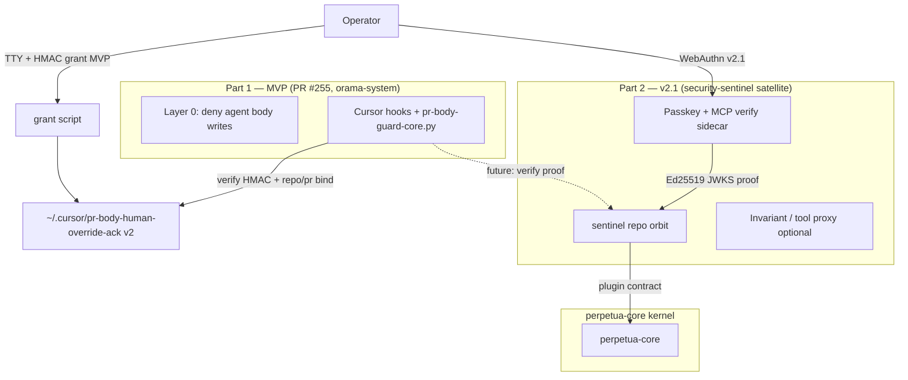

# PR-body grant security remediation — two-part plan (MVP + v2.1 sentinel)

> **Date:** 2026-08-02  
> **Branch / PR:** `2026-07-31-010-remediation-doctrine-phase6-sync` → [orama-system PR #255](https://github.com/diazMelgarejo/orama-system/pull/255)  
> **Trigger:** [CodeRabbit review 4835288649](https://github.com/diazMelgarejo/orama-system/pull/255#pullrequestreview-4835288649)  
> **Research:** [`bin/orama-system/references/pr-body-human-grant-security-gap-research.md`](../../bin/orama-system/references/pr-body-human-grant-security-gap-research.md)  
> **Method:** oramasys-method (AFRP Type C, Practitioner) — Ruthless MVP, defer crypto-heavy orbit to v2.1  
> **Status:** **Plan — awaiting operator confirm before MVP code**

---

## Requirements restatement

1. **Close the security gap** on the PR-body human grant path: TTY gating and plaintext
   ack files are **not** human authorization; agents with shell can run the grant script or
   forge the ack file ([research verdict](../../bin/orama-system/references/pr-body-human-grant-security-gap-research.md)).
2. **Ship a fast MVP patch** on PR #255 (orama-system harness layer) — honest doctrine,
   tightened gates, **Vallum-style HMAC binding** at minimum viable strength.
3. **Defer** passkey + MCP approval plane to **v2.1** as an orbiting **security-sentinel**
   satellite around **perpetua-core** (same orbit pattern as [agate](../v2/42-agate-hardware-policy-orbit.md)).
4. Align with **community consensus**: enforcement at tool boundary, non-forgeable proofs,
   out-of-band human verification for high-impact actions ([OWASP AI Agent Cheat Sheet](https://cheatsheetseries.owasp.org/cheatsheets/AI_Agent_Security_Cheat_Sheet.html),
   [Vallum HMAC PR #32](https://github.com/kahramanemir/Vallum/pull/32),
   [GoodRoom passkey MCP](https://dev.to/goodroom/adding-passkey-backed-human-approval-to-high-risk-mcp-actions-38h)).

---

## Two-part architecture



| Part | When | Where | Authorization model |
| --- | --- | --- | --- |
| **1 — MVP** | PR #255 (now) | orama-system `scripts/cursor/` | HMAC-bound grant file + strict TTY + repo/PR binding; **not** cryptographic human identity |
| **2 — v2.1** | After perpetua-core cut | `oramasys/security-sentinel` satellite | Passkey WebAuthn + MCP `verify` sidecar; hash-bound action proofs ([GoodRoom pattern](https://dev.to/goodroom/adding-passkey-backed-human-approval-to-high-risk-mcp-actions-38h)) |

**Elegant invariant (orama doctrine):** Harness hooks **deny by default**; escalation requires
a **verifiable artifact** the agent cannot mint from prompt alone. MVP raises the bar to
HMAC + binding; v2.1 moves signing and WebAuthn **out of the agent repo** into sentinel.

---

## Patterns to mirror

| Category | Source | Pattern |
| --- | --- | --- |
| Orbit satellite | `docs/v2/42-agate-hardware-policy-orbit.md` | Single-purpose repo orbits perpetua-core; kernel imports contract |
| Dotenv harmonize | `scripts/mesh/dotenv_merge.py` | Fill missing keys only; never print secrets |
| EXA key resolution | `scripts/exa/exa_key_resolve.py` | Keychain → openclaw.json → env; shared resolver module |
| Vallum HMAC | [kahramanemir/Vallum#32](https://github.com/kahramanemir/Vallum/pull/32) | Per-action HMAC replaces forgeable boolean |
| hashgate binding | [Seppelllo/hashgate](https://github.com/Seppelllo/hashgate) | Hash canonical action state at approval time |
| Hook core tests | `tests/test_pr_body_guard_core.py` | importlib load script; monkeypatch `ACK_PATH` |
| Incident ledger | `bin/orama-system/references/pr-body-anti-clobber-incident-ledger.md` | Link plan; no duplicate doctrine |
| Mesh secrets | `scripts/mesh/ensure_local_mesh_secrets.py` | Keychain + harmonize; log names not values |

---

## Part 1 — MVP implementation plan (fast patch)

**Complexity:** Medium (2–4 hours)  
**Goal:** CodeRabbit closure + honest security posture without waiting for sentinel repo.

### MVP-A — Doctrine honesty (no security pretense)

| File | Action | Why |
| --- | --- | --- |
| `scripts/cursor/grant-pr-body-human-override.sh` | UPDATE | Fix header comment; strict TTY; require `owner/repo` + PR number args |
| `.claude/hookify.pr-body-append-only.local.md` | UPDATE | Remove agent-copyable grant steps; point to operator external terminal |
| `.cursor/rules/pr-body-comment-only.mdc` | UPDATE | Same; link this plan |
| `bin/orama-system/references/pr-body-anti-clobber-incident-ledger.md` | UPDATE | MVP grant semantics |
| `bin/orama-system/skills/cursor-pr-body/` | UPDATE | Operator workflow only |

**Grant script TTY fix:**

```bash
# Deny unless BOTH stdin and stdout are TTY (omamori #319 class)
if [[ ! -t 0 || ! -t 1 ]]; then
  echo "error: operator grant requires a full interactive terminal" >&2
  exit 1
fi
```

**Deny agent harness sessions** (defense-in-depth, not sufficient alone):

```bash
if [[ -n "${CURSOR_AGENT:-}" ]] || [[ -n "${CI:-}" ]]; then
  echo "error: grant must be run from operator shell, not agent/CI" >&2
  exit 1
fi
```

### MVP-B — HMAC grant v2 (Vallum pattern, shared lib)

**New:** `scripts/cursor/pr-body-grant-lib.py`

- `resolve_hmac_secret()` — macOS Keychain `openclaw.pr_body_grant.hmac` (generate on first grant if missing; never log)
- `mint_grant(repo, pr_number, nonce) → dict` — fields + `token=hmac_sha256(secret, canonical_payload)`
- `verify_grant(ack_text, repo, pr_number) → bool` — TTL + marker + HMAC + binding match

**Ack file format v2** (`operator-grant-v2`):

```text
operator-grant-v2
issued-at=2026-08-02T01:30:00Z
repo=diazMelgarejo/orama-system
pr-number=255
grant-nonce=<random>
token=<hex hmac>
```

**Update:**

| File | Action |
| --- | --- |
| `scripts/cursor/grant-pr-body-human-override.sh` | Call Python mint; require `owner/repo` and PR# |
| `scripts/cursor/hooks/pr-body-guard-core.py` | Replace `_human_override_active()` with `verify_grant()`; parse `append-pr-body.sh` args for repo/pr match |
| `scripts/cursor/append-pr-body.sh` | Fail if grant repo/pr mismatch |

Reject `operator-grant-v1` plaintext acks (fail-closed migration).

### MVP-C — Hookify / rules (CodeRabbit)

- Remove instructions telling agents to run `grant-pr-body-human-override.sh`
- Document: **operator** runs grant in **separate terminal** (or iTerm pane without agent), then tells agent to run **only** `append-pr-body.sh` with matching repo/PR

### MVP-D — Tests

| Test | Validates |
| --- | --- |
| `tests/test_pr_body_grant_lib.py` | HMAC mint/verify; wrong repo/pr fails; TTL expiry |
| `tests/test_pr_body_guard_core.py` | Forged v1 ack denied; valid v2 ack allows append only; hidden newline segments still denied |
| `tests/test_grant_pr_body_human_override.sh` | Mock `test -t` failure paths (bash test with env stubs) |

**Validate:**

```bash
cd orama-system
python3 -m pytest tests/test_pr_body_guard_core.py tests/test_pr_body_grant_lib.py -q
bash scripts/git/check-guard-sync-divergence.sh
```

### MVP acceptance

- [ ] Plaintext v1 ack **never** activates override
- [ ] Agent cannot activate override without HMAC secret (Keychain) + matching repo/pr
- [ ] Docs never claim “not agent-runnable” without listing limits
- [ ] CodeRabbit 4835288649 items addressed or explicitly deferred to Part 2 with link to [`docs/v2/51-security-sentinel-orbit-passkey-mcp.md`](../v2/51-security-sentinel-orbit-passkey-mcp.md)

### MVP risks

| Risk | Likelihood | Mitigation |
| --- | --- | --- |
| Agent reads Keychain HMAC secret | Medium | MVP raises bar; Part 2 moves signing to sentinel + passkey |
| Operator forgets grant step | Medium | `append-pr-body.sh` clear error with grant command |
| Breaking v1 ack files | Low | One-time operator re-grant; document in PR #255 |
| Cursor env vars incomplete | Medium | Combine TTY + Keychain + repo bind |

---

## Part 2 — v2.1 deferred (security-sentinel satellite)

**Canonical v2 doc:** [`docs/v2/51-security-sentinel-orbit-passkey-mcp.md`](../v2/51-security-sentinel-orbit-passkey-mcp.md)

Summary:

- New repo `oramasys/security-sentinel` (name TBD) **orbits perpetua-core** like agate
- Delivers **GoodRoom-class** passkey approval MCP + optional Invariant guardrail proxy
- orama-system hooks become **clients** verifying Ed25519 JWKS proofs bound to action hash
- perpetua-core exposes **plugin slot** for sentinel-mediated high-impact tool calls

**Not in MVP** — do not half-implement WebAuthn in orama-system scripts.

---

## Implementation order (after confirm)

```text
1. MVP-A doctrine + TTY + agent env deny
2. MVP-B pr-body-grant-lib.py + grant.sh + guard-core.py + append-pr-body.sh
3. MVP-D tests (red → green)
4. MVP-C hookify / rules / skill / ledger links
5. Update WORKSPACE + research doc “implemented” section
6. Part 2 doc only (no sentinel code in this PR)
```

---

## WAITING FOR CONFIRMATION

Reply **yes / proceed** to implement Part 1 MVP on PR #255 branch, or **modify:**
with changes. Part 2 remains documentation-only in this PR unless you expand scope.

---

## Cross-links

- Research: `bin/orama-system/references/pr-body-human-grant-security-gap-research.md`
- v2.1 orbit: `docs/v2/51-security-sentinel-orbit-passkey-mcp.md`
- Working memory: `.agent/memory/working/WORKSPACE.md`
