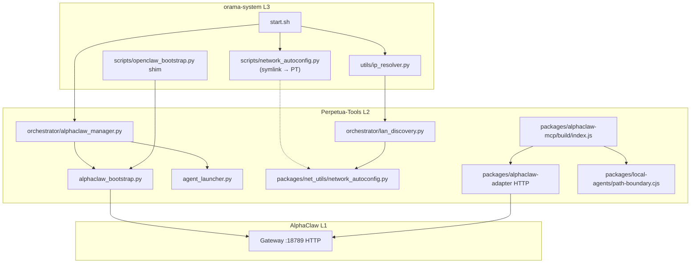

# Perpetua-Tools MCP + net_utils Migration — Design Spec

**Date:** 2026-05-25  
**Scope:** Perpetua-Tools (PT) untracked WIP + orama-system (`network_autoconfig`, `start.sh`, `ip_resolver`)  
**Status:** Draft for brainstorming / autoplan — **no implementation in this document**  
**Out of scope:** F9 branch `2026-05-25-f9-portal-dashboard-404` (unpushed), AlphaClaw repo internals, `node_modules` hygiene

---

## Goal

Land untracked PT work safely: retire legacy Gate 0 MCP, establish a single owner for LAN autoconfig, wire `lan_discovery` / bootstrap / orama `start.sh` without duplicate MCP surfaces or conflicting Windows IP heuristics.

### Success criteria

1. Exactly one stdio MCP entry point for AlphaClaw: `packages/alphaclaw-mcp/build/index.js`.
2. `packages/net_utils/network_autoconfig.py` tracked in PT; orama consumes it via existing symlink pattern (no second divergent copy long-term).
3. Tracked `orchestrator/lan_discovery.py` imports `net_utils` (logic from `lan_discovery 2.py`, with `.103` tilting — not `.100`).
4. `alphaclaw_bootstrap.py` tracked; orama continues to delegate via `PT_HOME`.
5. All `* 2.py` Finder duplicates removed from PT tree.
6. Docs and registration strings updated; legacy `server.js` absent from disk and untracked set.

---

## 1. Context map (as-built + WIP)

### 1.1 Component inventory

| Component | Location | Git state | Role |
| --------- | -------- | --------- | ---- |
| **Canonical MCP** | `PT/packages/alphaclaw-mcp/src/index.ts` | Tracked | 14 tools, profiles, adapter + `local-agents` orchestrator |
| **Legacy Gate 0 MCP** | `PT/packages/alphaclaw-adapter/src/mcp/server.js` | **Untracked (`??`)** | 11-tool JS stdio server — superseded |
| **HTTP adapter** | `PT/packages/alphaclaw-adapter/src/index.js` | Tracked | AlphaClaw REST client (MCP must not bypass) |
| **Path boundary (fix 4)** | `PT/packages/local-agents/src/path-boundary.cjs` | Tracked | `resolveAllowedPath`, redaction; used by `orchestrator.js` for code tools |
| **MCP profiles (fix 6)** | `PT/packages/alphaclaw-mcp/src/mcp-profiles.ts` | Tracked | readonly / elevated tool gates |
| **LAN autoconfig (WIP)** | `PT/packages/net_utils/network_autoconfig.py` | **Untracked (`??`)** | `NetworkAutoConfig`, `discover_lan_agents` |
| **LAN autoconfig (orama)** | `orama-system/scripts/network_autoconfig.py` | Tracked | Same class shape; adds `_load_from_openclaw()` |
| **orama → PT symlink** | `orama-system/start.sh` L171–176 | Tracked | Symlink `scripts/network_autoconfig.py` → `PT/packages/net_utils/network_autoconfig.py` when file exists |
| **LAN discovery** | `PT/orchestrator/lan_discovery.py` | Tracked | Scan/takeover; `detect_active_tilting_ip()` — **no net_utils import** |
| **LAN discovery (dup)** | `PT/orchestrator/lan_discovery 2.py` | Untracked duplicate | Imports net_utils; **`.100` tilting (wrong)** |
| **AlphaClaw manager** | `PT/orchestrator/alphaclaw_manager.py` | Tracked | Authoritative probe + mode; delegates `alphaclaw_bootstrap.py` |
| **Bootstrap** | `PT/alphaclaw_bootstrap.py` | **Untracked (`??`)** | OpenClaw gateway install/commandeer; writes `~/.openclaw/openclaw.json` |
| **Bootstrap (dup)** | `PT/alphaclaw_bootstrap 2.py` | Untracked | Imports net_utils |
| **orama bootstrap shim** | `orama-system/scripts/openclaw_bootstrap.py` | Tracked | Delegates to `PT_HOME/alphaclaw_bootstrap.py` |
| **IP resolver** | `orama-system/utils/ip_resolver.py` | Tracked | P1–P6 chain; P4 calls PT `detect_active_tilting_ip()` |
| **Finder duplicates** | 78× `* 2.py` under PT | Untracked | Accidental copies; some import net_utils |

### 1.2 Authority model (already documented)

```text
AlphaClaw (L1)  ←HTTP/CLI←  Perpetua-Tools (L2)  ←subprocess JSON←  orama-system (L3)
```

- **PT `alphaclaw_manager.py`** is authoritative for backend probe, runtime mode, and bootstrap delegation (`--resolve --env-only` for orama).
- **orama `start.sh`** must not re-derive gateway decisions; it reads PT’s JSON payload.
- **MCP:** PT `alphaclaw-mcp` only; orama Cursor stack uses `code-review-graph` + optional `ai-cli-mcp` per `SECURITY-POLICY.md` fix 6 — not a second AlphaClaw MCP.

### 1.3 Data flow (target end state)



#### ASCII (stdio MCP path)

```text
Cursor / Claude Code
    │ stdio
    ▼
packages/alphaclaw-mcp/build/index.js
    ├─► @diazmelgarejo/alphaclaw-adapter  ──HTTP──► AlphaClaw gateway
    └─► packages/local-agents/orchestrator.js
            └─► path-boundary.cjs (user file paths for ask/propose_edit)

[DELETED] packages/alphaclaw-adapter/src/mcp/server.js  ← must not register
```

### 1.4 Current gaps (why migration is needed)

1. **Dual MCP surface:** Untracked `server.js` still on disk; docs mixed “deleted” vs file present; risk of `claude mcp add … server.js`. MIGRATE ALL unique features and annotations from `server.js` to `packages/alphaclaw-mcp/src/index.ts` and delete `server.js`, DULY NOTED on ALL docs and inline code comments for posterity.
2. **net_utils not wired:** Tracked `lan_discovery.py` does not import `net_utils`; WIP logic lives only in `* 2.py` duplicates. MERGE what is unique in these alternate versions and REMOVE ALL `* 2.py` files from PT tree.
3. **Conflicting tilting IP:** Tracked `lan_discovery.py` uses `.103` + UDP trick; `lan_discovery 2.py` uses `.100` + `NetworkAutoConfig` — orama `LESSONS.md` RC-5 documented `.100` typo.
4. **Duplicate autoconfig:** PT WIP `preferred_ips` (.110 / .108) vs orama tracked (`.105` + `openclaw.json` loader).
5. **Untracked bootstrap:** `alphaclaw_bootstrap.py` is the real implementation; orama shim already points at it but file is not in git.
6. **78 `* 2.py` files:** Pollute imports and confuse agents; must not be committed.

### 1.5 Security posture (fix 4 / 6)

| Surface | Path boundary | Notes |
| ------- | ------------- | ----- |
| `local_agent_*` tools | Yes — `path-boundary.cjs` | User-supplied `filePath` |
| `alphaclaw_read_config` / `alphaclaw_tail_logs` | Fixed paths only | `~/.openclaw/openclaw.json`, `hourly-sync.log` — no arbitrary path arg |
| Legacy `server.js` | No | Another stdio MCP if registered — **remove** |
| Bootstrap secrets | `SETUP_PASSWORD`, `.env` writes | Default password fallback documented; must not commit secrets |

**Gap to close in implementation:** Ensure `alphaclaw-mcp` file tools never accept caller-controlled paths (today they do not). Align env roots in MCP launch config: `MCP_APPROVED_ROOTS`, `ALPHACLAW_ROOT`, `PERPETUA_TOOLS_ROOT`, `ORAMA_SYSTEM_ROOT` per `orama-system/docs/SECURITY-POLICY.md`.

---

## 2. Three approaches — net_utils ownership + dedup

### Approach A — **PT-owned module, orama symlink consumer** (recommended)

**Design:** `PT/packages/net_utils/network_autoconfig.py` is the single source file. orama keeps `scripts/network_autoconfig.py` as symlink created by `start.sh` (already implemented). Merge orama-only `_load_from_openclaw()` into PT class (or small `network_autoconfig_orama.py` shim that subclasses — YAGNI: merge into PT with optional behavior gated on `OPENCLAW_JSON` env).

#### A.Pros

- Matches existing `start.sh` L171–176 and recovery docs (“do not replace orama file with symlink to PT” meant avoid *wrong* symlink target — PT as source is intended).
- PT is already authoritative for LAN/gateway (`alphaclaw_manager`, `agent_launcher`, hardware policy).
- One place to fix `preferred_ips` and `discover_lan_agents`.
- `ip_resolver` P4 imports PT `lan_discovery` — net_utils colocation reduces import path hacks.

#### A.Cons

- orama-specific openclaw.json logic moves into PT tree (acceptable: PT already writes `openclaw.json` via bootstrap).
- Requires PT commit before orama symlink works on fresh clones (ordering in rollout).

### Approach B — **orama-owned module, PT imports**

**Design:** Canonical `orama-system/scripts/network_autoconfig.py`; PT adds symlink or `sys.path` import from `ORAMA_SYSTEM_ROOT`.

#### B.Pros

- orama `network_autoconfig.py` already tracked with openclaw integration.
- orama install docs already center `python scripts/network_autoconfig.py --scan`.

#### B.Cons

- Inverts `start.sh` symlink direction today (would need rewrite).
- Violates “PT authoritative for probe/LAN” narrative in `alphaclaw_manager` docstring.
- PT CI/tests would depend on orama path layout.

### Approach C — **Shared contract, thin copies in both repos**

**Design:** Documented interface (methods + env keys); two implementations kept in sync manually or via copy script.

#### Pros

- Repo independence for contributors who only clone one tree.

#### Cons

- Guaranteed drift (already happened: `.108/.110` vs `.105`, `.100` vs `.103`).
- Highest maintenance cost; violates YAGNI for a ~220-line module.

### Recommendation: **Approach A — “PT-owned net_utils + orama symlink”**

**Name for autoplan:** `PT-owned-net_utils-orama-symlink`

**Merge rules for `NetworkAutoConfig`**

1. **Priority 1:** `_load_from_openclaw()` from orama (when `~/.openclaw/openclaw.json` has `lmstudio-win.baseUrl`).
2. **Priority 2:** `preferred_ips` constants — align with hardware matrix + `ip_resolver` fallback `.103` (not `.100`).
3. **Priority 3:** netifaces / interface heuristics (shared code).
4. **Export:** `discover_lan_agents`, `get_working_local_ip`, `get_optimal_server_config` unchanged signature for `start.sh` Python snippets.

**Dedup `detect_active_tilting_ip`:** Single implementation in **tracked** `orchestrator/lan_discovery.py`:

- Import `NetworkAutoConfig` when available.
- Keep env override chain: `LAN_GPU_IP_OVERRIDE`, `LM_STUDIO_WIN_ENDPOINTS`, `WIN_IP` / `WINDOWS_IP` (from `lan_discovery 2.py`).
- Subnet suffix **`.103`** for Windows GPU (tracked + orama `ip_resolver`); delete `.100` path permanently.

---

## 3. `server.js` disposition

### 3.1 Decision: **Delete** (not gitignore-only)

| Option | Verdict |
| ------ | ------- |
| **Delete untracked file** | **Yes** — Gate 2 TS absorbed tools; file is `??` and not part of release artifact |
| **gitignore `packages/alphaclaw-adapter/src/mcp/`** | Only if empty dir must remain; prefer delete entire legacy path |
| **Keep with warning stub** | No — YAGNI; increases duplicate MCP risk |

**Rationale:** `CLAUDE.md` and `MIGRATION.md` already state deleted (2026-05-22). Keeping `??` file contradicts docs and security goal “no duplicate MCP surfaces.” Gitignore without delete leaves local `claude mcp` registrations working until someone notices.

### 3.2 References to update (grep sweep)

#### Perpetua-Tools — product docs (update to `packages/alphaclaw-mcp/build/index.js`)

| File | Kind |
| ---- | ---- |
| `docs/MIGRATION.md` | Says deleted — align checklist; remove “RECEIVED from AlphaClaw” path as active |
| `docs/LESSONS.md` L173 | Stale registration command |
| `docs/adapter-interface-contract.md` L213 | MCP server path |
| `docs/adr/ADR-001-three-repo-adapter-architecture.md` L46, L114, L142 | Architecture + registration |
| `docs/system-design-three-repo-architecture.md` L58, L165, L324 | Migration table + tree diagram |
| `packages/alphaclaw-mcp/src/index.ts` L29 | Comment only — OK |

#### Perpetua-Tools — ignore (not AlphaClaw MCP)

- `vendor/ecc-tools/**` — unrelated `server.js` in Docker/pm2 examples and test fixtures.

#### orama-system

- No matches for `alphaclaw-adapter/src/mcp/server.js`.

#### OpenClaw workspace meta

| File | Action |
| ---- | ------ |
| `OpenClaw/v1/2026-05-23-security-markdown.md` L586 | Update chore list when untracked set cleared |

**Operator action:** After delete, run `claude mcp list` / Cursor MCP config audit; remove any local registration still pointing at `server.js`.

### 3.3 Canonical registration (unchanged)

```bash
cd packages/alphaclaw-mcp && npm run build
claude mcp add --transport stdio alphaclaw -- node packages/alphaclaw-mcp/build/index.js
```

Examples: `packages/alphaclaw-mcp/examples/mcp.readonly.json`, `mcp.elevated.json`.

---

## 4. Wiring sequence (YAGNI phases)

### Phase 0 — Inventory gate (no code)

- [ ] Confirm `git status` untracked set: `server.js`, `packages/net_utils/`, `alphaclaw_bootstrap.py`, `* 2.py`
- [ ] Confirm no Cursor/Claude MCP config in repo references `server.js` (local user config out of band)

### Phase 1 — Legacy MCP cleanup

- [ ] Delete `packages/alphaclaw-adapter/src/mcp/server.js` (and `mcp/` if empty)
- [ ] Doc sweep (table §3.2)
- [ ] Verify `npm run build` in `alphaclaw-mcp` still green

### Phase 2 — net_utils owner (Approach A)

- [ ] Add `packages/net_utils/__init__.py` (empty or re-export) + track `network_autoconfig.py`
- [ ] Port `_load_from_openclaw()` from orama into PT module (or shared helper)
- [ ] Unify `preferred_ips` with hardware / `ip_resolver` (document constants in `hardware/SKILL.md` once)
- [ ] orama: keep `start.sh` symlink; when PT file missing, fail loud with `_warn` (already partial)

### Phase 3 — Wire consumers (tracked files only)

- [ ] `orchestrator/lan_discovery.py` — merge import + `detect_active_tilting_ip` from `lan_discovery 2.py` with **`.103`**
- [ ] `alphaclaw_bootstrap.py` — track; optional `NetworkAutoConfig` for `MAC_IP`/`WIN_IP` when env unset
- [ ] `orchestrator/alphaclaw_manager.py` — only if probe should use net_utils (optional; YAGNI unless probe duplication found)
- [ ] `agent_launcher.py` — only if replacing hardcoded `.110`/`.108` defaults (align with Phase 2 constants)

### Phase 4 — Dedupe `* 2.py`

- [ ] Delete all 78 `* 2.py` files (bulk `find … -delete` after review)
- [ ] Add CI or `repo_hygiene` check: fail on `* 2.py` / `* 2.md` in PT (orama optional)

### Phase 5 — Tests

- [ ] `tests/test_lan_discovery.py` — tilting IP: env override, subnet `.103`, net_utils mock
- [ ] `packages/net_utils` — smoke `python -m packages.net_utils.network_autoconfig` or direct main
- [ ] Integration: `python -m orchestrator.alphaclaw_manager --resolve --env-only` (offline OK)
- [ ] orama: `tests/test_version_docs.py` already expects `network_autoconfig.py` in README

### Phase 6 — Docs

- [ ] PT `MIGRATION.md` / `CLAUDE.md` — net_utils path, bootstrap tracked
- [ ] orama `README.md` / `LESSONS.md` — symlink target PT `packages/net_utils/…`
- [ ] `SECURITY-POLICY.md` — note legacy MCP removed from disk
- [ ] This spec → mark **Approved** after user decision (§7)

**Suggested branch:** `2026-05-25-NNN-pt-mcp-netutils-migration` (PT + orama lockstep commits per §6 git hygiene)

---

## 5. Risks and security

| Risk | Severity | Mitigation |
| ---- | -------- | ---------- |
| **Duplicate MCP registration** | High | Delete `server.js`; doc sweep; operator `mcp list` audit |
| **Fix 4 bypass via legacy MCP** | High | Legacy server reads files under `ALPHACLAW_ROOT` without TS profile gates — deletion |
| **Windows IP `.100` regression** | High | Explicit test for `.103`; never merge `lan_discovery 2.py` suffix blindly |
| **Drift PT vs orama autoconfig** | Medium | Single PT file + symlink only |
| **Bootstrap default password** | Medium | `SETUP_PASSWORD` env required in prod; document in bootstrap; no secrets in git |
| **`openclaw.json` writes** | Medium | Bootstrap writes provider URLs — coordinate with `discover.py` / `ip_resolver` priority |
| **Untracked commit accident** | Medium | Phase 4 before broad commit; hygiene gate for `* 2.py` |
| **Symlink skip when regular file exists** | Low | `start.sh` `_ensure_symlink` skips if orama tracked file blocks — migration may need one-time manual replace per `docs/v2/11-idempotency-and-guard-patterns.md` |
| **Stale local MCP in IDE** | Low | Post-migration note in PR body |

**Fix 4 — alphaclaw-mcp:** File tools use fixed paths under `~/.openclaw` — OK. Code delegation uses `path-boundary.cjs`. Implementation follow-up: wire `getApprovedRoots()` in MCP server startup log for debugging.

**Fix 6:** Enforce `ALPHACLAW_MCP_PROFILE=readonly` in published Cursor examples; no second AlphaClaw server in `cursor-mcp.stack.json`.

---

## 6. Open decisions

### Resolved in this spec (pending user ack)

- net_utils owner → **PT (Approach A)**
- `server.js` → **delete**
- Tilting suffix → **`.103`** (matches tracked `lan_discovery.py` + orama `ip_resolver`)

### ONE question for the user

**Windows GPU last-octet on LAN /24 subnets:** Should `detect_active_tilting_ip()` always use **fixed `.103`** (current tracked code + orama `ip_resolver`), or **discovered last octet** from `NetworkAutoConfig` / live probe (as in WIP `lan_discovery 2.py` with `.100`)?

- **A — Fixed `.103`** (recommended): Matches Active Tilting spec in tracked `lan_discovery.py` and `utils/ip_resolver.py` fallback `192.168.254.103`.
- **B — Discovered:** Use `get_working_local_ip()` + different suffix or full Win probe — requires updating orama P4/P6 and hardware docs together.

Everything else in this migration should follow **A** unless you choose **B**, in which case Phase 3 and `ip_resolver.py` must change in the same PR pair.

---

## 7. Implementation map (file checklist)

| Action | Path | Why? |
| ------ | ---- | ---- |
| Delete | `PT/packages/alphaclaw-adapter/src/mcp/server.js` | Delete old server.js |
| Track | `PT/packages/net_utils/network_autoconfig.py`, `__init__.py` | PT owner, not orama |
| Track | `PT/alphaclaw_bootstrap.py` | |
| Modify | `PT/orchestrator/lan_discovery.py` | |
| Delete | `PT/**/* 2.py` (78 files) | |
| Modify | `PT/docs/*` per §3.2 | |
| Modify | `orama-system/scripts/network_autoconfig.py` | Deprecate body → re-export from PT |
| Verify | `orama-system/start.sh` symlink block | |
| Optional | `orama-system/utils/ip_resolver.py` | Only if user chooses B |

## 8. Self-review (TBDs closed)

| TBD | Resolution |
| --- | ---------- |
| Delete vs gitignore server.js | Delete |
| net_utils owner | PT + orama symlink |
| Which lan_discovery wins | Tracked file + net_utils import, not `* 2.py` |
| orama copy of network_autoconfig | Symlink consumer; merge openclaw loader into PT |
| alphaclaw_manager imports net_utils? | Optional / YAGNI in Phase 3 |
| F9 branch | Out of scope |

**AskUserQuestions** for any conflict or clarification needed.

---

## References

- `PT/orchestrator/alphaclaw_manager.py` — PT authoritative for orama
- `PT/packages/alphaclaw-mcp/src/index.ts` — canonical MCP
- `orama-system/start.sh` L117–176, L383–460 — PT resolve + net symlink
- `orama-system/utils/ip_resolver.py` — P4 → PT `detect_active_tilting_ip`
- `orama-system/docs/SECURITY-POLICY.md` — fixes 4, 6
- `orama-system/docs/LESSONS.md` — RC-5 `.100` vs `.103`
- `PT/CLAUDE.md` L99–105 — MCP registration
- `OpenClaw/v1/2026-05-23-security-markdown.md` — untracked chore list
