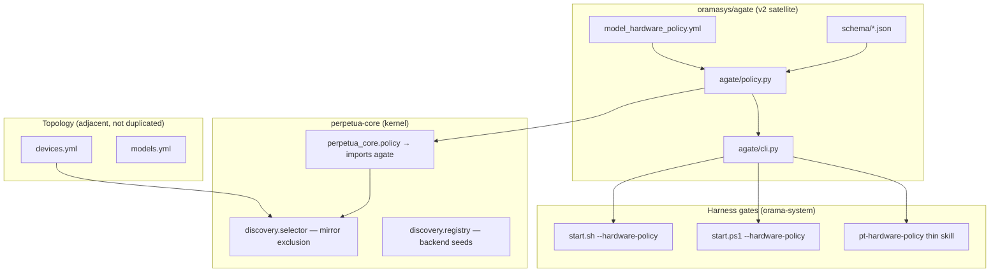

# 42 — agate Orbit: Hardware Policy Satellite Around perpetua-core

> **Status:** Active v2 plan (v1 operational in Perpetua-Tools today)  
> **Date:** 2026-06-26  
> **Repo target:** [github.com/oramasys/agate](https://github.com/oramasys/agate)  
> **Cross-refs:** [`07-agate-vision.md`](07-agate-vision.md), [`17-hardware-policy-enforcement.md`](17-hardware-policy-enforcement.md), [`references/agate-mvp-design.md`](references/agate-mvp-design.md), [`../hermes-hardware-policy-cross-harness.md`](../hermes-hardware-policy-cross-harness.md)

---

## 1. Thesis — minimum moving parts, maximum orbit clarity

v1 grew hardware routing inside monolithic **Perpetua-Tools** (`diazMelgarejo/Perpetua-Tools`):
topology in `devices.yml`, affinity in `model_hardware_policy.yml`, enforcement in
`hardware_policy.py`, operator surface in `hardware_policy_cli.py`, plus selector/registry
layers that **read** topology but do not duplicate NEVER lists.

v2 spins this into an **orbiting satellite** — the **agate** repo — around the ruthless
**perpetua-core** kernel. agate owns the **contract + validator + reference API + CLI**.
perpetua-core imports agate; oramasys imports perpetua-core; v1 PT shrinks to a thin
consumer during migration.

**Elegant invariant (preserved from v1, enshrined 2026-06-24):**

| # | Surface | v1 location (today) | v2 owner (`oramasys/agate`) |
|---|---------|---------------------|-----------------------------|
| 1 | **One policy file** | `config/model_hardware_policy.yml` | `policy/model_hardware_policy.yml` + JSON Schema |
| 2 | **One API** | `src/utils/hardware_policy.py` | `agate/policy.py` (imported by `perpetua_core.policy`) |
| 3 | **One CLI** | `scripts/hardware_policy_cli.py` | `agate/cli.py` → `agate` console script |

**Not absorbed into agate (stay in perpetua-core orbit modules):**

| Concern | Why separate | v2 home |
|---------|--------------|---------|
| `devices.yml` topology | Physical inventory — IPs, ports, runtimes, mirror flags | `perpetua-core` config plane or `agate` **adjacent** `topology/devices.schema.json` (validated together, not merged into affinity YAML) |
| `models.yml` registry | Model metadata, tiers, HF refs | PT / perpetua-core model registry module |
| `selector.py` routing | Runtime backend pick given registry + policy | `perpetua_core.discovery.selector` (imports agate `check_affinity`) |
| Harness entrypoints | `start.sh`, `start.ps1`, Hermes thin skills | orama-system / harness adapters only **call** agate CLI |

agate absorbs **logic and documentation** for the hardware **model matrix** and affinity
contract. `devices.yml` remains the topology companion — agate documents the join
(topology facts + affinity verdicts = safe dispatch) but does not stuff LAN IPs into
the affinity file.

---

## 2. What agate repo contains (target tree)

```
github.com/oramasys/agate/
├── SPEC.md                              # RFC: PREFER / ALLOW / NEVER semantics
├── schema/
│   ├── model_hardware_policy.schema.json
│   └── devices_topology.schema.json     # adjacent — validates devices.yml shape
├── agate/
│   ├── policy.py                        # load_policy, _normalize_policy, check_affinity
│   ├── cli.py                           # --list, --validate, --check-openclaw, --filter
│   └── migrate_v1.py                    # list-YAML → per-model affinity map (optional)
├── examples/
│   ├── model_hardware_policy.v1.yml     # current PT shape (windows_only lists)
│   └── model_hardware_policy.v2.yml     # agate per-model affinity map
├── docs/
│   ├── hardware-model-matrix.md         # spun from PT docs/MODEL_HARDWARE_MATRIX.md
│   ├── devices-topology.md              # devices.yml contract + mirror semantics
│   └── cross-harness.md                 # pointer to orama hermes-hardware-policy doc
├── tests/
└── pyproject.toml                       # zero heavy deps; PyYAML + jsonschema
```

**Publication path:** PyPI `agate-validator` (schema only) → `agate` (API + CLI).
See [`references/agate-mvp-design.md`](references/agate-mvp-design.md) 3-file MVP.

---

## 3. v1 → v2 schema evolution

### v1 (as-shipped in PT)

List-based encoding — implicit NEVER via list membership:

```yaml
windows_only: [qwen3.5-27b-claude-4.6-opus-reasoning-distilled-v2, gemma-4-26b-a4b-it]
mac_only: []
shared: [qwen3.5-9b-mlx, gemma-4-e4b-it]
windows_only_aliases: [gemma-4-26B-A4B-it-Q4_K_M]
```

### v2 (agate target)

Per-model explicit verdicts (from [`07-agate-vision.md`](07-agate-vision.md)):

```yaml
agate_version: "1.0"
models:
  qwen3.5-27b-claude-4.6-opus-reasoning-distilled-v2:
    affinity:
      mac: NEVER
      windows: PREFER
      shared: NEVER
```

**Migration rule:** `agate/migrate_v1.py` converts list YAML → v2 map; dual-read in
`perpetua_core.policy` until v1 list format is retired.

---

## 4. Layered architecture (v1 as-built → v2 orbit)



### Four enforcement layers (unchanged semantics)

Documented in [`17-hardware-policy-enforcement.md`](17-hardware-policy-enforcement.md):

1. **`devices.yml`** — which machine is primary vs mirror (`lm-studio` mirror on Mac)
2. **`model_hardware_policy.yml`** — which model IDs are NEVER on which platform
3. **`selector.py`** — `_MIRROR_BACKENDS`, `_TIER_HOSTS` (code-level mirror kill)
4. **`agent_launcher.py` / supervisor** — `check_affinity()` fail-closed before spawn

agate owns layers **1 schema documentation + 2 file/API/CLI**. Layers 3–4 stay in
perpetua-core but **must call agate API** — no forked parsers (lesson from PT PR #131).

---

## 5. Plan file index (session canon)

| Doc | Role |
|-----|------|
| [`plans/2026-06-24-hermes-harness-canonical-onboarding.md`](../plans/2026-06-24-hermes-harness-canonical-onboarding.md) | Phased harness wiring; one-policy invariant; env var contract |
| [`plans/2026-06-24-hermes-windows-hardware-policy-walkthrough.md`](../plans/2026-06-24-hermes-windows-hardware-policy-walkthrough.md) | Live Win verification checklist; PR #128–#131 gap chain |
| [`hermes-hardware-policy-cross-harness.md`](../hermes-hardware-policy-cross-harness.md) | Mermaid cross-harness architecture; platform role reversal |
| [`references/agate-mvp-design.md`](references/agate-mvp-design.md) | 3-file community MVP; LangChain pain points; schema sketch |

v2 agate repo **ingests** the normative content from these docs; orama-system keeps
pointers (no duplication of NEVER lists in markdown).

---

## 6. Consumption contract (harnesses)

| Harness | Gate | agate invocation |
|---------|------|------------------|
| OpenClaw macOS/Linux | `orama-system/start.sh --hardware-policy` | `python -m agate.cli --check-openclaw` (or PT wrapper during migration) |
| Hermes Windows | `platform/windows/start.ps1 --hardware-policy` | same CLI via `PERPETUA_TOOLS_ROOT` |
| Cursor / Codex / Claude | `pt-hardware-policy` thin skill | points to canonical CLI — no embedded lists |
| DR / offline orama | `config/hardware_policy_cache.yml` | cache is **read-only snapshot** of agate policy; refresh via `refresh_policy_cache.py` |

**Rule:** orama `discover.py`, `portal_server.py`, and DR resolvers must import
`perpetua_core.policy` (agate-backed) — eliminate `_simple_policy_parse` forks that
skip alias merge.

---

## 7. Migration phases (PT monolith → agate orbit)

| Phase | Action | Gate |
|-------|--------|------|
| **M0** (now) | v1 one-file/one-API/one-CLI in PT; cross-harness wired | PT #128–#131 + orama #107 ✅ |
| **M1** | Publish `oramasys/agate` with schema + v1-compatible loader + tests ported from `tests/test_hardware_routing.py` | agate CI green |
| **M2** | `perpetua-core` depends on `agate`; PT `hardware_policy.py` becomes thin re-export | import boundary lint |
| **M3** | v2 per-model affinity YAML; dual-read | migration script + diff tool |
| **M4** | Retire duplicate parsers in orama (`portal_server`, `discover.py` local fallback) | grep gate in CI |
| **M5** | Community publish: PyPI `agate-validator`, npm optional | external adopters |

---

## 8. Open questions (agate-specific)

| ID | Question | Bias |
|----|----------|------|
| OQ42.1 | Does `devices.yml` live inside agate repo or perpetua-core only? | Schema in agate; instance files in PT/orama config |
| OQ42.2 | Derive `_MIRROR_BACKENDS` from `devices.yml` at runtime? | Yes in v2 — see OQ19 in README |
| OQ42.3 | When does list-YAML format EOL? | After M3 dual-read soaks one release cycle |

---

## 9. Acceptance gates

- [ ] `oramasys/agate` repo exists with SPEC + schema + policy.py + cli.py
- [ ] `agate --validate gemma-4-26B-A4B-it-Q4_K_M mac` exits 1 (alias merge)
- [ ] `perpetua-core` imports agate; CI enforces one-way boundary
- [ ] orama harness gates call agate CLI (not stub parser)
- [ ] Plan docs §5 remain pointers — no NEVER list drift in markdown
