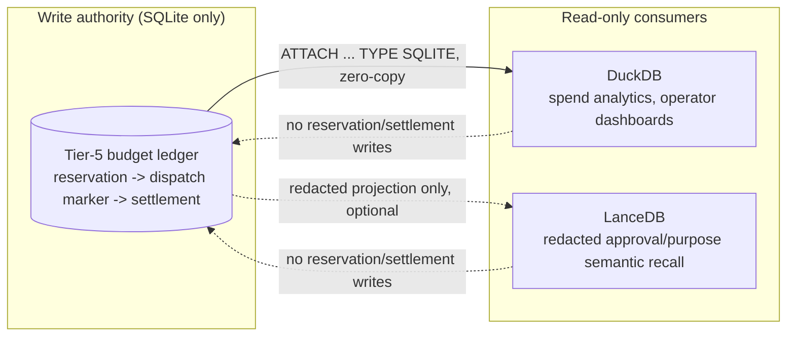

# 52 — Tier-5 / Frugality Mechanism as a Storage Consumer (SQLite / DuckDB / LanceDB)

> **Repository standard:** everything executable lives under `/src`; no root-level `scripts`/`tests`/`tools`/`examples`; data output and produced binaries stay `.gitignore`d, never committed with secrets, personal paths, or SecOps material. Additive — see [`46-repository-standard.md`](46-repository-standard.md).
> **Status:** Docs-only. Maps an already-decided Perpetua-Tools (PT) design onto the already-canonical v2 storage architecture — no new architecture decision is made here, and no code changes accompany this PR.
> **Scope:** How PT's Tier-5 governed-pipeline budget ledger (the `PIPELINE_TIERED_ENABLED` / frugality-router paid-execution path) fits the existing SQLite/DuckDB/LanceDB roles already defined in [`20-rag-and-memory-design.md`](20-rag-and-memory-design.md).

---

## 1. Why this doc exists

PT's Tier-5 pipeline work (governed paid-model execution behind the frugality gate) needed a durable accounting mechanism, and the design decision for that mechanism — reached separately, in PT, reviewing a naive JSON-counter `reserve()`/`rollback()` sketch against a proper durable-ledger requirement — landed on the *same* SQLite-as-write-authority / DuckDB-as-read-only-analytics split this repo already uses for GossipBus and session telemetry. That's not a coincidence worth re-deriving from scratch each time a new PT subsystem needs durable state; it's worth recording once, here, as the general shape any future PT consumer should follow.

Source material this doc consolidates (PT-side, not duplicated in full — read there for implementation detail):

- `Perpetua-Tools/docs/superpowers/plans/2026-08-14-tier5-durable-budget-ledger.md` — the durable ledger implementation plan (schemas, status transitions, run-key idempotency, conservative settlement, crash recovery).
- `Perpetua-Tools/references/claude-handoff-tier5-autoplan-2026-08-15.md` — the steelmanned decision record: SQLite is the durable accounting authority; DuckDB is a read-only analytics/projection consumer; LanceDB is optional redacted semantic recall; **neither analytics store may perform reservation or settlement writes**.
- `Perpetua-Tools/references/lancedb-duckdb-oramasys-architecture.md` — the general-purpose LanceDB/DuckDB architecture reference this mapping specializes.

## 2. The general pattern (already canonical, restated for context)

Per [`20-rag-and-memory-design.md`](20-rag-and-memory-design.md) and the reference architecture doc above, this stack already treats SQLite as the single write-authoritative store for operational state, with DuckDB attached read-only for OLAP-style analytics (`ATTACH '...db' AS x (TYPE SQLITE)`, zero ETL, zero-copy Arrow interop with LanceDB), and LanceDB reserved for vector/semantic recall over redacted event history — never for anything requiring transactional correctness.

## 3. Tier-5/frugality specifics

| Concern | Store | Write path | Notes |
|---|---|---|---|
| Reservation, dispatch marker, settlement, run-key idempotency, crash recovery | **SQLite** | PT's ledger service only | The only store that may ever record "money moved" or "a provider call may have happened." Integer micro-USD, no float. |
| Legacy aggregate-counter migration/compatibility read | SQLite (via adapter) | Read-through only | The prior `cost_reservation_usd` check-then-record pattern (see PT `orchestrator/cost_guard.py`, and the known-gap comment left in `orchestrator/fastapi_app.py`'s `run_tiered_pipeline` handler) is superseded by this ledger, not extended — no reserve/rollback sketch was built on top of the old pattern once the ledger plan existed. |
| Spend analytics, operator dashboards, daily/period aggregation | **DuckDB** | None (read-only) | Same `ATTACH ... TYPE SQLITE` zero-ETL pattern already used for GossipBus telemetry. |
| Redacted approval/purpose semantic recall (e.g. "what were similar past approvals for this purpose") | **LanceDB** (optional) | None (redacted projection only) | Only ever a *derived, redacted* copy — trace_id, purpose (redacted), tier, outcome. Never prompt content, never a credential, never a live reservation state. Follows the same redaction discipline as GossipBus event ingestion (`orchestrator/memory_governance.classify_and_redact()`), applied before anything reaches this projection. |
| Approval boundary (who approved, expiry, scope, revocation) | SQLite-adjacent, but currently a filesystem artifact | PT's approval registration endpoint only | Currently `PT_PIPELINE_APPROVAL_DIR`-based JSON files (see PT `orchestrator/tiered_pipeline.py`'s `register_pipeline_approval`/`load_pipeline_approval`), not yet folded into the SQLite ledger schema. Candidate for consolidation into the ledger's `run_key`-adjacent tables once the ledger implementation itself lands — noted here, not decided here. |

## 4. Invariant carried forward from the PT decision record

> Neither DuckDB nor LanceDB may perform reservation or settlement writes.

This is the same invariant this repo's storage architecture already enforces for every other SQLite-backed consumer (GossipBus, session telemetry) — Tier-5/frugality accounting doesn't get a special exception, and this doc exists so the next SQLite-backed PT consumer doesn't have to re-derive that from first principles either.

## 5. What this doc does not do

- Does not implement the ledger (PT-side, separately planned and separately gated — see §1's source material).
- Does not change orama-system's ownership boundary: orama remains stateless methodology; PT remains runtime/state/secrets/routing/paid-provider authority (per this repo's own `CLAUDE.md` §0 and the cross-repo ownership contract in the Tier-5 hardened plan). This doc records a storage-shape mapping, not a responsibility transfer.
- Does not authorize starting the ledger implementation, mesh work, or any other deferred item — those remain gated by their own plans and acceptance criteria.

---

**Canonical links:** [`20-rag-and-memory-design.md`](20-rag-and-memory-design.md) · [`41-agentic-stack-gstack-gbrain-memory-blend.md`](41-agentic-stack-gstack-gbrain-memory-blend.md) · PT `docs/superpowers/plans/2026-08-14-tier5-durable-budget-ledger.md` · PT `references/claude-handoff-tier5-autoplan-2026-08-15.md` · PT `references/lancedb-duckdb-oramasys-architecture.md`
