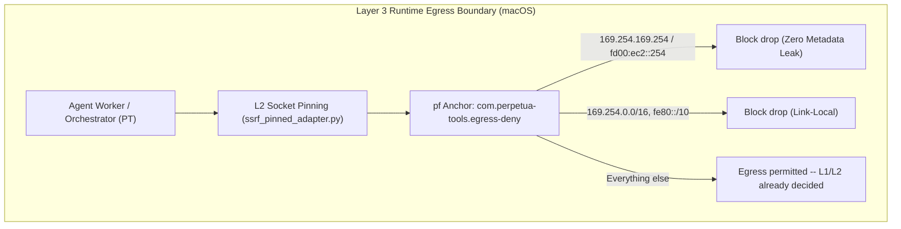
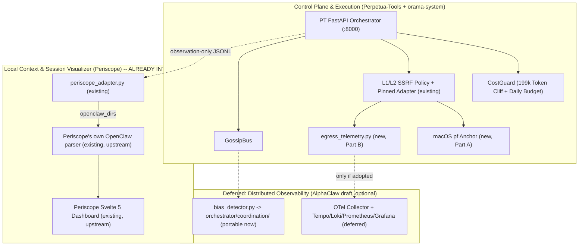

# 54. Tri-Stack Observability & L3 Egress Architecture (v2.0.0 — harmonized)

**Date:** 2026-08-23
**Status:** Canonical — design complete, implementation staged as 3 stacked PRs (see § 7)
**Supersedes (research basis, not deleted):** `references/11-TRI-STACK-OBSERVABILITY-AND-L3-EGRESS-SYNTHESIS-2026-08-23.md`
(kept as the original v1.0.0 research record — EXA/Firecrawl deep research by Agnes), reconciled
against a second independently-authored design brief and direct verification of the PT and
orama-system checkouts.

---

## Executive Summary

This document answers "how to design Layer-3 egress rules in the actual runtime environment, and
add redacted runtime telemetry" for the PT/orama stack. The original research (doc 11, v1.0.0)
proposed a Kubernetes-first architecture and a full Periscope vendor-in. A second, independently
authored design reasoned from the actual runtime and existing code instead, and was **verified
more accurate on every point of disagreement** — see § 0. This version keeps v1.0.0's genuinely
reusable research (OTel redaction-processor config, semantic-conventions naming) and replaces its
platform and vendoring assumptions with the verified design.

Three converging concerns, kept correctly separate:

1. **Layer-3 Egress Rules & Socket-Level Defense-in-Depth:** an OS-enforced floor beneath the
   existing Layer 1/2 application-level SSRF policy.
2. **Redacted Runtime Telemetry:** a new, minimal, redacted event emitter — not an OTel/Grafana
   stack rollout.
3. **Tri-Stack Observability Integration:** Periscope integration is **already built**
   (`orchestrator/periscope_adapter.py` in Perpetua-Tools); the AlphaClaw draft is a small,
   genuinely-portable Python scaffold, not a binary artifact requiring extraction.

---

## 0. Ground-truth corrections (v1.0.0 → v2.0.0)

Verified directly against the PT and orama-system checkouts and a locally-unzipped AlphaClaw
observability draft on 2026-08-23. Nothing below is a guess.

| v1.0.0 claim | Verified reality | Disposition |
| :--- | :--- | :--- |
| Design against Kubernetes `NetworkPolicy` / Cilium / Calico | PT's runtime host is **macOS** (SKILL.md hardware profiles: Ollama on Mac, LM Studio on Win — no K8s anywhere in the stack today) | K8s section demoted to "if this ever runs in containers" appendix; **`pf` (Packet Filter) is the actual Part A design**. |
| Host rules via `iptables`/`ip6tables` | Same reason — Linux-specific, not the runtime host | Superseded by macOS `pf` anchor rules below. |
| Vendor `latentsignal-org/periscope` under `Perpetua-Tools/vendor/periscope`, wire a new bridge | `orchestrator/periscope_adapter.py` (346 lines) and `tests/test_periscope_adapter.py` (447 lines) **already exist and are complete**: an observation-only emitter writing OpenClaw-compatible JSONL that Periscope's *own, already-built* OpenClaw session parser consumes directly — "no Periscope parser, route, or orchestration function is required" (adapter's own module docstring). PT's own `docs/plans/2026-07-28-periscope-lineage-modernization-epic.md` independently confirms: "L4 observability — Satisfied without lineage modernization: PT adapter + existing Periscope OpenClaw parser." | **No vendoring needed. Nothing to build here.** This item is done; see § 5. |
| AlphaClaw's observability draft is binary, must be extracted manually, likely Xcode/Swift and not portable | A local, already-unzipped draft directory was directly readable: `docker-compose.yaml`, `otel-collector.yaml`, `tempo-config.yaml`, `grafana-dashboard.json`, `observability/{bias_detector.py,metrics.yaml,semantic-conventions.yaml}`. `bias_detector.py` is 41 lines of **plain Python, stdlib only** (`difflib.SequenceMatcher`, `dataclasses`), zero Swift/Xcode dependency. | Directly portable, not just "schema ideas." See § 4. |
| Full Grafana/Tempo/Loki/Prometheus stack as part of this work | The frugality doctrine already established during the `mcp-remote` pinning decision ("frugal path reuse, zero new toolchains") applies here too | Docker-compose OTel stack from the AlphaClaw draft is **optional, deferred** infrastructure — not required to satisfy "add redacted runtime telemetry." Ship the minimal emitter first (§ 3); stand up the full stack only if/when trace-level detail is actually needed. |
| Layer-3 rules as PT/Python responsibility | Layer 3 is infrastructure, not app code — "Python cannot enforce a 'deny' the OS itself doesn't enforce," restating a finding from a prior merged PT PR review | Design stays split exactly as PT's existing Layer 1 (`endpoint_policy_core.py`, `ssrf_fetch_policy.py`) / Layer 2 (`ssrf_pinned_adapter.py`) / **Layer 3 (new, OS-level, this doc)** already implies. |

**Everything below reflects the corrected design.**

---

## 1. Two separate problems, one boundary

Layer 3 egress rules and runtime telemetry are **not the same system** and must not merge into one
component:

| Concern | Lives where | Enforced by | Status |
| :-- | :-- | :-- | :-- |
| Egress rule *decision* (deny `169.254.169.254`, RFC1918 outside LAN allowlist, etc.) | `src/utils/endpoint_policy_core.py` / `src/utils/ssrf_fetch_policy.py` (Layer 1) + `src/utils/ssrf_pinned_adapter.py` (Layer 2, connect-time socket pinning) | Application code (Perpetua-Tools) | **Already merged** (verified present) |
| Egress rule *enforcement floor* | OS/network layer — `pf` (macOS, the actual runtime) | Operating system, not Python | **New — this doc, Part A** |
| Telemetry (what happened) | New: redacted event emitter, two call sites | Perpetua-Tools, feeding Periscope | **New — this doc, Part B** |
| Periscope integration | `orchestrator/periscope_adapter.py` (PT) | PT, observation-only | **Already done — § 5** |

Layer 3 is infrastructure, not app code. Python cannot enforce a "deny" the OS itself doesn't
enforce. What PT needs is the **local host-level enforcement floor** plus the **event stream that
proves the floor is working**.

---

## 2. Part A — Layer-3 egress rules on the actual runtime host (macOS `pf`)



### `pf` anchor design

`/etc/pf.anchors/com.perpetua-tools.egress-deny`:

```pf
# Deny outbound to cloud metadata + link-local, regardless of source app or
# egress interface (Wi-Fi, Thunderbolt/USB-C Ethernet, VPN utun*, USB tethering).
# `on en0` alone scopes a rule to that interface only -- any route via another
# interface silently bypasses it, and the failure is invisible unless the
# verifier checks the actual outbound path rather than grepping for interface
# literals. Omit an interface qualifier entirely so `quick` matches on the
# first hit across every interface, matching this doc's own "regardless of
# source app" claim.
#
# This is the enforcement floor beneath Layer 1 (endpoint_policy_core.py)
# and Layer 2 (ssrf_pinned_adapter.py) -- if a future bug skips app-level
# validation entirely, the OS still refuses the packet.
block drop out quick to 169.254.0.0/16
block drop out quick to 169.254.169.254
block drop out quick to fd00:ec2::254
block drop out quick to fe80::/10
```

**Attach the anchor from `/etc/pf.conf` before loading rules into it, and place the anchor
declaration before any broad `pass ... quick` rule.** A `pfctl -a <name> -f <file>` call alone
does not make `pf` evaluate those rules — the anchor must first be declared as an attachment
point in the main ruleset, or the loaded rules sit inert. Just as important: `pf` evaluates
`/etc/pf.conf` top to bottom, and any earlier rule marked `quick` (for example a catch-all
`pass out quick all` some setups add for general connectivity) terminates evaluation the moment
it matches — the anchor is never reached, regardless of what rules are loaded into it. The anchor
declaration must come *before* any such rule, not just exist somewhere in the file. Add to
`/etc/pf.conf`, near the top of the outbound rule section:

```pf
anchor "com.perpetua-tools.egress-deny"
load anchor "com.perpetua-tools.egress-deny" from "/etc/pf.anchors/com.perpetua-tools.egress-deny"
# Any broader pass/quick rules for general connectivity belong AFTER this line, never before it.
```

Then reload the main ruleset once (`sudo pfctl -f /etc/pf.conf`) so the attachment point exists.
After that, the installer can update the anchor's rules at any time without touching `/etc/pf.conf`
again:

```bash
sudo pfctl -a com.perpetua-tools.egress-deny -f /etc/pf.anchors/com.perpetua-tools.egress-deny
```

Note the anchor name is used identically in all three places above (the file path's basename, the
`/etc/pf.conf` declaration, and the `-a` flag) — a mismatch between them (e.g. loading into
`com.perpetua-tools` while `/etc/pf.conf` attaches `com.perpetua-tools.egress-deny`) means the
rules land in an anchor `pf` never evaluates, with no error raised anywhere in the chain.

Verify the anchor is actually attached, correctly positioned, and populated — not just that the
installer ran:

```bash
sudo pfctl -s Anchors                              # confirm com.perpetua-tools.egress-deny is listed
sudo pfctl -a com.perpetua-tools.egress-deny -sr    # confirm the 4 deny rules are the ones loaded
sudo pfctl -sr                                      # confirm the anchor line appears BEFORE any
                                                     # broad pass/quick rule in the root ruleset --
                                                     # existence and content alone don't prove the
                                                     # anchor is ever reached; a preceding quick match
                                                     # terminates evaluation first
```

Ship as (Perpetua-Tools, PR 1 — see § 7):

- `scripts/security/install-egress-pf-rules.sh` — installer, **idempotent**, checks for the
  existing anchor before writing (never duplicate rule lines across re-runs). Must not scope
  rules to a specific interface (see the `pf` anchor design above).
- `scripts/security/verify-egress-pf-rules.sh` — asserts the anchor is loaded, correctly
  positioned (before any broad `pass ... quick` rule in the root ruleset, not merely present
  somewhere in it), and the rule set matches an expected hash (drift detection). Must verify
  against `pfctl -sr`'s actual root-ruleset output for position and `pfctl -a <name> -sr`'s
  output for content, not by grepping the anchor file for interface literals — the latter
  reports success even when the loaded rules don't match what's actually being evaluated, or
  are evaluated too late to matter, on the real outbound path.
- Wire `verify-egress-pf-rules.sh` into `start.sh` as a **non-blocking warning** — local dev
  startup should not hard-fail because `pf` wasn't configured, but the gap must be surfaced, not
  silent.
- This doc itself is the orama-system Layer-3 runbook (docs-only, split-ownership pattern),
  cross-linking to the PT installer scripts by relative path once they land.

### Container/K8s appendix (deferred, not the current runtime)

If PT or orama-system is ever containerized, v1.0.0's original K8s research remains valid and is
preserved here rather than discarded:

- **The additive-policy trap:** standard Kubernetes `NetworkPolicy` objects are strictly additive
  — a narrower policy cannot subtract permissions from a broader one already matching a pod.
  Fail-closed requires the CNI layer directly.
- **Cilium (`CiliumNetworkPolicy`):** `toCIDRSet` with explicit denylist for
  `169.254.169.254/32` and `fd00:ec2::254/128`.
- **Calico (`GlobalNetworkPolicy`):** cluster-wide default-deny egress with explicit
  `action: Deny` for link-local/internal subnets.

Do not build this now — it has no current runtime to run on. Revisit only if/when a containerized
deployment target is actually adopted.

---

## 3. Part B — Redacted runtime telemetry

### Reuse, don't duplicate

`orchestrator/periscope_adapter.py` already handles the Periscope side (§ 5). This part is scoped
narrowly: **a new egress-event emitter**, independent of Periscope, that proves the Layer 3/1/2
boundary is actually being enforced.

### What to emit (redacted event schema)

One event type, one emitter, called from exactly two existing dispatch points:
`src/utils/ssrf_pinned_adapter.py` (`send()` / connection-pool key construction) and
`orchestrator/orama_bridge.py`'s `_dispatch_oramasys_http()`.

```json
{
  "ts": "2026-08-23T18:00:00Z",
  "event": "egress_dispatch",
  "endpoint_class": "local" | "remote",
  "host_hash": "sha256:...",
  "resolved_ip_hash": "sha256:...",
  "port": 443,
  "scheme": "https",
  "redirect_count": 0,
  "deny_reason": null,
  "provider_route": "xai/grok-4.6" | "google/gemini-3.7-flash" | null,
  "duration_ms": 812
}
```

Hard redaction rules — same posture as the repo's existing anti-doxxing / portable-memory
invariants (docs/v2/47), applied to a new surface rather than a new policy:

- Never log raw hostname, raw IP, prompt text, response body, API keys, or file paths.
- Hash host and IP with a per-process salt (not persisted) — cross-request correlation still works
  within a session, but hostnames are not reversible from stored logs.
- `deny_reason` is a closed enum (`metadata_ip`, `rfc1918_unapproved`, `redirect_limit`,
  `scheme_disallowed`, `userinfo_present`), never a raw exception message that could leak a URL.
- No workstation paths, LAN IPs, or operator identity in the emitted event, its filenames, or any
  code/log referencing it — same rule doc 47 already states for tracked content, applied here to a
  runtime artifact instead of a git-tracked one.

### Sink

Local-first, matching the repo's established frugality doctrine — no new cloud or service
dependency for this piece:

- Append-only JSONL: `~/.perpetua/telemetry/egress-events.jsonl`, rotated daily.
- Optional forward to a Periscope ingest endpoint later, only if the operator explicitly opts in —
  not required for v1 of this feature.

### Implementation

New module (Perpetua-Tools, PR 2 — see § 7): `src/utils/egress_telemetry.py` — single
`emit(event: EgressEvent) -> None`, fire-and-forget (never blocks or raises into the request
path). Test coverage required for: redaction correctness (no raw host/IP ever appears in output),
non-blocking behavior on sink failure, and `deny_reason` enum coverage matching every
`SSRFPolicyError`/`AddressDenied`/`RedirectDenied` subtype already defined in
`ssrf_fetch_policy.py`.

Two call sites only, so there is one source of truth, not scattered logging.

### OpenTelemetry redaction reference (from v1.0.0, retained — apply only if/when the full OTel stack is stood up)

If the AlphaClaw draft's `docker-compose.yaml`/`otel-collector.yaml` stack is adopted later (§ 0
correction: optional, deferred), this two-stage redaction design from the original research still
applies and should gate it:

- **SDK level (in-process `SpanProcessor`):** strip attributes matching `*token*`, `*key*`,
  `*secret*`, `*password*`, `*auth*`, `*cookie*` before serialization.
- **Collector level (`processor/redactionprocessor`):** regex-mask span attributes, baggage, and
  log bodies:

```yaml
processors:
  redaction:
    allow_all_keys: false
    allowed_keys:
      - service.name
      - http.status_code
      - http.method
      - rpc.system
      - gen_ai.usage.prompt_tokens
      - gen_ai.usage.completion_tokens
    blocked_values:
      - 'fc-[a-f0-9]{32}'       # Firecrawl API keys
      - 'sk-[A-Za-z0-9]{48}'    # OpenAI / LLM API keys
      - 'fdc497[a-f0-9]{30}'    # Exa API keys
```

---

## 4. Part C — AlphaClaw observability draft: what's actually portable

Verified directly (a local draft copy was already unzipped, not a binary artifact):

```text
alphaclaw-observability/
├── docker-compose.yaml             # Tempo, Loki, Prometheus, Grafana -- DEFERRED (§0)
├── otel-collector.yaml             # OTLP pipeline -- DEFERRED, reference config for §3's redaction section
├── tempo-config.yaml               # DEFERRED
├── grafana-dashboard.json          # DEFERRED
└── observability/
    ├── bias_detector.py            # 41 lines, plain Python stdlib -- PORTABLE NOW
    ├── metrics.yaml                # Prometheus metric names -- reference only, no exporter wired yet
    └── semantic-conventions.yaml   # OTel attribute taxonomy -- reference for naming, not enforced yet
```

### `bias_detector.py` — directly portable, no extraction needed

Detects **Agreement Collapse** (`collapse_score > 0.85`, derived from confidence-delta variance
across a rolling 20-decision window) and **Echo Loops** (`SequenceMatcher(...).ratio() > 0.92`
between consecutive reasoning texts). Zero external dependencies.

Suggested integration point (Perpetua-Tools, PR 3 — see § 7): `orchestrator/coordination/` — wrap
as `CoordinationBiasDetector`, fed from GossipBus `dispatch`/`status_update` events already
flowing through the board, to flag runaway multi-agent consensus drift.

### Naming reference only (not enforced code)

`semantic-conventions.yaml` and `metrics.yaml` are useful as an attribute-naming reference if/when
full OTel is adopted (e.g. `gen_ai.request.model`, and PT-specific extensions like
`cost_guard.reservation_id`, `cost_guard.daily_spend`, `token_cliff.status`) — but adopting them
does not require pulling in the OTel/Grafana stack itself; they're just names to reuse
consistently once that stack (if ever) exists.

**Do not vendor the draft directory itself into PT.** Port only `bias_detector.py` (as working
code) and the naming ideas (as a reference doc), crediting AlphaClaw as prior art.

---

## 5. Part D — Periscope: already integrated, nothing to vendor

Confirmed via three independent sources, none of which required guessing:

1. `orchestrator/periscope_adapter.py` (346 lines) exists in PT — an observation-only emitter that
   writes OpenClaw-compatible session JSONL Periscope's *existing* `openclaw_dirs`-based parser
   already consumes, no new Periscope-side code required (module's own docstring).
2. `tests/test_periscope_adapter.py` (447 lines) exists and covers it.
3. `docs/plans/2026-07-28-periscope-lineage-modernization-epic.md` (this repo) independently
   states this exact conclusion in its own "Why this is optional" table: *"L4 observability —
   Satisfied without lineage modernization: PT adapter + existing Periscope OpenClaw parser."*
   That epic's only open item is the **fork's own git history cleanliness** (classifying 45
   historical patches against 583 upstream commits) — explicitly marked optional, high-cost, and
   irrelevant to functionality. It is not a blocker for anything in this document.

**There is nothing to build for Periscope integration.** The original two vendoring questions —
the AlphaClaw draft and `latentsignal-org/periscope` — resolve differently: AlphaClaw's draft has
one genuinely portable file (§ 4); Periscope needs no vendoring at all because the integration
point already exists and is already the right shape (thin, observation-only, no Go toolchain
pulled into PT's Python runtime).

If deeper integration is ever wanted (e.g. forwarding `egress_telemetry.py`'s JSONL into
Periscope's own ingest API), treat Periscope as an **external sidecar** process PT points a config
URL at — never an embedded `vendor/` submodule, which would add a Go toolchain dependency to a
Python-first repo and contradict the frugality doctrine already established during the
`mcp-remote` pinning decision.

---

## 6. Master tri-stack architecture (corrected)



### Unified roles & responsibilities

| Subsystem | Core technology | Primary responsibility | Status |
| :--- | :--- | :--- | :--- |
| **Perpetua-Tools / Orama** | Python 3.12, FastAPI, SQLite | Model routing, CostGuard, L1/L2 SSRF policy, GossipBus | Existing |
| **macOS `pf` egress floor** | OS packet filter | Layer-3 enforcement floor beneath L1/L2 | New — Part A |
| **`egress_telemetry.py`** | Local JSONL emitter | Proves the L1/L2/L3 boundary is working, redacted | New — Part B |
| **Periscope** | Go, SQLite FTS5, Svelte 5 (external, upstream) | Session/context visualizer, consumes PT's observation JSONL | Already integrated, no work needed |
| **`bias_detector.py`** | Plain Python, stdlib | Groupthink/echo-loop detection for `orchestrator/coordination/` | New but trivial — directly portable |
| **AlphaClaw OTel/Grafana stack** | Docker Compose, OTel Collector, Tempo, Loki, Prometheus, Grafana | Full distributed tracing | Deferred — not required for this design's goals |

---

## 7. Execution plan: 3 stacked PRs + distributed-agent dispatch

Per the session's own established discipline (PT PR #362's scoping: one concern per PR, no
"sixth everything PR") — but built as one **stacked** branch chain since PR 2 depends on PR 1's
`pf` runbook context and PR 3 depends on PR 2's telemetry module existing to attach the bias
detector's own event emission to later if desired. Stacking means: PR 2's branch is created from
PR 1's branch (not `main`), and PR 3's branch is created from PR 2's branch. Each PR still reviews
and can merge independently, in order.

```text
main
 └── PR1: 2026-08-23-001-l3-egress-pf-floor           (pf installer/verify + this runbook)
      └── PR2: 2026-08-23-002-egress-redacted-telemetry (egress_telemetry.py, 2 call sites)
           └── PR3: 2026-08-23-003-coordination-bias-detector (bias_detector.py port)
```

### Division of labor (GossipBus + distributed job queue, redacted)

Work is split between Claude Code Main and Agnes via the existing `orchestrator.coordination.cli
queue add` + `GossipBus().emit("dispatch", ...)` pattern already used earlier this session,
carrying the same redaction discipline as every other tracked artifact in this stack (docs/v2/47
— category-only in tracked content, no literal workstation paths, no LAN IPs, no operator
identity in dispatch payloads or job notes):

| PR | Owner | Rationale |
| :-- | :-- | :-- |
| PR 1 — `pf` egress floor | **Agnes** | Self-contained shell + doc work, no security-sensitive Python logic, no dependency on an unmerged branch. Good fit for a literal, narrowly-scoped dispatch. |
| PR 2 — `egress_telemetry.py` | **Claude Code Main** | Touches the same security-sensitive call sites as PR #362's SSRF work (`ssrf_pinned_adapter.py`, `orama_bridge.py`); redaction-correctness judgment (hash-not-log, enum coverage matching real exception subtypes) kept with the agent that did the original SSRF hardening this session. |
| PR 3 — `bias_detector.py` port | **Agnes** | Mechanical port of an already-complete 41-line stdlib module into an existing wiring point (`orchestrator/coordination/`, GossipBus events already flowing) — same "foolproof literal instructions" shape as prior successful Agnes dispatches this session (Phase 4 token-cliff primitive, cancellation-test annotations). |

Job queue and GossipBus payloads for both Agnes dispatches reference this document by its
repo-relative path (`docs/v2/54-tri-stack-observability-and-l3-egress-v2.md`) and quote only the
specific section (§ 2 for PR 1, § 4 for PR 3) rather than re-embedding full file contents, keeping
dispatch messages both complete (unambiguous spec) and redacted (no incidental leakage of
unrelated local state into a shared coordination channel).

**Status of this document: design complete, ground-truth verified. Branch chain created; PR 1 and
PR 3 dispatched to Agnes; PR 2 in progress by Claude Code Main.**
