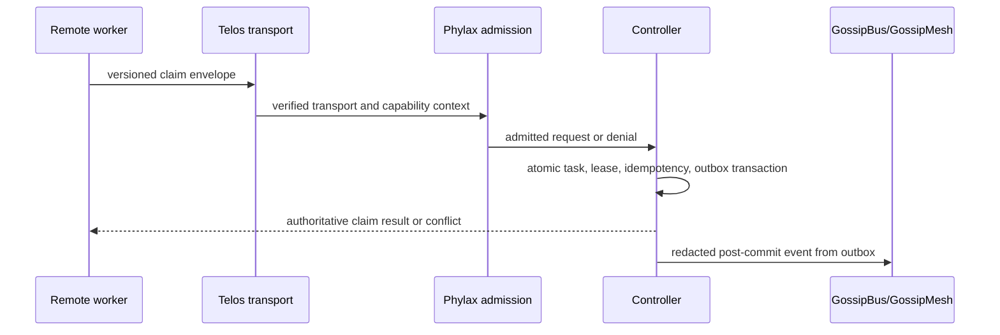

# 68 — Orchestrator Controller Satellite: Authoritative Job Claims

> **Status:** v2.1 design; **definitive home is the `oramasys/oramasys` internal
> satellite module** (`orama.orchestrator_controller`); no runtime implementation
> exists yet  
> **Spin-off:** a standalone `oramasys/orchestrator-controller` repository is a
> later and unlikely option, reachable only through the admission gate in §9  
> **Parent:** [`01-kernel-spec.md`](01-kernel-spec.md),
> [`43-gossipbus-mesh-transport.md`](43-gossipbus-mesh-transport.md), and
> [`48-board-job-source-line-schema.md`](48-board-job-source-line-schema.md)  
> **Cross-cutting constraints:** [`22-worktree-parallel-agents.md`](22-worktree-parallel-agents.md),
> [`46-repository-standard.md`](46-repository-standard.md),
> [`47-portable-memory-local-topology-invariant.md`](47-portable-memory-local-topology-invariant.md),
> [`49-peer-mesh-auth-tls-v2-plan.md`](49-peer-mesh-auth-tls-v2-plan.md), and
> [`61-pt-coordination-principal-identity-design.md`](61-pt-coordination-principal-identity-design.md)

---

## 1. Decision

`GossipBus` remains append-only local evidence and interest-filtered event
fan-out. It is deliberately **not** a distributed lock or authorization
system. A remote worker must not infer authority from a shared checkout, a
database filename, a matching file identity, or an environment variable.

When v2.1 has an operational need for remote workers to claim work, the
Orchestrator Controller is the sole authority for these state transitions:

```text
pending -> claimed -> completed
                 \-> released | failed | expired
```

The controller serializes claims in a durable local store, returns the
authoritative result to the caller, and emits a redacted event through
GossipBus only after the state transition is durable. Gossip events never
grant or alter authority.

This is a **new v2 protocol**, not a network wrapper around a v1 CLI and not a
runtime dependency of either legacy repository. Legacy coordination remains
independent until a separately approved migration provides parity evidence.

## 2. Ownership And Dependency Boundary

| Concern | Owner | Controller relationship |
| --- | --- | --- |
| Generic execution primitives and event contracts | `oramasys/perpetua-core` | Supplies dependency-minimal execution/event interfaces; does not import controller code. |
| Application composition, workflow policy, UI/API integration, budgets/effects | `oramasys/oramasys` | Submits declared jobs and renders controller state; does not reimplement claim semantics. |
| Atomic claims, leases, idempotency, recovery, and event outbox | `oramasys/orchestrator-controller` (proposed) | Single executable authority for job lifecycle. |
| Endpoint/network-safe transport | `oramasys/telos` | Provides endpoint authorization and secure transport; controller does not create an independent HTTP/TLS/SSRF stack. |
| Principal admission, capability verification, provenance/redaction, audit packs | `oramasys/phylax` | Verifies caller capability and applies generic admission/audit policy; controller consumes decisions. |
| Hardware placement evidence | `oramasys/agate` | Optional placement input only; cannot authorize or claim a job. |
| Event replication and observability | GossipBus/GossipMesh | Receives redacted post-commit events; cannot become a second write authority. |

**Home decision (recorded 2026-09-27).** The definitive home is the internal
module `oramasys/oramasys` → `src/orama/orchestrator_controller/`. Independent
versioning, maintainer ownership, and a separate release cadence are not
justified today, so the module ships inside the application repository it
serves. A standalone satellite remains possible but unlikely, and only through
the §9 gate; until that gate is opened the standalone row in §2 is a
documentation placeholder, not a plan.

In either shape the ownership and one-way dependencies in this document remain
unchanged: Core supplies execution/event contracts, Telos supplies transport,
Phylax supplies admission, and `oramasys/oramasys` composes. There is exactly
one claim-state writer, whether it is packaged as a module or as a repository.

## 3. Threat Model And Invariants

The controller addresses accidental double work, stale workers, duplicate
delivery, and a compromised or misconfigured agent attempting to claim as a
different principal. It does not claim to protect a fully compromised
controller host.

The control surface reuses two building blocks rather than inventing a third
contract: the **envelope card** (§3.1) and **agent states** (§3.2). The
invariants in §3.3 are the crystallization of every prior plan on this subject;
each cites the document it came from.

### 3.1 Building block A — the envelope card

An envelope is the identity card of one unit of work, and the same card header
travels in every plane. The consolidated shape:

- **Tier U (universal, no default):** `envelope_id`, `envelope_schema_version`,
  `envelope_kind`, `created_at` (tz-aware), `privacy_tier`, `author{agent_id,
  model, availability}`, `actor{agent_id, instance_id, identity_verified}`,
  `redaction.applied`. A missing Tier U field is a validation error, never a
  silent default.
- **Tier K (kind-required):** only what that kind means. For the controller the
  kind is `claim`, whose required fields are §4.2's request fields; the response
  owns lease data and the result receipt separately.
- **Tier C (conditional, declared explicitly):** present only when the case
  applies, and otherwise declared as `None`/empty under `extra="forbid"` so the
  absence is a recorded decision. `lineage{on_behalf_of, prior_agent,
  prior_agent_status, takeover, superseded_ref}` lives here.
- **Four planes, one kind axis:** the four envelope planes
  (`references/observability/12-MULTI-AGENT-ENVELOPES-TELEMETRY-AND-COORDINATION-STANDARDS-2026-08-24.md`,
  an off-repo OpenClaw working reference not published in this repository)
  classify *where* a record operates; `envelope_kind` classifies *what it means*.
  They are orthogonal, so one `claim` card can be projected to the observability
  plane without becoming a new kind.
- **A double-sided card:** `actor` is who presents the record now (the only
  verifiable identity); `author` is who originated the work. When the ids differ,
  `lineage` is present — its existence *is* the divergence signal, so no extra
  boolean is needed.

**Scope of this restatement (non-supersession).** The card is repeated here only
to the depth the controller needs. The consolidated envelope standard owns the
canonical header text, and this document does not supersede the LAN transport
envelope, the budget envelope, `MonitorabilityEnvelopeV1`, `TaskEnvelope`,
`WorkerResult`, the Hermes dispatch envelopes, or its own §4.2 claim mechanics.
§4.2 remains the normative claim contract and the card is additive to it.

**Canonical owners for projected values.** For claim records this document is the
canonical owner of the task and principal values (§4.2); a delivery envelope owns
its own task and assignee values, and a standalone round record owns `round_id`.
A record that projects any of these values must carry its canonical value
exactly, and a mismatch is rejected before state or capability lookup. A
projection never grants authority (IC-28).

### 3.2 Building block B — agent states

Three state families exist and must never be conflated:

| Family | Values | Only writer | Meaning |
| --- | --- | --- | --- |
| Agent/principal observation | `active`, `inactive`, `unknown` | any actor, at write time | what that actor observed; never authority, never a state transition |
| Claim/lease state | `pending` → `claimed` → `completed`, or `released`, `failed`, `expired` | the controller | authoritative job lifecycle (§1) |
| Envelope custody | author == actor, or author != actor with `lineage` | the actor | who originated versus who presents |

The v1 board shows why the split matters: `heartbeat list/check/timeline` report
liveness, and `heartbeat cleanup` *releases claims held by DEAD agents*. That is
acceptable v1 convenience, but it is **not** the v2 rule: an observation may
never mutate claim state. In v2 only lease expiry and documented recovery rules
move a claim, and only the controller applies them.

### 3.3 Crystallized invariants

#### A. Authority

- **One writer (IC-1):** only the controller process mutates claim state.
  Clients, GossipBus consumers, and analytics stores are read-only with
  respect to it.
- **No observation mutates state (IC-2):** `availability` and every other
  liveness observation is a write-time statement by the actor. Writing one never
  updates a heartbeat store, never affects a claim, and never confers authority.
- **Fail closed (IC-3):** absent, invalid, expired, revoked, or insufficient
  capability proof rejects a mutation before a task is examined.
- **Capability before task lookup (IC-4):** Phylax verifies a principal
  capability bound to operation, task scope, expiry, and controller audience. A
  self-declared agent name is never authentication.
- **Gossip is never a second writer (IC-5):** a replayed, reordered, or forged
  event cannot create, renew, complete, release, or bypass a claim.
- **No topology-as-authentication (IC-6):** a local topology probe may select a
  read-only workflow, but cannot create a principal, capability, lease, or
  queue-write right.

#### B. Identity and envelope

- **Tier U carries no default (IC-7):** a missing universal field is a
  validation error, so an incomplete card cannot be silently completed by a
  reader.
- **Tier C is declared, not omitted (IC-8):** conditional fields are `None` or
  empty under `extra="forbid"`, so absence is a recorded decision.
- **Double-sided card (IC-9):** when `author.agent_id != actor.agent_id`,
  `lineage` is required; omitting it must fail validation, because the
  divergence is already observable from the two ids.
- **No inherited authority (IC-10):** the actor never inherits the author's
  authority. Reporting is not a claim, credit stays on the author, and an
  unknown author stays `unknown` rather than defaulting to the actor.

#### C. Atomicity and idempotency

- **Atomic claim (IC-11):** exactly one transaction decides whether a pending
  task can be claimed. A loser receives a conflict response, never an ambiguous
  success.
- **Two idempotency scopes (IC-12):** the controller owns **claim-scope**
  idempotency — `principal_id` + `operation` + `idempotency_key` +
  `request_digest` over the canonicalized request — while `oramasys/oramasys`
  owns **workflow-scope** idempotency for task and job reruns. The two scopes
  share no key and no table, which is why the ownership tables can both say
  "idempotency" without creating a second claim authority.
- **Same key, different content is rejected (IC-13):** repeating an identical
  request returns the original result; reusing a key with a different request
  digest is refused rather than silently served.
- **Version guard (IC-14):** a stale `expected_task_version` cannot mutate
  state; the caller is told it conflicts.

#### D. Leases and recovery

- **Lease-bound execution (IC-15):** a claim has an expiry and an unguessable
  `lease_token`; renewal, completion, release, and failure require both the
  authorized principal and the active lease.
- **Conservative recovery (IC-16):** after uncertain delivery or process
  failure the controller retains a durable claim until an expiry/recovery rule
  decides it. It never issues the same work merely because a client timed out.
- **Restart safety (IC-17):** a controller restart preserves pending outbox
  delivery and never reissues an unexpired lease.
- **Recovery authority (IC-18):** `recover-expired` is controller-only and
  follows a documented clock rule; no client may declare a lease expired.

#### E. Provenance

- **Source-line proof (IC-19):** every new v2 job carries `source_ref` and
  `expected_base_sha`. A claimant creates a fresh worktree and proves the
  expected base before editing.
- **Legacy disposition (IC-20):** rows created before this protocol need an
  explicit migration or handoff disposition; they are never silently treated as
  compliant.

#### F. Egress and privacy

- **Redact before egress (IC-21):** audit and outbox events use a minimal
  allowlisted envelope. Secrets, raw prompts, and proof material never leave the
  controller store.
- **No topology in artifacts (IC-22):** envelopes, receipts, events, and any
  published document carry opaque references (for example `worktree_ref`) and
  never local paths, hostnames, device identifiers, or ports.
- **Tamper evidence (IC-23):** a card carries its own integrity evidence —
  digest, `redaction.allowlist_digest`, frozen values, and `extra="forbid"` —
  so a reader detects alteration instead of trusting the bearer.

#### G. Outcome semantics

- **Explicit outcomes (IC-24):** unauthorized is `401`/`403`, stale version or
  already-claimed is `409`, invalid envelope is `400`, a duplicate identical
  request returns its original result, and duplicate key with different request
  is rejected. No endpoint returns a generic success for an indeterminate
  outcome.
- **Audited denials (IC-25):** unauthorized, revoked, and expired principals
  fail closed and are audited without logging proof material.

#### H. Dependency direction

- **One-way dependencies (IC-26):** the controller imports Core contracts
  only, consumes Telos transport and Phylax decisions, and treats Agate as
  optional placement input that cannot authorize or claim work.
- **The application composes (IC-27):** `oramasys/oramasys` submits declared
  jobs and renders controller state. It never reimplements claim semantics, and
  no second job-state writer may exist.

#### I. Projections

- **Exact-match projections (IC-28):** a record that projects a task, principal,
  or round value must carry exactly the canonical value; round references must
  resolve to one record; a mismatch is rejected before state or capability lookup,
  and no projection grants authority.
- **Additive header (IC-29):** a controller envelope may carry the common header
  without altering §4.2 semantics. §4.2 stays the normative claim contract, and
  this document never becomes a second contract for transport, budget,
  monitorability, dispatch, or worker-result shapes.

### 3.4 Where each invariant came from

| Family | Primary sources |
| --- | --- |
| A Authority | this document §1 and §3; [`43`](43-gossipbus-mesh-transport.md); [`61`](61-pt-coordination-principal-identity-design.md) |
| B Identity and envelope | consolidated envelope card (`author`/`actor`/`lineage`, tiers U/K/C) and the no-liveness-write rule in §3.2 |
| C Atomicity and idempotency | this document §4.1–§4.3; [`11`](11-idempotency-and-guard-patterns.md) |
| D Leases and recovery | this document §1 and §10; recovery clock rules pending implementation |
| E Provenance | [`48`](48-board-job-source-line-schema.md); [`22`](22-worktree-parallel-agents.md) |
| F Egress and privacy | [`47`](47-portable-memory-local-topology-invariant.md); [`54`](54-tri-stack-observability-and-l3-egress-v2.md) |
| G Outcome semantics | this document §4.3; [`63`](63-gate1-endpoint-observation-and-conformance-evidence.md) |
| H Dependency direction | [`62`](62-telos-phylax-authority-gate0-adr.md); [`46`](46-repository-standard.md) |
| I Projections | the consolidated envelope standard's canonical-owner rule (board decisions of 2026-09-26/27: records 3738, 3744, 3746) and this document §4.2 |

## 4. Minimal v2.1 Protocol

### 4.1 Durable records

The first release uses one controller-owned SQLite database for authoritative
state. SQLite is selected for transactional correctness and operational
simplicity, not for cross-machine replication. DuckDB and LanceDB remain
analytics/recall consumers as defined by the storage plans; neither writes
claims.

```text
tasks(task_id, state, version, source_ref, expected_base_sha, payload_digest)
leases(task_id, principal_id, lease_id, lease_expires_at, state)
idempotency(principal_id, operation, idempotency_key, request_digest, result)
outbox(event_id, sequence, kind, redacted_payload, published_at)
audit(event_id, actor, action, outcome, policy_version, occurred_at)
```

The task mutation and its outbox/audit records commit in the same transaction.
An asynchronous publisher later sends the outbox event to GossipBus and marks
delivery without changing the underlying task result.

### 4.2 Request envelope

Every mutation has a versioned, canonical envelope:

```json
{
  "schema_version": "1",
  "operation": "claim",
  "task_id": "opaque-task-id",
  "principal": "opaque-principal-id",
  "idempotency_key": "opaque-random-key",
  "expected_task_version": 7,
  "source_ref": "reviewed-ref",
  "expected_base_sha": "immutable-source-sha",
  "capability_proof": "opaque-proof"
}
```

`capability_proof` is validated by Phylax and is not written to events or
logs. The controller canonicalizes the covered request fields before computing
the request digest used for idempotency. The request is rejected when its
source-line fields do not match the stored task.

### 4.3 Operations

| Operation | Preconditions | Atomic effect | Successful result |
| --- | --- | --- | --- |
| `claim` | Valid capability, pending task, matching version/source line | Creates one active lease, increments task version, writes outbox/audit | `lease_id`, `lease_token`, expiry, task version |
| `renew` | Same principal, active lease, unexpired renewal window | Extends one lease, writes audit | New expiry and task version |
| `complete` | Same principal, active lease, expected result digest | Finalizes task once, writes outbox/audit | Immutable completion receipt |
| `release` | Same principal, active lease | Returns task to pending or named terminal disposition | Updated task version |
| `fail` | Same principal, active lease | Records classified failure/disposition | Immutable failure receipt |
| `recover-expired` | Controller recovery authority only | Expires a stale lease using a documented clock rule | Recovery receipt |

Expected outcomes are explicit: unauthorized is `401`/`403`, stale version or
already-claimed is `409`, invalid envelope is `400`, duplicate same request
returns its original result, and duplicate key/different request is rejected.
No endpoint returns a generic success for an indeterminate outcome.

## 5. Transport And Authentication

The controller exposes a narrow HTTPS API only through Telos-backed transport.
Phylax verifies a principal capability bound to operation, task scope, expiry,
and controller audience. The controller never accepts a self-declared agent
name as authentication.

The exact credential format is an implementation decision under the principal
identity migration, but it must satisfy the invariants above. It may begin with
rotatable per-agent bearer credentials in the scoped deployment model of
[`61-pt-coordination-principal-identity-design.md`](61-pt-coordination-principal-identity-design.md),
then graduate to stronger proof material without changing request semantics.
Mutual TLS, short-lived proofs, and revocation behavior are evaluated under
[`49-peer-mesh-auth-tls-v2-plan.md`](49-peer-mesh-auth-tls-v2-plan.md), not
duplicated here.

## 6. GossipBus Relationship



GossipMesh may replicate the final redacted event for observability and
handoff. It may not replay an event as a claim, resolve a conflict, extend a
lease, or bypass the controller. This preserves the frugality and local
durability rules in [`43-gossipbus-mesh-transport.md`](43-gossipbus-mesh-transport.md).

## 7. Reconciled Protocol Inputs

This document consolidates the shared-claim relay planning surface. The source
documents retain their narrower authority; none is silently superseded outside
the shared-claim question.

| Source | Accepted input | Controller disposition |
| --- | --- | --- |
| [`43-gossipbus-mesh-transport.md`](43-gossipbus-mesh-transport.md) | Delta sync, interest filtering, idempotent ingest, redaction before egress, and local durable logs | Gossip is the post-commit outbox consumer. It cannot claim work or act as a distributed lock. |
| [`48-board-job-source-line-schema.md`](48-board-job-source-line-schema.md) | `source_ref` plus `expected_base_sha` prevent stale branch execution | Mandatory for new controller tasks; legacy rows require explicit migration/handoff disposition. |
| [`61-pt-coordination-principal-identity-design.md`](61-pt-coordination-principal-identity-design.md) | Principal mismatch is a real failure mode; self-declared identity is not authentication | Phylax-backed capability is required before task lookup. The v1 bearer migration remains v1 design evidence. |
| [`22-worktree-parallel-agents.md`](22-worktree-parallel-agents.md) | Shared board state is not shared file state; a claimant needs a verified source line and fresh worktree | Controller receipt grants a lease only; the worker must independently prove checkout base before edits. |
| [`49-peer-mesh-auth-tls-v2-plan.md`](49-peer-mesh-auth-tls-v2-plan.md) | Transport credentials, TLS, rotation, and revocation need an explicit lifecycle | Telos provides secure transport and Phylax validates capability; controller does not fork either security stack. |
| [`47-portable-memory-local-topology-invariant.md`](47-portable-memory-local-topology-invariant.md) | Portable artifacts must not leak local topology or identity | Envelopes and outbox events use opaque identifiers and redacted fields only. |
| Local Cursor worker coordination evidence | A self-hosted worker is not automatically a coordinator or shared-board peer | Treated as operational evidence only; v2 clients receive API receipts, never local board paths or shell relay instructions. |

The historical shell wrapper is therefore intentionally excluded: local command
execution is neither transport nor authorization, and cannot be promoted by
configuration flags into either.

## 8. Worktree And Remote-Worker Rule

The imported operator evidence, now published in-repo as
[`2026-09-26-cursor-self-hosted-worker-coordination-plan.md`](references/2026-09-26-cursor-self-hosted-worker-coordination-plan.md),
confirms a useful v1 operational boundary: a remote self-hosted worker is not
automatically on the coordinator's checkout or authoritative board. That plan
is **evidence, not v2 authority**.

For v2.1 the rule is normative:

1. A remote worker receives an authoritative controller receipt, not a database
   path or local-shell relay instruction.
2. The worker verifies the source line and creates an isolated worktree under
   [`22-worktree-parallel-agents.md`](22-worktree-parallel-agents.md).
3. The worker submits only the lease-bound completion/release/failure outcome.
4. Loss of connectivity means no new transition; the controller lease and
   recovery process decide the next state.

## 9. Repository Admission And Delivery Gates

### Repo admission gate (dormant while the internal module is the home)

The module home is decided (§2). This gate applies only if a standalone
repository is ever proposed.

Before creating a standalone repository, record why the controller needs an
independent release cadence, distinct maintainer ownership, and a dependency
surface that cannot remain an `oramasys/oramasys` module. If any answer is
missing, build no new repository.

If admitted, its initial shape follows the repository standard:

```text
orchestrator-controller/
  src/orchestrator_controller/
    api.py
    service.py
    store.py
    leases.py
    idempotency.py
    outbox.py
    policy_adapter.py
  tests/
  SPEC.md
```

No root-level executable directories, concrete workstation paths, credentials,
or topology fragments are permitted.

### Delivery sequence

1. Freeze the protocol schema and state-transition table; obtain Telos and
   Phylax contract review.
2. Implement SQLite migrations and transaction-level claim/idempotency tests.
3. Add lease expiry/recovery with deterministic clock tests.
4. Add Telos/Phylax adapters and deny-path integration tests.
5. Add transactional outbox and duplicate/reordered GossipBus delivery tests.
6. Add isolated-worker end-to-end tests: source mismatch, duplicate claim,
   timeout after dispatch, retry, revocation, controller restart, and redaction.
7. Publish only after security review, migration disposition for legacy jobs,
   and a rollback/operational runbook are accepted.

## 10. Acceptance Criteria

- [ ] Concurrent claims for one task produce exactly one active lease.
- [ ] Same idempotency request returns the original receipt; changed reuse is
      rejected.
- [ ] A stale source line, lease, capability, or expected task version cannot
      mutate state.
- [ ] Controller restart preserves pending outbox delivery and never reissues
      an unexpired lease.
- [ ] Gossip replay cannot create, renew, complete, or release a claim.
- [ ] Unauthorized, revoked, and expired principals fail closed and are audited
      without logging proof material.
- [ ] Event egress is redacted and portable-memory/topology scans remain clean.
- [ ] The v2 controller can be tested without v1 runtime repositories present.

### 10.1 Invariant coverage

- [ ] IC-2: writing an envelope with `availability` leaves every heartbeat and
      liveness record unchanged (assert the store is untouched).
- [ ] IC-9: same agent authors and reports → `lineage` absent; a commit on
      another agent's work → `lineage` present, and omitting it fails
      validation.
- [ ] IC-12: a claim key replayed after a workflow rerun is still resolved in
      claim scope only, and no workflow-scope table is written.
- [ ] IC-14: a stale `expected_task_version` returns `409` and leaves state
      unchanged.
- [ ] IC-17: kill and restart the controller mid-publish; the pending outbox row
      is delivered and no unexpired lease is reissued.
- [ ] IC-22: scan every envelope, receipt, and published document for local
      paths, hostnames, device identifiers, and ports — zero matches.
- [ ] IC-28: a record projecting a task, principal, or round value that differs
      from the canonical value is rejected before capability or state lookup.
- [ ] IC-29: adding the common header leaves every §4.2 claim field's semantics
      unchanged (assert the claim contract conformance suite still passes).

## 11. Explicit Non-Goals

- Replacing v1 coordination in place or importing v1 runtime code.
- Multi-primary database replication, CRDT claim resolution, or gossip-based
  locking.
- Granting remote shell access, desktop access, or worktree write authority.
- Making analytics/recall stores authoritative for workflow state.
- Shipping a controller before Telos/Phylax contract evidence and operator
  recovery procedures exist.

## References

- [`43-gossipbus-mesh-transport.md`](43-gossipbus-mesh-transport.md) — event
  mesh and the explicit non-lock boundary.
- [`48-board-job-source-line-schema.md`](48-board-job-source-line-schema.md) —
  source-line fields that become mandatory in this protocol.
- [principal-identity design](61-pt-coordination-principal-identity-design.md) —
  v1 design evidence and deferred principal migration.
- [`62-telos-phylax-authority-gate0-adr.md`](62-telos-phylax-authority-gate0-adr.md) —
  specialist ownership and no-duplicate-authority rule.
- [`67-lancedb-duckdb-dense-info-layer-shape.md`](67-lancedb-duckdb-dense-info-layer-shape.md) —
  durable SQLite versus analytics/recall-store separation.
