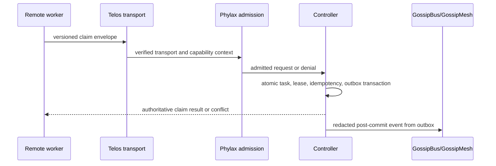

# 68 — Orchestrator Controller Satellite: Authoritative Job Claims

> **Status:** deferred v2.1 design; no runtime implementation implied  
> **Target:** proposed `oramasys/orchestrator-controller` satellite, admitted
> only after the repository-admission gate below  
> **Parent:** [`01-kernel-spec.md`](01-kernel-spec.md),
> [`43-gossipbus-mesh-transport.md`](43-gossipbus-mesh-transport.md), and
> [`48-board-job-source-line-schema.md`](48-board-job-source-line-schema.md)  
> **Cross-cutting constraints:** [`22-worktree-parallel-agents.md`](22-worktree-parallel-agents.md),
> [`46-repository-standard.md`](46-repository-standard.md),
> [`47-portable-memory-local-topology-invariant.md`](47-portable-memory-local-topology-invariant.md),
> [`49-peer-mesh-auth-tls-v2-plan.md`](49-peer-mesh-auth-tls-v2-plan.md), and
> [`61-pt-coordination-principal-identity-design.md`](61-pt-coordination-principal-identity-design.md)

---

## 1. Decision

`GossipBus` remains append-only local evidence and interest-filtered event
fan-out. It is deliberately **not** a distributed lock or authorization
system. A remote worker must not infer authority from a shared checkout, a
database filename, a matching file identity, or an environment variable.

When v2.1 has an operational need for remote workers to claim work, the
Orchestrator Controller is the sole authority for these state transitions:

```text
pending -> claimed -> completed
                 \-> released | failed | expired
```

The controller serializes claims in a durable local store, returns the
authoritative result to the caller, and emits a redacted event through
GossipBus only after the state transition is durable. Gossip events never
grant or alter authority.

This is a **new v2 protocol**, not a network wrapper around a v1 CLI and not a
runtime dependency of either legacy repository. Legacy coordination remains
independent until a separately approved migration provides parity evidence.

## 2. Ownership And Dependency Boundary

| Concern | Owner | Controller relationship |
| --- | --- | --- |
| Generic execution primitives and event contracts | `oramasys/perpetua-core` | Supplies dependency-minimal execution/event interfaces; does not import controller code. |
| Application composition, workflow policy, UI/API integration, budgets/effects | `oramasys/oramasys` | Submits declared jobs and renders controller state; does not reimplement claim semantics. |
| Atomic claims, leases, idempotency, recovery, and event outbox | `oramasys/orchestrator-controller` (proposed) | Single executable authority for job lifecycle. |
| Endpoint/network-safe transport | `oramasys/telos` | Provides endpoint authorization and secure transport; controller does not create an independent HTTP/TLS/SSRF stack. |
| Principal admission, capability verification, provenance/redaction, audit packs | `oramasys/phylax` | Verifies caller capability and applies generic admission/audit policy; controller consumes decisions. |
| Hardware placement evidence | `oramasys/agate` | Optional placement input only; cannot authorize or claim a job. |
| Event replication and observability | GossipBus/GossipMesh | Receives redacted post-commit events; cannot become a second write authority. |

The package may begin as an `oramasys/oramasys` internal module only if the
admission gate finds that independent versioning, ownership, and release
cadence are not yet justified. It becomes a standalone satellite only when
that gate passes. In either shape, the ownership and one-way dependencies in
this document remain unchanged.

## 3. Threat Model And Invariants

The controller addresses accidental double work, stale workers, duplicate
delivery, and a compromised or misconfigured agent attempting to claim as a
different principal. It does not claim to protect a fully compromised
controller host.

1. **One writer:** only the controller process mutates claim state. Clients,
   GossipBus consumers, and analytics stores are read-only with respect to it.
2. **Fail closed:** absent, invalid, expired, revoked, or insufficient
   capability proof rejects a mutation before a task is examined.
3. **Atomic claim:** exactly one transaction decides whether a pending task can
   be claimed. A loser receives a conflict response, never an ambiguous
   success.
4. **Idempotent request:** every mutation has a caller-generated opaque
   `idempotency_key`. Repeating the same principal, operation, and canonical
   request returns the original result; reusing a key with different content
   is rejected.
5. **Lease-bound execution:** a claim has an expiry and an unguessable
   `lease_token`; renewal, completion, release, and failure require both the
   authorized principal and the active lease.
6. **Conservative recovery:** after uncertain delivery or process failure, the
   controller retains a durable claim until an expiry/recovery rule decides it.
   It never issues the same work merely because a client timed out.
7. **Source-line proof:** every new v2 job includes `source_ref` and
   `expected_base_sha`. A claimant creates a fresh worktree and proves the
   expected base before editing. Legacy rows need an explicit migration or
   handoff disposition; they are never silently treated as compliant.
8. **Redact before egress:** audit/outbox events use a minimal allowlisted
   envelope. Secrets, local paths, raw prompts, and private topology data do
   not leave the controller store.
9. **No topology-as-authentication:** a local topology probe may select a
   read-only workflow, but cannot create a principal, capability, lease, or
   queue-write right.

## 4. Minimal v2.1 Protocol

### 4.1 Durable records

The first release uses one controller-owned SQLite database for authoritative
state. SQLite is selected for transactional correctness and operational
simplicity, not for cross-machine replication. DuckDB and LanceDB remain
analytics/recall consumers as defined by the storage plans; neither writes
claims.

```text
tasks(task_id, state, version, source_ref, expected_base_sha, payload_digest)
leases(task_id, principal_id, lease_id, lease_expires_at, state)
idempotency(principal_id, operation, idempotency_key, request_digest, result)
outbox(event_id, sequence, kind, redacted_payload, published_at)
audit(event_id, actor, action, outcome, policy_version, occurred_at)
```

The task mutation and its outbox/audit records commit in the same transaction.
An asynchronous publisher later sends the outbox event to GossipBus and marks
delivery without changing the underlying task result.

### 4.2 Request envelope

Every mutation has a versioned, canonical envelope:

```json
{
  "schema_version": "1",
  "operation": "claim",
  "task_id": "opaque-task-id",
  "principal": "opaque-principal-id",
  "idempotency_key": "opaque-random-key",
  "expected_task_version": 7,
  "source_ref": "reviewed-ref",
  "expected_base_sha": "immutable-source-sha",
  "capability_proof": "opaque-proof"
}
```

`capability_proof` is validated by Phylax and is not written to events or
logs. The controller canonicalizes the covered request fields before computing
the request digest used for idempotency. The request is rejected when its
source-line fields do not match the stored task.

### 4.3 Operations

| Operation | Preconditions | Atomic effect | Successful result |
| --- | --- | --- | --- |
| `claim` | Valid capability, pending task, matching version/source line | Creates one active lease, increments task version, writes outbox/audit | `lease_id`, `lease_token`, expiry, task version |
| `renew` | Same principal, active lease, unexpired renewal window | Extends one lease, writes audit | New expiry and task version |
| `complete` | Same principal, active lease, expected result digest | Finalizes task once, writes outbox/audit | Immutable completion receipt |
| `release` | Same principal, active lease | Returns task to pending or named terminal disposition | Updated task version |
| `fail` | Same principal, active lease | Records classified failure/disposition | Immutable failure receipt |
| `recover-expired` | Controller recovery authority only | Expires a stale lease using a documented clock rule | Recovery receipt |

Expected outcomes are explicit: unauthorized is `401`/`403`, stale version or
already-claimed is `409`, invalid envelope is `400`, duplicate same request
returns its original result, and duplicate key/different request is rejected.
No endpoint returns a generic success for an indeterminate outcome.

## 5. Transport And Authentication

The controller exposes a narrow HTTPS API only through Telos-backed transport.
Phylax verifies a principal capability bound to operation, task scope, expiry,
and controller audience. The controller never accepts a self-declared agent
name as authentication.

The exact credential format is an implementation decision under the principal
identity migration, but it must satisfy the invariants above. It may begin with
rotatable per-agent bearer credentials in the scoped deployment model of
[`61-pt-coordination-principal-identity-design.md`](61-pt-coordination-principal-identity-design.md),
then graduate to stronger proof material without changing request semantics.
Mutual TLS, short-lived proofs, and revocation behavior are evaluated under
[`49-peer-mesh-auth-tls-v2-plan.md`](49-peer-mesh-auth-tls-v2-plan.md), not
duplicated here.

## 6. GossipBus Relationship



GossipMesh may replicate the final redacted event for observability and
handoff. It may not replay an event as a claim, resolve a conflict, extend a
lease, or bypass the controller. This preserves the frugality and local
durability rules in [`43-gossipbus-mesh-transport.md`](43-gossipbus-mesh-transport.md).

## 7. Reconciled Protocol Inputs

This document consolidates the shared-claim relay planning surface. The source
documents retain their narrower authority; none is silently superseded outside
the shared-claim question.

| Source | Accepted input | Controller disposition |
| --- | --- | --- |
| [`43-gossipbus-mesh-transport.md`](43-gossipbus-mesh-transport.md) | Delta sync, interest filtering, idempotent ingest, redaction before egress, and local durable logs | Gossip is the post-commit outbox consumer. It cannot claim work or act as a distributed lock. |
| [`48-board-job-source-line-schema.md`](48-board-job-source-line-schema.md) | `source_ref` plus `expected_base_sha` prevent stale branch execution | Mandatory for new controller tasks; legacy rows require explicit migration/handoff disposition. |
| [`61-pt-coordination-principal-identity-design.md`](61-pt-coordination-principal-identity-design.md) | Principal mismatch is a real failure mode; self-declared identity is not authentication | Phylax-backed capability is required before task lookup. The v1 bearer migration remains v1 design evidence. |
| [`22-worktree-parallel-agents.md`](22-worktree-parallel-agents.md) | Shared board state is not shared file state; a claimant needs a verified source line and fresh worktree | Controller receipt grants a lease only; the worker must independently prove checkout base before edits. |
| [`49-peer-mesh-auth-tls-v2-plan.md`](49-peer-mesh-auth-tls-v2-plan.md) | Transport credentials, TLS, rotation, and revocation need an explicit lifecycle | Telos provides secure transport and Phylax validates capability; controller does not fork either security stack. |
| [`47-portable-memory-local-topology-invariant.md`](47-portable-memory-local-topology-invariant.md) | Portable artifacts must not leak local topology or identity | Envelopes and outbox events use opaque identifiers and redacted fields only. |
| Local Cursor worker coordination evidence | A self-hosted worker is not automatically a coordinator or shared-board peer | Treated as operational evidence only; v2 clients receive API receipts, never local board paths or shell relay instructions. |

The historical shell wrapper is therefore intentionally excluded: local command
execution is neither transport nor authorization, and cannot be promoted by
configuration flags into either.

## 8. Worktree And Remote-Worker Rule

The imported operator evidence
[`2026-09-26-cursor-self-hosted-worker-coordination-plan.md`](../../references/2026-09-26-cursor-self-hosted-worker-coordination-plan.md)
confirms a useful v1 operational boundary: a remote self-hosted worker is not
automatically on the coordinator's checkout or authoritative board. That plan
is **evidence, not v2 authority**.

For v2.1 the rule is normative:

1. A remote worker receives an authoritative controller receipt, not a database
   path or local-shell relay instruction.
2. The worker verifies the source line and creates an isolated worktree under
   [`22-worktree-parallel-agents.md`](22-worktree-parallel-agents.md).
3. The worker submits only the lease-bound completion/release/failure outcome.
4. Loss of connectivity means no new transition; the controller lease and
   recovery process decide the next state.

## 9. Repository Admission And Delivery Gates

### Admission gate

Before creating a standalone repository, record why the controller needs an
independent release cadence, distinct maintainer ownership, and a dependency
surface that cannot remain an `oramasys/oramasys` module. If any answer is
missing, build no new repository.

If admitted, its initial shape follows the repository standard:

```text
orchestrator-controller/
  src/orchestrator_controller/
    api.py
    service.py
    store.py
    leases.py
    idempotency.py
    outbox.py
    policy_adapter.py
  tests/
  SPEC.md
```

No root-level executable directories, concrete workstation paths, credentials,
or topology fragments are permitted.

### Delivery sequence

1. Freeze the protocol schema and state-transition table; obtain Telos and
   Phylax contract review.
2. Implement SQLite migrations and transaction-level claim/idempotency tests.
3. Add lease expiry/recovery with deterministic clock tests.
4. Add Telos/Phylax adapters and deny-path integration tests.
5. Add transactional outbox and duplicate/reordered GossipBus delivery tests.
6. Add isolated-worker end-to-end tests: source mismatch, duplicate claim,
   timeout after dispatch, retry, revocation, controller restart, and redaction.
7. Publish only after security review, migration disposition for legacy jobs,
   and a rollback/operational runbook are accepted.

## 10. Acceptance Criteria

- [ ] Concurrent claims for one task produce exactly one active lease.
- [ ] Same idempotency request returns the original receipt; changed reuse is
      rejected.
- [ ] A stale source line, lease, capability, or expected task version cannot
      mutate state.
- [ ] Controller restart preserves pending outbox delivery and never reissues
      an unexpired lease.
- [ ] Gossip replay cannot create, renew, complete, or release a claim.
- [ ] Unauthorized, revoked, and expired principals fail closed and are audited
      without logging proof material.
- [ ] Event egress is redacted and portable-memory/topology scans remain clean.
- [ ] The v2 controller can be tested without v1 runtime repositories present.

## 11. Explicit Non-Goals

- Replacing v1 coordination in place or importing v1 runtime code.
- Multi-primary database replication, CRDT claim resolution, or gossip-based
  locking.
- Granting remote shell access, desktop access, or worktree write authority.
- Making analytics/recall stores authoritative for workflow state.
- Shipping a controller before Telos/Phylax contract evidence and operator
  recovery procedures exist.

## References

- [`43-gossipbus-mesh-transport.md`](43-gossipbus-mesh-transport.md) — event
  mesh and the explicit non-lock boundary.
- [`48-board-job-source-line-schema.md`](48-board-job-source-line-schema.md) —
  source-line fields that become mandatory in this protocol.
- [principal-identity design](61-pt-coordination-principal-identity-design.md) —
  v1 design evidence and deferred principal migration.
- [`62-telos-phylax-authority-gate0-adr.md`](62-telos-phylax-authority-gate0-adr.md) —
  specialist ownership and no-duplicate-authority rule.
- [`67-lancedb-duckdb-dense-info-layer-shape.md`](67-lancedb-duckdb-dense-info-layer-shape.md) —
  durable SQLite versus analytics/recall-store separation.
