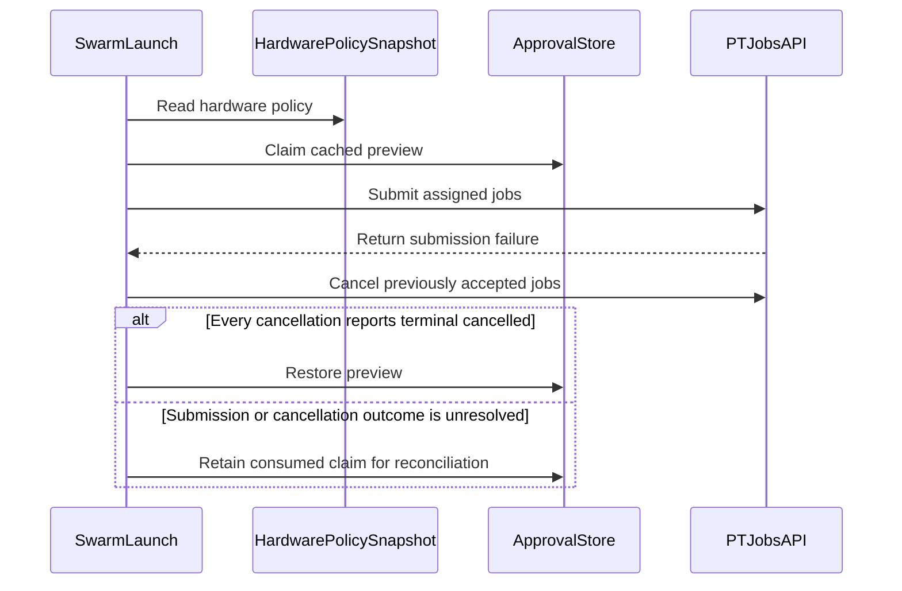

# 70 — Portal knowledge HITL development ladder

> **Repository standard:** additive — see [`46-repository-standard.md`](46-repository-standard.md).
> **Status:** Design intent + as-built note for draft PR #368 (v2.1 portal slice).
> Forward milestones (v2.2–v2.5) are **aspirational and non-binding**. They do not
> override numbered invariants, security descopes, or git-governance doctrine.
> **Document owner:** `orama-system`
> **Parents:** [`16-web-app-orchestration-plan.md`](16-web-app-orchestration-plan.md),
> [`03-safety-v2.5.md`](03-safety-v2.5.md),
> [`references/HUMAN-IN-LOOP-ACCOUNTABILITY.md`](references/HUMAN-IN-LOOP-ACCOUNTABILITY.md),
> [`45-single-operator-lan-threat-model-descope.md`](45-single-operator-lan-threat-model-descope.md),
> [`50-mesh-security-migration-ladder.md`](50-mesh-security-migration-ladder.md)
> **Does not supersede:** docs 16, 20, 23, 24, 27, 32, 39, 45, 50, 51, 53, 55, 61, 69,
> or `docs/HUMAN-IN-LOOP-ACCOUNTABILITY.md`.

---

## 1. Why this file exists

A rejected exhaustive tip on PR #368 dumped a parallel ladder at
`docs/v2/plans/PORTAL-V2-DEVELOPMENT-LADDER.md` plus a root
`docs/portal-server-auth-patch.md` that told humans to apply auth later.
That pattern is **wrong**. Knowledge-route auth is already shipped in code.
This document keeps the *design intent* (Amplifier Principle, portal gate
classes, HITL tokens, later research themes) and **cross-links** existing
plans instead of restating or racing them.

There is no `PORTAL-V2-DEVELOPMENT-LADDER.md` in-tree. There is no
root-level “apply this one-liner later” auth patch file. Agents must not
reintroduce either.

---

## 2. Amplifier Principle (design intent)

Canonical statement lives in
[`references/HUMAN-IN-LOOP-ACCOUNTABILITY.md`](references/HUMAN-IN-LOOP-ACCOUNTABILITY.md)
and is echoed in [`03-safety-v2.5.md`](03-safety-v2.5.md) (R1–R5) and
[`55-oramasys-agent-observability-contract-adr.md`](55-oramasys-agent-observability-contract-adr.md)
§5:

> AI amplifies human intent. It does not replace human judgment, absorb
> human accountability, or dissolve human moral agency.

Portal consequences of that principle (not new merge law):

- No consequential dispatch without a visible, traceable human initiation.
- No irreversible action without a server-issued, time-limited approval that
  binds the reviewed preview to the launch.
- Accountability is never lost in the agent graph: every Class-2+ action
  traces to an authenticated operator.
- No agent may self-approve.

EU AI Act Art. 14 (human oversight) is an **external legal reference**, not
a PR #368 shipping gate. Kernel mapping of Art. 12–15 already lives in
[`03-safety-v2.5.md`](03-safety-v2.5.md). Classification of any deployment
as “high-risk” remains a builder decision (same note as doc 03).

---

## 3. Portal surface gates vs HITL initiation classes

[`HUMAN-IN-LOOP-ACCOUNTABILITY.md`](references/HUMAN-IN-LOOP-ACCOUNTABILITY.md)
§II defines MAESTRO **initiation / spawn** classes (plan start, always-on,
external write, …). Those remain authoritative for SWARM/always-on
lifecycle.

The table below is a **portal HTTP surface** classification only. It does
not renumber HITL §II and does not replace MAESTRO 7-layer threat modeling
in [`03-safety-v2.5.md`](03-safety-v2.5.md) or the T1–T47 / MCP runtime
material in [`39-maestro-owasp-genai-reference.md`](39-maestro-owasp-genai-reference.md).
Critique of finance-agent gaps (hallucination, MCP, over-simple graphs)
stays in [`53-maestro-swarm-v2-redesign-critique.md`](53-maestro-swarm-v2-redesign-critique.md)
— this file does not re-argue that critique.

| Portal class | Name | Example on the glass | Required gate (intent) | As-built on PR #368 |
| --- | --- | --- | --- | --- | --- |
| 0 | Read | `GET /api/knowledge/search` | Public read; bounded scan | **Shipped** — §4 |
| 0b | Authenticated read | MCP / A2A | Bearer on every method | **Target** — §4; knowledge public |
| 1 | Soft write | Config flag (future) | Bearer + confirm | Not in this slice |
| 2 | Dispatch | Swarm launch | Preview + exclusive claim | **Shipped** — claim before PT posts |
| 3 | External / identity | OIDC / financial | Class-2 + identity | **Deferred** — docs 51 + 61 |
| 4 | Irreversible | Fleet delete / publish | Class-3 + OOB 2FA | **Deferred** — doc 45 |
| E | Emergency stop | Kill agents | Override not blocked | R3 kernel; no portal button |

HITL reality for Class 2 on this PR: Preview mints fail-closed when the
approval secret is missing (`issue_approval` must not look successful).
Launch rejects empty-string tokens even if a grandfather env is on.
Omitted (`None`) credentials may grandfather **only** when
`ORAMA_SWARM_LEGACY_APPROVE=1`. Default on this branch is fail-closed
`"0"`. That is a portal tightening of P5 HMAC, not a rewrite of
[`50-mesh-security-migration-ladder.md`](50-mesh-security-migration-ladder.md)
Phase C/D (Phase D remains the v2-launch strict cutover).

### Dispatch rollback finality

The exclusive preview claim remains consumed once downstream dispatch becomes
ambiguous. A successful cancellation HTTP response is an acknowledgement, not
proof that the job stopped. The portal restores a claimed preview only after
every accepted PT job reports a persisted `cancelled` terminal state. A
PT cancellation is rollback-final for portal purposes only when Perpetua
returns `terminal_state="cancelled"` **and** the corresponding supervisor
admission entry is no longer active (`_active` on the PT side). That is
not a guarantee that CLI child processes are dead; external execution
containment is a separate contract (see
[`references/portal-pt-cancel-rollback-contract.md`](references/portal-pt-cancel-rollback-contract.md)).

Acknowledgement-only and unresolved outcomes remain non-retryable.
Cancellation acknowledgement is not execution containment. For CLI-backed jobs,
preview restoration is blocked only when Perpetua returns `worker_kind=cli` and
a **present** `containment_state` is neither `verified` nor `not-applicable`.
When `containment_state` is omitted (mixed deploy), `terminal_state=cancelled`
alone remains sufficient to restore, as before v1 containment.

**Authority split:** Perpetua-Tools owns job lifecycle, admission-slot
finality, and the cancel HTTP response schema. orama-system owns exclusive
preview claims and retry eligibility. Orama does not inspect `_active`; it
consumes only the redacted cancel payload below.

**Perpetua cancel response (rollback consumer minimum):**

```json
{
  "cancel_requested": true,
  "terminal_state": "cancelled",
  "worker_kind": "cli",
  "containment_state": "verified"
}
```

`worker_kind` and `containment_state` are optional for backward compatibility.

Any other `terminal_state`, missing fields, transport failure, or accepted
job without a stable `job_id` keeps the approval consumed (`orphaned_jobs`,
`launch_blocked`). Do not add a second `rollback_verified` flag on the PT
API; the pair above is sufficient when PT also releases the admission slot.



---

## 4. As-built for PR #368 / v2.1 (authoritative)

Knowledge, MCP, and A2A routes live on `src/orama_system/knowledge_gateway.py`.
`portal_server.py` mounts that router with `app.include_router(knowledge_router)`.
Class-0 documentation search is **public read**: `portal_path_is_public()` in
`utils/control_plane_auth.py` exempts `/api/knowledge/*` and
`/.well-known/agent-card.json`. `/health` and `/assets/` stay public too.
Swarm preview/launch and the rest of the operator console remain behind
operator auth.

**MCP and A2A (v2 contract).** `/api/mcp` and `/api/a2a` are operator routes,
not public reads. A client proves identity with one of:

- **Bearer.** `Authorization: Bearer` matching an orama-lane token:
  `ORAMA_CONTROL_PLANE_TOKEN` or `ORAMA_CONTROL_PLANE_TOKEN_LOCAL`
  (`orama_lane_token_candidates()` / `token_matches_control_plane(..., scope="orama")`).
- **Web session cookie, when the browser will send it.**
  `bearer_token_from_request()` also accepts the `orama_control_plane_token`
  cookie. The only setter today is `POST /api/notifications/session`, and that
  cookie’s `Path` is `/api/notifications`, so it is **not** sent to `/api/mcp`
  or `/api/a2a`. A browser or desktop client of those routes sends the bearer
  header. Do not add a loopback exemption: a local tab can reach loopback.

Until the allowlist edit, `_PUBLIC_PORTAL_PATHS` still contains `/api/mcp` and
`/api/a2a`, so unauthenticated calls succeed. Treat that as drift from this
contract, not as the v2 rule.

Same-origin `GET /api/knowledge/search` is Markdown FTS over the docs tree
(no DB, no embeddings, no Redis). Scans run in a worker thread with
`ORAMA_KNOWLEDGE_MAX_FILES_SCAN`, `ORAMA_KNOWLEDGE_MAX_CONCURRENT_SEARCHES`,
and `ORAMA_KNOWLEDGE_SEARCH_TIMEOUT_S` caps so a single query cannot block
swarm approval indefinitely. MCP Streamable HTTP uses protocol date
`2026-07-28` (`server/discover` optional probe so clients are not −32601;
dual-era `initialize` and `notifications/initialized` → 202 still accepted;
`tools/list` / `tools/call` for read-only `search_docs`). A2A is
synchronous `message/send` plus `GET /.well-known/agent-card.json`.
Unicode search folds NFKD/casefold and excerpts from original text via an
origin map.

Web glass: Docs nav → `KnowledgePortal`; SwarmComposer Preview-first with
server-issued tokens. Portal listen port in operator-facing copy is
**8002** (API remains 8001).

This slice stays on the **orama-system** portal process. It does not move
runtime/state authority out of Perpetua-Tools ([Unified Absorption Plan](../2026-05-14--UNIFIED-ABSORPTION-PLAN.md)).
Product thesis for the glass remains [`16-web-app-orchestration-plan.md`](16-web-app-orchestration-plan.md).

---

## 5. Topology and process (do not invent new rules)

- **D23** ([`45-`](45-single-operator-lan-threat-model-descope.md)): this
  fleet is a single-operator LAN. Do not wire BFT/Sybil/witness-quorum or
  two-stranger co-signature into production because a later milestone
  table mentioned “multi-operator.” Re-run Q1–Q3 before any Class-4
  multi-principal scheme.
- **Soft-push / draft:** PR #368 stays draft until a human merges. This
  document does not add merge blockers, calendar ship dates, or a second
  git process. Canonical git doctrine is
  [`27-git-governance-zero-fragmentation.md`](27-git-governance-zero-fragmentation.md)
  (one canonical `scripts/git/`, tree-twin after rewrites, no
  ahead/behind judgments).
- **Security preconditions** for new HTTP/MCP/RAG surfaces remain
  [`23-security-preconditions.md`](23-security-preconditions.md) and
  [`24-security-first-platform.md`](24-security-first-platform.md).
  Implementation guidance for auth/tools/memory stays
  [`32-agentic-security-controls.md`](32-agentic-security-controls.md).
  Envelope identity for units of work is [`69-agent-envelope-standard.md`](69-agent-envelope-standard.md)
  — this ladder does not define a fifth plane.

---

## 6. Forward ladder (non-binding)

Themes below are research bookmarks. They **must** be implemented by
extending the linked docs, not by treating this table as a second SSoT.
Numeric quality gates and calendar conformity deadlines from the rejected
dump are **not** acceptance criteria for #368 or for v2.1.

| Milestone | Theme | Where the real plan lives | Portal note |
| --- | --- | --- | --- |
| **v2.1** | Knowledge glass + fail-closed HITL tokens | This PR; doc 16 | §4 as-built for knowledge. MCP and A2A take the bearer or local token in §4; they are not public. |
| **v2.2** | Observability + retrieval beyond linear scan | [`20-rag-and-memory-design.md`](20-rag-and-memory-design.md), [`41-`](41-agentic-stack-gstack-gbrain-memory-blend.md), [`55-`](55-oramasys-agent-observability-contract-adr.md), [`67-`](67-lancedb-duckdb-dense-info-layer-shape.md) | Markdown search is a Class-0 stopgap. Bayesian/vector RAG, hallucination budgets, and p99 histograms are **not** specified here. |
| **v2.3** | Dual-model check + Class-3 identity | [`53-`](53-maestro-swarm-v2-redesign-critique.md) (critique only), [`51-`](51-security-sentinel-orbit-passkey-mcp.md), [`61-`](61-pt-coordination-principal-identity-design.md) | OIDC/passkey/HMAC-bridge are satellite/identity plans. Do not require GitHub OIDC on knowledge search. |
| **v2.4** | External conformity literature | [`03-safety-v2.5.md`](03-safety-v2.5.md), [`23-`](23-security-preconditions.md), [`24-`](24-security-first-platform.md), [`32-`](32-agentic-security-controls.md), [`39-`](39-maestro-owasp-genai-reference.md) | EU database registration, Annex III dossiers, and FINRA-style autonomy monitors are **external references / future conformity work**, not mandatory shipping gates while D23 + doc 23 still describe the live threat model. |
| **v2.5** | Safety overlays; co-signature only if trust boundary changes | [`03-safety-v2.5.md`](03-safety-v2.5.md), [`45-`](45-single-operator-lan-threat-model-descope.md) | MAESTRO/SWARM enforcement is the v2.5 vehicle. Emergency-stop and always-on renewal follow 03 R3 and HITL; they are not portal #368 scope. |

---

## 7. Cross-cutting themes (pointers only)

Do not copy MCP/orchestration/hallucination playbooks into this file.

| Theme | Canonical |
| --- | --- |
| MCP least privilege, path boundary, tool pinning | [`23-`](23-security-preconditions.md) fixes 4–6, [`32-`](32-agentic-security-controls.md), [`39-`](39-maestro-owasp-genai-reference.md) MCP runtime controls |
| Optional MCP transport module | [`02-modules/mcp-optional-transport.md`](02-modules/mcp-optional-transport.md) — still deferred as a kernel module; this PR’s `/api/mcp` is a **portal** adapter, not that module |
| Graph complexity / merge validation | [`08-technical-architecture-review.md`](08-technical-architecture-review.md), [`53-`](53-maestro-swarm-v2-redesign-critique.md), MiniGraph docs 57–59 |
| Hallucination / grounding | [`20-`](20-rag-and-memory-design.md), [`53-`](53-maestro-swarm-v2-redesign-critique.md) § hallucination stack |
| Mesh / discovery / swarm HMAC phases | [`50-`](50-mesh-security-migration-ladder.md) |
| Hardware refuse-to-dispatch | [`17-hardware-policy-enforcement.md`](17-hardware-policy-enforcement.md) — already a Launch precondition via preview `hardware_policy.ok` |

---

## 8. Explicit non-goals

- Replacing `portal_server.py` with a stub or “human must patch later” note.
- Root `docs/portal-server-auth-patch.md`.
- A second ladder under `docs/v2/plans/` that duplicates this document.
- Making EU AI database registration or FINRA 2026 metrics merge gates.
- Multi-operator co-signature on a single-admin LAN (D23).
- New git merge/process rules beyond doc 27 and existing draft-PR norms.
- In-process approval cache, OAuth, vector DB, Redis, or a new process —
  still out of the v2.1 knowledge slice.
