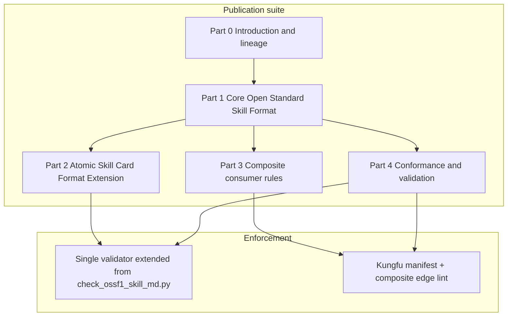

# Publication Plan — Open Standard Skill Format (OSSF) Suite

**Status:** draft plan for manual review (references/ only — no commit, no push)  
**Date:** 2026-09-16  
**Normative drafts:**
[`2026-09-16-ossf-part0-introduction.md`](2026-09-16-ossf-part0-introduction.md) → Parts 1–4  
**AFRP:** Type C | Practitioner | Mode 2 (architecture + publication planning)  
**Scope:** Elaborate how to publish one harmonized standard with an **optional**
extension profile for Kungfu composable **atoms/subskills** only; **composite**
consumer cards remain on the core profile.

**Upstream (read and reconciled):**

- `references/2026-09-12-v2-skill-construction-guide.md` — harmonized instruction set
- `references/2026-09-12-ossf1-to-atomic-card-reconciliation-plan.md` — OSSF-1 →
  Atomic Card convergence (applied)
- PT `.agent/memory/semantic/OSSF1_SKILL_FORMAT_STANDARDIZATION_SAGA_2026-08-07.md`
  — historical arc (append-only)
- `references/2026-09-14-kungfu-v2-plan-reviews-ceo-eng-dx.md` Part 4 — atom
  frontmatter reconciliation

---

## 1. Coordination board (fresh read)

| ID | Agent | Relevant ruling |
| ---- | ------- | ----------------- |
| **2843** | cline-gate4-halfa | OSSF-1 → Atomic Card convergence **finalized** (operator approval executed) |
| **2841** | cursor-composer-ossf1-reconcile | Reconciliation plan applied; lineage `USF-1→OSSF-1→doc44→AtomicSkillCard` |
| **2831** | cline-gate4-halfa | v2 Skill Construction Guide published |
| **2827** | cline-gate4-halfa | Kungfu MVP plan **approved as-is**; Kungfu owns v2 Skill Contract format spec |

**Implication for this plan:** publication work is **additive** to an already-ratified
convergence direction. Vendor-neutral naming is **Open Standard Skill Format (OSSF)**;
**split core vs extension** via `format_profile` profiles.

---

## 2. The design problem (what you are really asking)

The construction guide currently places Kungfu atom fields (`outcome`,
`approval_limit`, typed `references[]`) inside §4.0 beside the OSSF-1 floor.
That is correct for **atoms**, but it blurs three distinct card roles:

| Card role | Examples | Needs OSSF-1 core? | Needs composable-atom extension? |
| ----------- | ---------- | -------------------- | -------------------------------- |
| **Generic skill card** | Altitude A local cards, v1 adapters, orbit packages | Yes | No |
| **Composable atom / subskill** | Kungfu `skills/<domain>/<verb>` | Yes | **Yes** |
| **Composite consumer** | Kungfu `composites/*`, thin orchestrators | Yes | **No** — references atoms; does not duplicate atom semantics |

**Operator intent (this plan):** publish **one unified standard** where:

1. **Open Standard Skill Format (core)** — Part 1; normative for every `SKILL.md`.
2. **Open Standard Skill Format (Atomic Skill Card Format Extension)** — Part 2;
   optional **profile** on top of core, **required only** for composable atoms
   (`format_profile: composable-atom`).
3. **Composite consumers** — Part 3; validate against **core only** plus composite-edge
   rules (manifest / typed graph), never against Part 2 extension fields.

This mirrors how mature open standards separate **base protocol**, **optional
capabilities**, and **profiles** without forcing every document type to carry
every field.

---

## 3. Lessons from open standardization (adopt / extend)

### 3.1 IETF / TCP/IP family (RFC 6709, BCP 14)

| Practice | Adopt for OSSF | How |
| ---------- | ------------------- | ----- |
| **Base + extension** | Yes | Core format stable; extension adds fields with explicit capability flag |
| **Profiles** | Yes | `core` vs `composable-atom` conformance classes; profiles may tighten MAY→MUST, not silently remove base MUST |
| **Unknown extension handling** | Yes | Consumers that do not implement extension MUST still parse core and reject/fail-closed on atom dispatch when extension required |
| **RFC 2119 keywords sparingly** | Yes | Use MUST/SHOULD/MAY only for interoperability and safety; prose normative statements allowed without keywords (IESG 2023 guidance) |
| **Normative vs informative refs** | Yes | Split Part 1 (normative core) from historical saga/inventory (informative) |

### 3.2 OASIS ODF (multi-part, conformance targets)

| Practice | Adopt for OSSF | How |
| ---------- | ------------------- | ----- |
| **Multi-part suite** | Yes | Part 0 intro, Part 1 core schema, Part 2 extension, Part 3 composite rules, Part 4 conformance |
| **Conformance targets** | Yes | Define **producer**, **consumer**, **validator** separately (ODF distinguishes package producer vs consumer) |
| **Conforming vs extended** | Cautiously | Prefer **named profiles** over a vague “extended” bucket; “extended producer” invites drift |
| **Document-type profiles** | Yes | `skill-card`, `composable-atom`, `composite-consumer` as three conformance profiles |

### 3.3 Ecma / TC39 (publication ladder)

| Stage | Ecma/TC39 analogue | OSSF analogue |
| ------- | ------------------- | ------------------- |
| Straw / idea | TC39 Stage 0 | OpenClaw `v1/` inventory + fusion spec |
| Working draft | TC39 Stage 1–2 | `references/*.md` drafts (this folder) |
| Candidate draft | TC39 Stage 3, Ecma “final draft” | `oramasys/alexandria` PR with review window |
| Ratified standard | GA approval, yearly ECMA-262 snapshot | Alexandria merged spec + version tag; Kungfu contract tests green |
| Optional modules | ECMAScript modules (goal symbols) | **Extension profile** — not a separate standard, a declared capability on atoms |

**Adopt:** explicit stage gates, editor-maintained drafts, **one integration PR**
into alexandria (like tc39/ecma262), not parallel “almost canonical” copies.

### 3.4 Cross-cutting synthesis



---

## 4. Proposed standard identity and naming

| Artifact | ID | Audience |
| ---------- | ----- | ---------- |
| **Core standard** | **Open Standard Skill Format (core)** — Part 1, v1.0.0-draft | Every `SKILL.md` author |
| **Optional extension** | **OSSF (Atomic Skill Card Format Extension)** — Part 2, v1.0.0-draft | Kungfu atoms / composable subskills only |
| **Composite profile** | **Composite consumer profile** — Part 3 | Thin orchestrators |
| **Harmonized guide** | `references/2026-09-12-v2-skill-construction-guide.md` | Human onboarding (informative hub until alexandria absorbs Parts 0–4) |
| **Machine gate (v1)** | `orama-system/scripts/hooks/check_ossf1_skill_md.py` | OSSF-1 implementation ⊂ Part 1 (today); extend per Part 4, do not fork |

**BCP 14 boilerplate** (place in Part 0 when normative Parts ship):

> The key words "MUST", "MUST NOT", "SHOULD", "MAY", and "OPTIONAL" in normative
> parts of this standard are to be interpreted as described in RFC 2119 and RFC 8174.

---

## 5. Normative split — what belongs where

### 5.1 OSSF (core) — Part 1 (required for all altitudes A / B / C)

Inherited wholesale from OSSF-1 + construction guide §4.0 **minus** atom-only fields:

**Frontmatter (required):** `name`, `description` (≥20 chars), `version`, `allowed-tools`,
activation (`triggers` or embedded activation in `description`), compatibility
(`compatibility` or `agent_compatibility`).

**Body (required):** `## Purpose` or `## When to Use`; `## Boundaries` with
`### Always Do`, `### Ask First`, `### Never Do`.

**Size:** ≤200 preferred, ≤500 hard ceiling.

**Encoding:** UTF-8 without BOM.

**New core field (publication addition):**

```yaml
format_profile: core   # default when omitted
```

Validators treat absent `format_profile` as `core`.

### 5.2 OSSF (Atomic Skill Card Format Extension) — Part 2 (composable atoms only)

**Activation:** card declares:

```yaml
format_profile: composable-atom
# or Kungfu-native equivalent:
card_kind: atom
```

**Additional required frontmatter (when profile active):**

| Field | Requirement |
| ------- | ------------- |
| `outcome` | MUST — observable success condition (mastery + doc 44) |
| `approval_limit` | MUST — `never` \| `ask-first` \| `auto` |
| `references` | MUST — typed list (`owner` \| `reference` \| `pr`) |
| `name` | MUST follow `<domain>/<verb-phrase>` (Kungfu atom ID) |

**Additional semantic rules:**

- One trigger boundary, one outcome (Kungfu plan invariant).
- Fail-closed: missing/dead owner link = hard error for atom dispatch, not silent v1 fallback.
- Packaged `.skill` export may trim into `metadata:` (skillify dogfood
  pattern) — canonical repo card keeps full frontmatter.

**Explicit non-requirement:** composite cards MUST NOT set `format_profile:
composable-atom`. Composites use `format_profile: composite-consumer` (core only).

### 5.3 Composite consumer profile (core + graph, no extension)

**Activation:**

```yaml
format_profile: composite-consumer
```

**Required beyond core:**

- `## Composition` section: ordered atom references (IDs only — no prose duplication).
- Typed edges per Kungfu plan (`requires-success`, `must-precede`, `conditional-on`,
  `approval-before`, `on-failure`) in `composites/<name>.yaml` or manifest row —
  **not** duplicated inside each atom’s Boundaries.
- MUST reference atoms; MUST NOT copy owner policy prose (link to phylax/telos/agate/anamnesis).

**Validator behavior:** run Part 1 (core) checks on `SKILL.md`; run composite-edge
lint separately; **do not** require `outcome` / `approval_limit` on the composite card.

---

## 6. Document suite — publication elaboration

Publish as a **versioned suite** under `oramasys/alexandria` after human review.
Until then, keep working drafts in `~/code/OpenClaw/references/`.

| Part | Working draft filename | Normative? | Contents |
| ------ | ------------------------ | ------------ | ---------- |
| **0** | [`2026-09-16-ossf-part0-introduction.md`](2026-09-16-ossf-part0-introduction.md) | Informative + registry | Lineage, scope, terminology, BCP14, document map |
| **1** | [`2026-09-16-ossf-part1-core-open-standard-skill-format.md`](2026-09-16-ossf-part1-core-open-standard-skill-format.md) | **Normative** | OSSF (core) schema, body order, size, encoding |
| **2** | [`2026-09-16-ossf-part2-atomic-skill-card-format-extension.md`](2026-09-16-ossf-part2-atomic-skill-card-format-extension.md) | **Normative (profile)** | Extension fields, atom naming, typed references |
| **3** | [`2026-09-16-ossf-part3-composite-consumer-profile.md`](2026-09-16-ossf-part3-composite-consumer-profile.md) | **Normative** | Thin composite cards, edge types, anti-duplication |
| **4** | [`2026-09-16-ossf-part4-conformance-and-validation.md`](2026-09-16-ossf-part4-conformance-and-validation.md) | **Normative** | Producer/consumer/validator classes; single-validator rule |
| **A** | Existing construction guide | Informative hub | Onboarding + altitude routing; points to Parts 1–4 |
| **B** | Existing reconciliation plan | Informative | Historical convergence record |
| **C** | OSSF-1 saga (PT memory) | Informative | Evidence anchors only — never edited in place |

**Part 0 mandatory sections** (ODF-style):

1. Scope  
2. Terminology  
3. Normative references  
4. Informative references  
5. Lineage diagram (USF-1 → OSSF-1 impl → doc 44 → OSSF Part 1 → Part 2 extension)  
6. Conformance profile overview  

**Part 4 mandatory sections** (IETF-style):

1. Validator classes (`core-only`, `composable-atom`, `composite-consumer`)  
2. Capability discovery (`format_profile` + manifest disposition)  
3. Interoperability matrix (what happens when extension fields appear on a
   composite — **MUST reject** or strip with explicit error)  
4. Security considerations (supply-chain, no secrets in cards)  
5. Change control (version semver on the standard, not on every skill)  

---

## 7. Publication ladder (OSSF-adapted)

| Gate | Name | Exit criteria | Owner |
| ------ | ------ | --------------- | ------- |
| **G0** | Working draft | Parts 0–4 exist in `references/`; construction guide cross-links | OpenClaw references editor |
| **G1** | Board + autoplan review | Compact board note; CEO/Eng/DX pass on **profile split** (not re-litigating OSSF-1) | Kungfu plan owners |
| **G2** | Candidate draft | Alexandria PR; negative fixtures; extended validator prototype | alexandria + kungfu |
| **G3** | Implementation proof | Wave-1 contract tests green; O1–O3 product gates unchanged | kungfu CI |
| **G4** | Ratified standard | Alexandria merge; version tag `ossf-1.0.0`; construction guide becomes informative summary only | alexandria GA equivalent |

**G0 status (2026-09-16):** Parts 0–4 drafted; construction guide §4.0 and reconciliation
plan aligned to OSSF naming. **Next (G1):** board + autoplan review on profile split.

**Between G1 and G2:**

1. Prototype validator profile switch in `check_ossf1_skill_md.py` (design in Part 4; code in G2).  
2. Negative fixtures per Part 4 interoperability matrix.

---

## 8. Validator architecture (single gate, extended)

Honor reconciliation plan §2 item 4 and lesson `lesson_5cafd5d6ce27`:

```text
validate(path):
  1. Part 1 / OSSF (core) — today = OSSF-1 hook checks — always
  2. Read format_profile from frontmatter
  3. If composable-atom → Part 2 extension checks
  4. If composite-consumer → Part 3 rules (no Part 2 fields required)
  5. If unknown profile → fail closed
```

**Capability negotiation** (RFC 6709-style): Kungfu router reads atom
`format_profile`; if manifest row says `disposition: atom` but card lacks
`composable-atom`, **hard error** (stale manifest or wrong card).

**Composites without extension:** validator passes core + composition graph lint;
presence of `outcome` on a composite is **MAY** (documentation aid) but never
required; presence without `format_profile: composable-atom` must not trigger
Ext requirements.

---

## 9. Relationship to existing artifacts (no forks)

| Artifact | After publication |
| ---------- | ------------------- |
| `check_ossf1_skill_md.py` | Implementation alias; docs cite Part 1 / Part 4; extend, do not fork |
| Construction guide | Remains onboarding hub; §4.0 points to Parts 1–3 for normative text |
| OSSF-1 saga | Stays append-only; Part 0 cites evidence SHAs |
| Kungfu manifest | Adds `format_profile` expectation per disposition |
| `docs/v2/44-docs-v2-skills.md` | Still governs folder shape; OSSF governs card semantics |
| Alexandria | Becomes canonical host for Parts 0–4 |

---

## 10. Execution checklist (references/ only until G1)

- [x] **Draft Part 1** —
  [`2026-09-16-ossf-part1-core-open-standard-skill-format.md`](2026-09-16-ossf-part1-core-open-standard-skill-format.md)  
- [x] **Draft Part 2** —
  [`2026-09-16-ossf-part2-atomic-skill-card-format-extension.md`](2026-09-16-ossf-part2-atomic-skill-card-format-extension.md)  
- [x] **Draft Part 3** —
  [`2026-09-16-ossf-part3-composite-consumer-profile.md`](2026-09-16-ossf-part3-composite-consumer-profile.md)  
- [x] **Draft Part 0** —
  [`2026-09-16-ossf-part0-introduction.md`](2026-09-16-ossf-part0-introduction.md)  
- [x] **Draft Part 4** —
  [`2026-09-16-ossf-part4-conformance-and-validation.md`](2026-09-16-ossf-part4-conformance-and-validation.md)  
- [x] **Align construction guide** — §4.0 → OSSF Parts 1–3 cross-links  
- [x] **Align reconciliation plan** — §1, §6 → OSSF naming  
- [ ] **Review pass** — verify composite example card validates core-only.  
- [x] **Board note** — GossipBus #2844 (`cursor-composer-ossf-draft`):
  `verdict=g0_drafts_ready;standard=OSSF;...`  
- [ ] **Defer** — alexandria PR, validator code until G1 sign-off.

---

## 11. Annotated examples (normative intent preview)

### 11.1 Composable atom (core + extension)

```yaml
---
name: git/cherry-reanchor
format_profile: composable-atom
description: >-
  Re-anchors a stale branch onto a rewritten main using evidence-backed
  tree diff. Activates when cherry-pick message match is insufficient.
version: 1.0.0
compatibility: kungfu-atom, claude-code
triggers: [cherry reanchor, rewritten history, headRefOid]
allowed-tools: bash, file-operations
outcome: >-
  Local tip tree matches expected merged headRefOid OR explicit empty
  cherry-pick with documented supersession.
approval_limit: ask-first
references:
  - {type: owner, repo: orama-system, ref: skills/git-history-surgery}
  - {type: reference, path: references/reanchor-after-rewrite.md}
---
```

### 11.2 Composite consumer (core only — no extension fields)

```yaml
---
name: review/pre-merge-integrity
format_profile: composite-consumer
description: >-
  Runs pre-merge integrity checks as an ordered composite over git and
  security atoms. Activates before merging cross-repo skill changes.
version: 1.0.0
compatibility: kungfu-composite
triggers: [pre-merge integrity, skill format gate]
allowed-tools: bash, file-operations
---
## Purpose
Orchestrate atoms; do not restate their policy.

## Composition
1. `git/verify-remote-head`
2. `security/three-gate-content-integrity`

See `composites/pre-merge-integrity.yaml` for typed edges.

## Boundaries
### Always Do
- Fail closed if any atom returns hard error.
### Ask First
- Skipping an atom in the composite chain.
### Never Do
- Duplicate atom Boundaries or owner policy in this card.
```

---

## 12. Open questions for operator (G0 sign-off)

1. ~~**Profile field name:** `format_profile` vs `card_kind` vs both with alias map?~~
   **RESOLVED by the Part 0–4 drafts themselves** (2026-09-16 dual review, §14):
   Parts 0–4 already normatively define `format_profile` only — no `card_kind`
   appears anywhere in Part 1 or Part 2's normative text. This question was
   stale relative to its own suite before the review caught it. Treat
   `format_profile` as INVARIANT; do not reopen without a documented reason.
2. **Rename timing:** keep `check_ossf1_skill_md.py` filename until
   alexandria ratifies OSSF Part 1?  
3. **Altitude C orbit packages:** always `core` only — confirm?  
4. **Extension on v1 adapters (Wave 2):** forbidden, or allowed when disposition becomes atom?  

---

## 14. Pilot-Gated Publication Ladder — dual-review reconciliation (2026-09-16)

**Status of this section:** extension to the working draft, not a new gate
number. G0/G1 (draft exists, board+autoplan review) are satisfied by this
section; G2 (candidate draft — Alexandria PR, negative fixtures, extended
validator prototype) is now explicitly conditioned on the pilot below, per
§14.3. This plan and its Parts 0–4 remain `references/`-only working drafts
(no commit, no push) throughout; nothing here is submitted for ratification.

### 14.1 Review summary

Two fully independent reviews (Claude, reading the plan + validator source
directly with no prior context; Codex, `codex exec` on the same materials
plus the existing `check_ossf1_skill_md.py`) converged on the same core
finding: **§9's "single validator, extended, not forked" claim is not
currently implementable**, and the publication ladder (§7) measures drafting
mechanics, not whether the atom/composite model actually improves outcomes
over a v1 card.

Convergent findings (both reviews, independently):

- `check_ossf1_skill_md.py` is hardcoded to one repo (`bin/orama-system/`,
  read via `git diff --cached` on that repo's index). It has no path- or
  repo-resolution model for Kungfu atoms/composites living elsewhere.
  Extending it in place means either building real multi-repo architecture,
  or Kungfu gets its own validator — the fork §9 forbids.
- The frontmatter parser is a hand-rolled string splitter, not YAML. It
  cannot validate Part 2's typed `references:` list (mappings with a `type`
  discriminator). Codex additionally found the parser's own list-detection
  heuristic would reject the plan's own flow-style `triggers: [...]`
  examples — the worked examples don't validate against the tool named to
  validate them.
- `format_profile` vs `card_kind` (§12 Q1) was carried as an open question
  after the drafts had already normatively settled it — a dispatch-safety
  ambiguity if left unresolved in a reader's mind, now closed (§12.1 above).
- No decision-tree exists for a new author choosing a profile; defaulting
  omitted `format_profile` to `core` (Part 1 §1.4.4) means the likely first
  mistake (forgetting the field on an atom) validates silently until a
  manifest/router rejects it downstream.

Codex-original findings (not independently found by Claude, folded in as
real):

- Part 3 §3.4's composite-edge companion artifact
  (`composites/<name>.yaml` or "manifest row") has no schema, canonical
  location, atom-resolution algorithm, or graph-conflict semantics anywhere
  in the suite — a validator cannot lint an artifact the standard doesn't
  define.
- §7's G0–G4 ladder has no predeclared comparison metric against the v1-card
  baseline (task completion, selection correctness, authoring time) and no
  kill/rollback criterion — it can reach "ratified" without ever answering
  whether composability is worth its overhead.
- Part 2 §2.3's design invariants ("one trigger boundary," "no policy
  duplication," a "fixed directory set" for atom domains) are prose rules
  without a formal registry or deterministic test per rule.
- Part 0 §0.1 claims "vendor-neutral, implementation-neutral" scope while
  Part 1 §1.4.1 mandates a literal `SKILL.md` filename and directory-name
  match "where the construction guide applies" — a real internal tension
  between the neutrality claim and the concrete binding, now clarified in
  Part 0 §0.1 rather than left contradictory.

**Six-month regret (both reviews, Codex sharpest):** a polished 5-part suite
with fail-closed dispatch semantics can harden architectural debt into place
before anything proves the architecture is needed — turning ordinary skill
edits into cross-artifact transactions while agents keep using familiar
monolithic v1 cards in practice.

### 14.2 Invariant vs. variable — what this review locks and what it doesn't

Operator ruling (2026-09-16): publish the working draft now (already true —
G0 status), run the pilot in parallel, let pilot evidence — not calendar
time — decide what graduates to G2. Nothing below blocks continued drafting;
it blocks *candidate-draft* status (G2) on unresolved items.

| Status | Item | Where it lives |
| --- | --- | --- |
| **INVARIANT** | Three-way card classification (generic / atom / composite) | §2 |
| **INVARIANT** | Core / extension / composite-consumer profile split | §4, Parts 1–3 |
| **INVARIANT** | OSSF naming, BCP14/RFC2119 convention | §4, Part 0 §0.4 |
| **INVARIANT** | `format_profile` as the sole profile field (no `card_kind`) | §12.1, Part 1 §1.4.4 |
| **INVARIANT** | Part 0–4 document structure as the *drafting* organization | §6 |
| **INVARIANT** | Encoding/size/BOM/Boundaries-section rules (already enforced today) | Part 1 §1.3, §1.5 |
| **VARIABLE — pilot-gated, not locked before G2** | Validator architecture: single hardcoded script vs. shared rules-engine + per-repo adapters | Part 4 §4.2–4.3 |
| **VARIABLE — pilot-gated** | Frontmatter parsing mechanism (current regex hack vs. real YAML parser) | Part 2 §2.5, Part 4 §4.2 |
| **VARIABLE — pilot-gated** | Composite manifest schema, canonical location, resolution algorithm | Part 3 §3.4 |
| **VARIABLE — pilot-gated** | Formal testability of Part 2 §2.3 design-invariant prose rules | Part 2 §2.3 |
| **VARIABLE — pilot-gated** | Publication-ladder timing (G2/G3/G4 dates) | §7 |
| **VARIABLE — pilot-gated** | Author decision-tree / getting-started tooling | §2, Part 0 §0.6 |

### 14.3 Pilot work item (new, satisfies both reviews' actual fix)

Before G2 (Alexandria PR, extended validator prototype), build and measure:

1. **One real atom** and **one real composite** consuming it, authored
   against the current draft (Parts 1–3 as they stand today).
2. **A predeclared v1-comparison metric** — pick one and commit to it before
   running the pilot, not after: task completion rate, selection correctness
   (did the router pick the right atom), or authoring/maintenance time
   versus an equivalent v1 card. Do not cherry-pick a favorable metric after
   seeing results.
3. **An explicit rollback trigger** — a stated threshold at which the pilot
   is judged to have failed and the atom/composite model is held at
   "Kungfu-experimental profile" rather than advanced toward Alexandria
   ratification.
4. Pilot results directly resolve the VARIABLE rows in §14.2 — they are not
   a gate to pass, they are the evidence source those rows need before they
   can become INVARIANT.

### 14.4 Amended G2 exit criteria

G2 ("Candidate draft") in §7's table now additionally requires: pilot
complete, comparison metric reported (pass or fail against its own
predeclared threshold), and every VARIABLE row in §14.2 either resolved with
evidence or explicitly re-classified INVARIANT with a stated reason. G0/G1
are unaffected — this plan and Parts 0–4 continue as working drafts,
publishable and citable as `1.0.0-draft`, with no ratification claim.

---

## 13. One-sentence summary

Publish **Open Standard Skill Format (core)** (Part 1) as the unified required
standard for every skill card, **OSSF (Atomic Skill Card Format Extension)**
(Part 2) as an optional declared profile for composable atoms only, and
**composite-consumer** (Part 3) as core-plus-graph orchestration with **no Part 2
fields required** — using a multi-part ODF-style suite, IETF-style profiles and
extension rules, and an Ecma-style draft→candidate→ratified ladder into
alexandria, enforced by one extended validator (Part 4).
