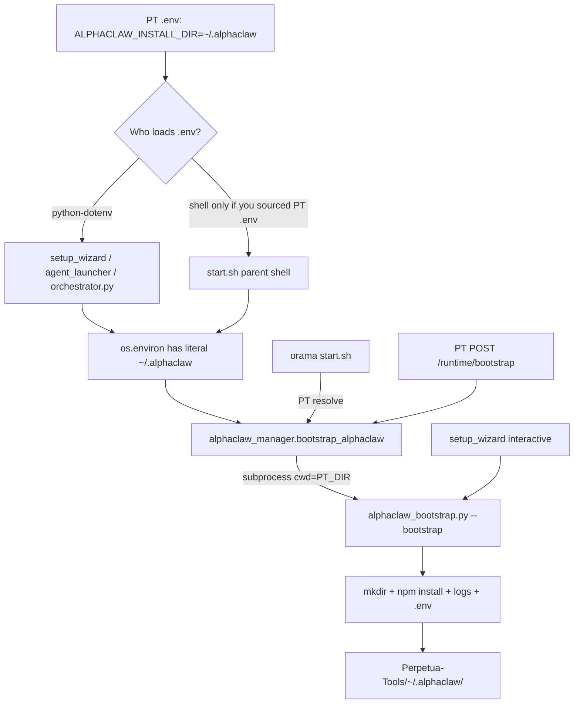

# 18. Literal `~/` Under Perpetua-Tools — `ALPHACLAW_INSTALL_DIR` Tilde Bug

> **Canonical wiki (full forensic report):** [Perpetua-Tools/docs/wiki/12-literal-tilde-alphaclaw-install-dir.md](https://github.com/diazMelgarejo/Perpetua-Tools/blob/main/docs/wiki/12-literal-tilde-alphaclaw-install-dir.md)

**TL;DR:** A one-shot `alphaclaw_bootstrap.py --bootstrap` run created a **literal folder named `~`** under the PT repo (`Perpetua-Tools/~/.alphaclaw/`) because `ALPHACLAW_INSTALL_DIR=~/.alphaclaw` in PT `.env` was loaded by python-dotenv (no tilde expansion) and `alphaclaw_bootstrap.py` used `Path(...)` without `.expanduser()`. Not a daemon — bootstrap only. Fix: `.expanduser().resolve()` on all install-dir reads.

**Date discovered:** 2026-07-25 (incident on **2026-07-22** ~21:27–21:29 +0800)  
**Severity:** Medium (352 MB junk in repo tree; no committed secrets; mergeable into real `$HOME/.alphaclaw`)  
**Status:** Fixed in PT `main` (2026-07-25) — see [Fix applied](#fix-applied-2026-07-25) below. Junk removed; merge archive deleted.

---

## What Created `Perpetua-Tools/~/`

It was **not** a background daemon rewriting the repo. It was a **one-shot AlphaClaw bootstrap** on **2026-07-22 ~21:27–21:29 +0800** (~2 minutes): `npm install`, gateway start, `.env` write, logs — all matching `alphaclaw_bootstrap.py`.

| Path (under literal `Perpetua-Tools~/`) | Created | Last modified | Notes |
| --- | --- | --- | --- |
| `~/` (literal `~` folder) | 21:27:37 | 21:27:37 | dir |
| `~/.alphaclaw/` | 21:27:37 | 21:28:57 | bootstrap root |
| `logs/openclaw-gateway.log` | 21:27:37 | 21:27:44 | 3.7 KB |
| `npm install` → `node_modules/` | 21:28:06 | 21:28:52 | **351 MB** |
| `package.json` / `package-lock.json` | 21:28:52 | 21:28:52 | 110 B / 170 KB |
| outer `.env` | 21:28:52 | 21:28:52 | 61 B — only `ALPHACLAW_ROOT_DIR` |
| nested `~/.alphaclaw/` (2nd mistake) | 21:28:57 | 21:28:59 | second relative-tilde hop |
| nested `.env` | 21:28:11 | 21:28:57 | 461 B |
| `db/*.db` + WAL/SHM | 21:28:59 | 21:28:59 | fresh/empty schemas |
| `logs/alphaclaw.log` / `process.log` | 21:28:58–59 | 21:28:59 | 847 B / 353 B |

**Total span:** ~2 minutes. Active PT branch that day: `2026-07-22-001-fleet-mesh-lesson-graduation` (stack/bootstrap work likely).

After cleanup (2026-07-25), the junk tree was removed and assets were merged additively into `$HOME/.alphaclaw` with archive at `$HOME/.alphaclaw/archive/merge-pt-junk-20260722/`.

---

## Root Cause (Confirmed)

### Trigger

`ALPHACLAW_INSTALL_DIR=~/.alphaclaw` in **PT `.env`** (and documented the same way in `.env.example`), loaded by **python-dotenv**, which does **not** expand `~`.

### Bug

`Perpetua-Tools/src/perpetua_tools/alphaclaw_bootstrap.py` builds the install path without `.expanduser()`:

```python
ALPHACLAW_INSTALL_DIR = Path(
    os.getenv("ALPHACLAW_INSTALL_DIR", str(Path.home() / ".alphaclaw"))
)
```

With env set to the literal string `~/.alphaclaw`, `Path` is **relative**, not under `$HOME`. Bootstrap always runs with **`cwd` = PT repo root** (`alphaclaw_manager.bootstrap_alphaclaw` sets `cwd=str(SCRIPT_DIR)`), so it materializes:

```
Perpetua-Tools/~/.alphaclaw/
```

### Nested `~/.alphaclaw/~/.alphaclaw/`

Second hop: bootstrap writes `ALPHACLAW_ROOT_DIR='~/.alphaclaw'` into the junk `.env` (via `str(ALPHACLAW_INSTALL_DIR)` when install dir is still the relative `Path('~/.alphaclaw')`). AlphaClaw/OpenClaw then treats that as a relative path again from the wrong cwd.

### Proof (repro)

```python
from pathlib import Path
import os

os.environ["ALPHACLAW_INSTALL_DIR"] = "~/.alphaclaw"
p = Path(os.getenv("ALPHACLAW_INSTALL_DIR", str(Path.home() / ".alphaclaw")))
# is_absolute: False
# as_posix: ~/.alphaclaw
# From PT cwd → Perpetua-Tools/~/.alphaclaw
```

---

## Call Chain (Perpetua ↔ orama)



| Layer | Role | Loads PT `.env`? | Uses install dir? |
| --- | --- | --- | --- |
| **orama `start.sh`** | Calls `python -m orchestrator.alphaclaw_manager --resolve` | No (only orama `.env` via `scripts/env/load-local.sh`) | Indirect — passes through `os.environ` |
| **`orchestrator/alphaclaw_manager.py`** | Subprocess bootstrap, `cwd=SCRIPT_DIR` (PT root) | No | Inherits env into child |
| **`perpetua_tools/alphaclaw_bootstrap.py`** | `npm install`, writes `.env`, starts gateway | No (reads `os.environ` only) | **Bug here** — no `expanduser()` |
| **`perpetua_tools/setup_wizard.py`** | Loads PT `.env`, runs bootstrap | **Yes** | Same bug in `Path(os.getenv(...))` (3 call sites) |
| **`orchestrator.py`** | `load_dotenv()` at import | **Yes** (cwd `.env`) | Feeds bad env to `POST /runtime/bootstrap` |
| **`perpetua_tools/agent_launcher.py`** | `load_dotenv` on repo `.env` / `.env.local` | **Yes** | Can poison env for downstream tools |
| **orama `scripts/discover.py`** | Discovery path list | N/A | **Correct** — uses `.expanduser()` |

orama is mostly innocent on the path bug; **Perpetua-Tools owns the bad path handling**. orama is the usual **caller** of bootstrap via `start.sh` → `alphaclaw_manager`, but that path is only dangerous when `ALPHACLAW_INSTALL_DIR` is already in the environment (from PT dotenv, a prior shell export, or a Cursor session that loaded PT env).

---

## Bootstrap Steps That Matched the Junk Tree

From `alphaclaw_bootstrap.py` (abbreviated):

1. **Step 1.5:** `ALPHACLAW_INSTALL_DIR.mkdir(parents=True, exist_ok=True)` — creates `~/` under PT cwd.
2. **Step 2:** `npm install @chrysb/alphaclaw` with `cwd=str(ALPHACLAW_INSTALL_DIR)` — 351 MB `node_modules`.
3. **Writes** `ALPHACLAW_ROOT_DIR` into install-dir `.env` via `set_key`.
4. **Starts gateway** → `logs/openclaw-gateway.log` (migration/doctor warnings observed in archived log).

---

## Who Can Trigger Recurrence

Bootstrap runs when any of these invoke `alphaclaw_bootstrap --bootstrap`:

| Entry point | Mechanism |
| --- | --- |
| `orama-system/start.sh` | `python -m orchestrator.alphaclaw_manager --resolve` → `bootstrap_alphaclaw()` |
| `orchestrator/control_plane.py` | `POST /runtime/bootstrap` → `bootstrap_alphaclaw()` |
| `perpetua_tools/setup_wizard.py` | Interactive install after `load_dotenv(ENV_PATH)` |
| `start.sh` fallback | `python -m perpetua_tools.alphaclaw_bootstrap --bootstrap` if manager missing |

**Safe path:** `ALPHACLAW_INSTALL_DIR` unset → default `Path.home() / ".alphaclaw"` works.

**Unsafe path:** `ALPHACLAW_INSTALL_DIR=~/.alphaclaw` in process env + bootstrap with `cwd=PT_DIR`.

orama `.env` / `.env.local` on the discovery machine did **not** set `ALPHACLAW_INSTALL_DIR` at time of investigation.

---

## Will It Happen Again?

**Yes**, if bootstrap runs again while:

1. `ALPHACLAW_INSTALL_DIR=~/.alphaclaw` is in the process env (from PT `.env` via dotenv), and
2. Code still lacks `.expanduser()`.

**No**, if `ALPHACLAW_INSTALL_DIR` is unset (default works) or is an absolute path.

---

## Fix (Targeted)

1. **`src/perpetua_tools/alphaclaw_bootstrap.py`** — resolve install dir once at module load:
   ```python
   def _resolve_install_dir() -> Path:
       raw = os.getenv("ALPHACLAW_INSTALL_DIR", str(Path.home() / ".alphaclaw"))
       return Path(raw).expanduser().resolve()

   ALPHACLAW_INSTALL_DIR = _resolve_install_dir()
   ```
2. **`src/perpetua_tools/setup_wizard.py`** — same `.expanduser().resolve()` at all three `install_dir = Path(os.getenv(...))` sites.
3. **PT `.env.example`** — document that python-dotenv does not expand `~`; prefer leaving unset or use `$HOME/.alphaclaw` in shell-only exports (not in dotenv files).
4. **Optional:** add `/~/` to PT `.gitignore` so a recurrence cannot be staged.
5. **Regression test:** set `ALPHACLAW_INSTALL_DIR=~/.alphaclaw`, reload module, assert `ALPHACLAW_INSTALL_DIR.is_absolute()` and path equals `Path.home() / ".alphaclaw"`.

---

## Verification

```bash
# After fix — from PT repo root:
ALPHACLAW_INSTALL_DIR='~/.alphaclaw' python3 -c "
from perpetua_tools import alphaclaw_bootstrap as b
assert b.ALPHACLAW_INSTALL_DIR.is_absolute()
assert b.ALPHACLAW_INSTALL_DIR == (__import__('pathlib').Path.home() / '.alphaclaw')
print('OK:', b.ALPHACLAW_INSTALL_DIR)
"

# Confirm junk not present (from PT repo root):
test ! -d ./~ && echo "no literal tilde dir"
```

---

## Rules

1. **Never** put unexpanded `~` in values read by python-dotenv for filesystem paths.
2. **Always** `.expanduser().resolve()` on env-derived `Path`s before `mkdir`, `cwd=`, or writing `ALPHACLAW_ROOT_DIR`.
3. **orama `scripts/discover.py` already does this correctly** — match that pattern everywhere PT resolves install dirs.
4. Literal `Perpetua-Tools/~/` is runtime junk, not source — safe to delete after archiving anything worth keeping under real `$HOME/.alphaclaw`.

---

## Related

- [04. Gateway Discovery](04-gateway-discovery.md) — orama side of gateway/bootstrap delegation
- [07. Startup & IP Detection](07-startup-ip-detection.md) — `start.sh` / env loading
- [PT canonical wiki](https://github.com/diazMelgarejo/Perpetua-Tools/blob/main/docs/wiki/12-literal-tilde-alphaclaw-install-dir.md)
- [PT 04. Gateway Discovery](https://github.com/diazMelgarejo/Perpetua-Tools/blob/main/docs/wiki/04-gateway-discovery.md)
- Merge archive: removed after fix landed (was under user install dir `archive/merge-pt-junk-20260722/`)

---

## Fix applied (2026-07-25)

### Code changes (Perpetua-Tools — canonical)

| File | Change |
| --- | --- |
| `src/utils/env_paths.py` | **New** — `resolve_env_path()` and `resolve_alphaclaw_install_dir()`; always `.expanduser().resolve()` |
| `src/perpetua_tools/alphaclaw_bootstrap.py` | `ALPHACLAW_INSTALL_DIR = resolve_alphaclaw_install_dir()` at import |
| `src/perpetua_tools/setup_wizard.py` | All three install-dir reads call `resolve_alphaclaw_install_dir()` |
| `tests/test_env_paths.py` | Unit tests for tilde expansion and defaults |
| `tests/test_alphaclaw_bootstrap.py` | `test_alphaclaw_install_dir_expands_tilde_from_env` |
| `.gitignore` | `/~/` — literal tilde folder under repo cannot be staged |

Core helper:

```python
def resolve_env_path(raw: str | None, *, default: Path | None = None) -> Path:
    if not raw or not str(raw).strip():
        base = default if default is not None else Path.cwd()
        return base.expanduser().resolve()
    return Path(raw).expanduser().resolve()
```

`ALPHACLAW_ROOT_DIR` written during bootstrap now receives an **absolute** resolved path, so the nested `~/` mistake cannot recurse.

### Local `.env` hygiene

Remove or comment out `ALPHACLAW_INSTALL_DIR` in gitignored `.env` / `.env.local` when it uses a tilde-prefixed value — the code fix makes that safe, but leaving it unset is clearer.

### Verification (post-fix)

```bash
# From PT repo root — unit tests:
PYTHONPATH=src:. pytest tests/test_env_paths.py \
  tests/test_alphaclaw_bootstrap.py::test_alphaclaw_install_dir_expands_tilde_from_env -q

# Manual smoke (install dir must be absolute under user home):
ALPHACLAW_INSTALL_DIR='~/.alphaclaw' python3 -c "
from perpetua_tools import alphaclaw_bootstrap as b
assert b.ALPHACLAW_INSTALL_DIR.is_absolute()
print('OK:', b.ALPHACLAW_INSTALL_DIR)
"

test ! -d ./~ && echo "no literal tilde dir"
```

### Cleanup

- `Perpetua-Tools/~/` junk tree: deleted (prior session)
- Merge archive `archive/merge-pt-junk-20260722/`: deleted after fix landed

### orama-system

No code change required — `scripts/discover.py` already used `.expanduser()`. This page is the mirror; canonical detail lives in [PT/12](https://github.com/diazMelgarejo/Perpetua-Tools/blob/main/docs/wiki/12-literal-tilde-alphaclaw-install-dir.md).

